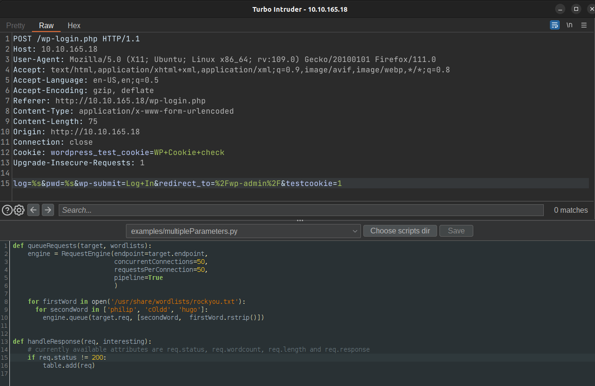
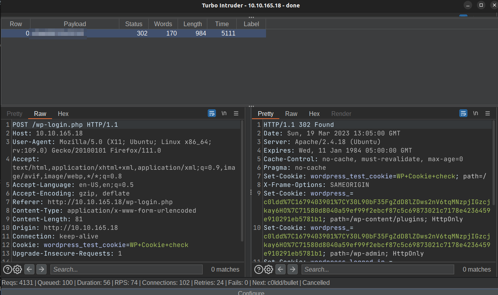
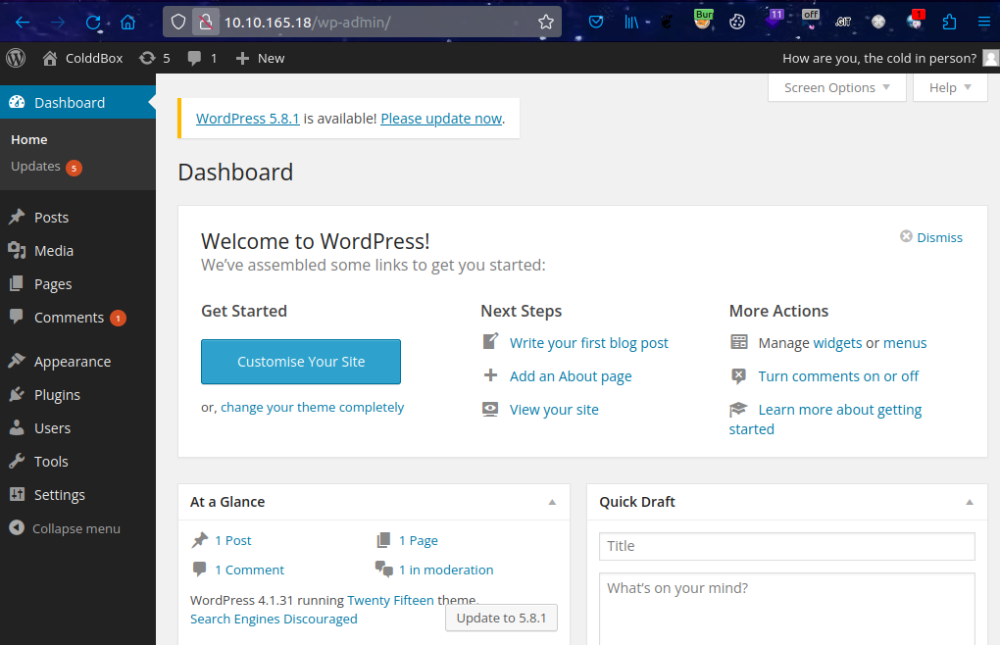
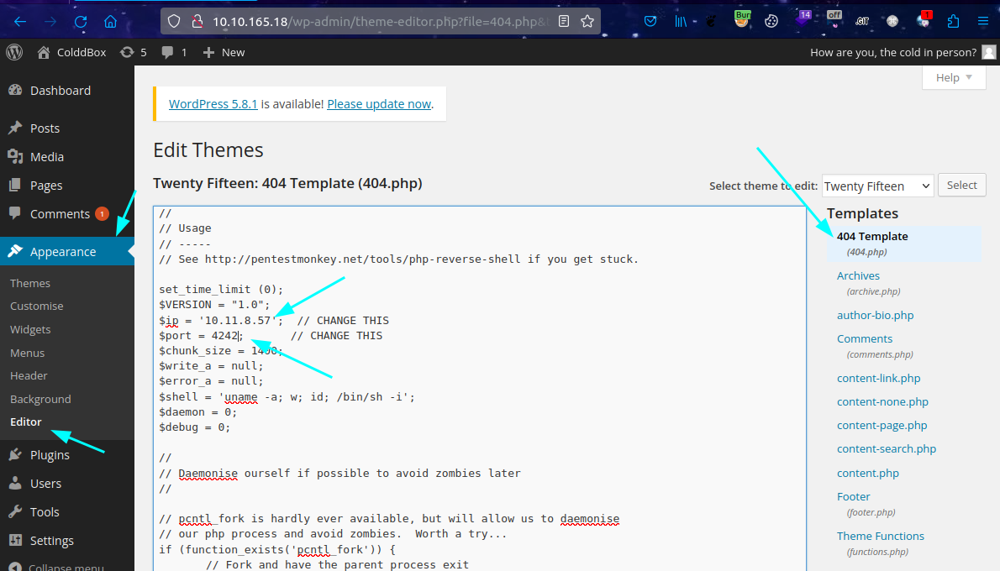
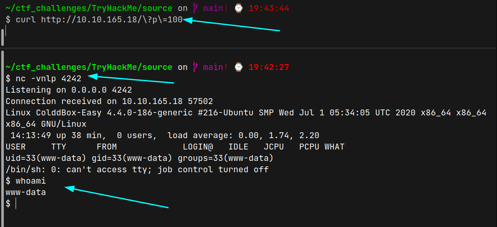
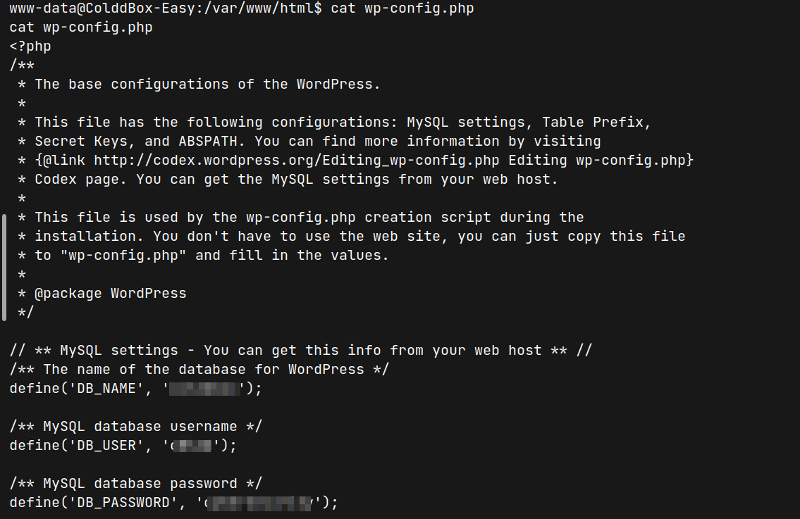

# ColddBox (THM)

- https://tryhackme.com/room/colddboxeasy
- March 7, 2023
- easy

---

## Enumeration

### Nmap

1. 80/http Apache httpd 2.4.18 ((Ubuntu))
   - WordPress 4.1.31
2. 1137/tcp no-response
3. 4512/ssh OpenSSH 7.2p2 Ubuntu 4ubuntu2.10 (Ubuntu Linux; protocol 2.0)

### HTTP

- wordpress website
- directory burte forcing with ffuf

```
hidden
index.php
wp-admin
wp-content
wp-includes
xmlrpc.php
```


- use `wpscan` to find vulnerabilities

```sh
wpscan --url http://$IP -e vt,vp,u
# vulnerable themes, plugins, usernames
# usernames found
```
```
the cold in person
philip
c0ldd
hugo
```
- try login at `wp-login.php`, the last 3 names are valid
- directory brute forcing to hidden route and nothing found
- find in `wp-includes`, nothing special found
- only one thing left to do if password brute forcing for above 3 names
- I used turbo intruder for this purpose



- found credentials



- Enter with these credentials



- add reverse shell to 404 page and update file
- https://github.com/pentestmonkey/php-reverse-shell/blob/master/php-reverse-shell.php



## User Access

- listen with nc and request to a page that will return 404.php that we have specified previously



- can't `sudo -l` as don't know the password
- from wp-config.php, found database credentials



- can't enter the database
- but can change other user account as he uses the same password
- skipped this step as `www-data` user can change root directly

- find suid 

```sh
find / -perm -4000 2>/dev/null
```
- found `/usr/bin/find`


## Root Access

- from GTFOBins resources,

```sh
find . -exec /bin/sh -p \; -quit
```

- get root access

- find flags
- they exist in normal positions but may be base64 encoded

```
# cat /home/xxxxx/user.txt

# cat /root/root.txt

```

---