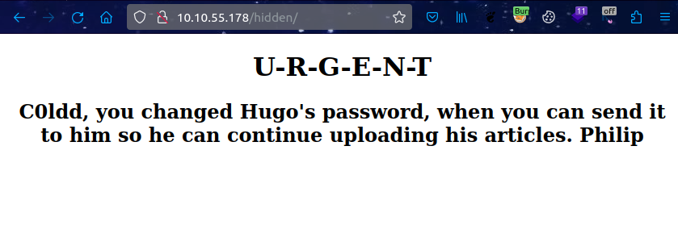

# ColddBox (THM)

- https://tryhackme.com/room/colddboxeasy
- March 7, 2023
- easy

---

## Enumeration

### Nmap

1. 80/http Apache httpd 2.4.18 ((Ubuntu))
   - WordPress 4.1.31
2. 1137/tcp no-response
3. 4512/ssh OpenSSH 7.2p2 Ubuntu 4ubuntu2.10 (Ubuntu Linux; protocol 2.0)

### HTTP

- directory burte forcing with ffuf

```
hidden
index.php
wp-admin
wp-content
wp-includes
xmlrpc.php
```



- use `wpscan` to find vulnerabilities

```sh
wpscan --url http://$IP -e vt,vp,u
# vulnerable themes, plugins, usernames
# usernames found
```

## User Access

## Root Access
