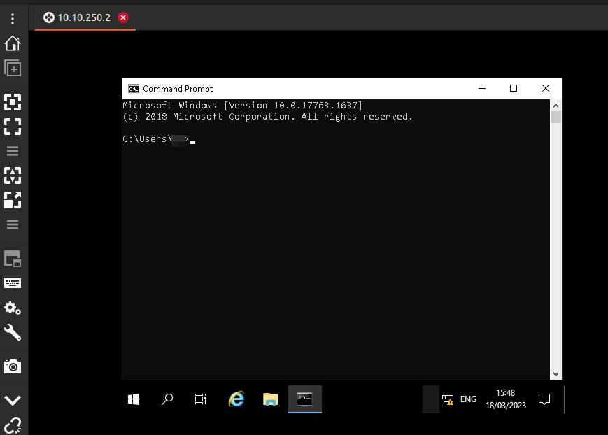

# Anthem (THM)

- https://tryhackme.com/room/anthem
- March 18, 2023
- easy

---

## Enumeration

### Nmap

- add `-Pn` 

```
PORT     STATE SERVICE       REASON
80/tcp   open  http          syn-ack
3389/tcp open  ms-wbt-server syn-ack
```

### HTTP

- Flags


- robots.txt

```
UmbracoIsTheBest!

# Use for all search robots
User-agent: *

# Define the directories not to crawl
Disallow: /bin/
Disallow: /config/
Disallow: /umbraco/
Disallow: /umbraco_client/
```
- CMS - Umbraco

- found login page


- at one of the blog page, there is a poem


- copy and search in google - 


- Get username
- enter the login page with their email pattern (\*\*@\*\*\*\*\*\*.\*\*\*) and password from one of the potential we have already found


- can access to admin dashboard

- in searchsploit found RCE and I used this script 


## User Access

- The RDP port is also open
- enter with above credential 
- username - only two capital letters



- In `C:\` found backup directory
- in backup directory `restore.txt` file exists
- it has no read access, but can change


- read the contents of restore.txt which may be a potential password


## Administrator Access

- enter cmd with administrator account with above password


- flags are under `C:\Users\Administrator\Desktop\root.txt` and `C:\Users\usrname\Desktop\user.txt`