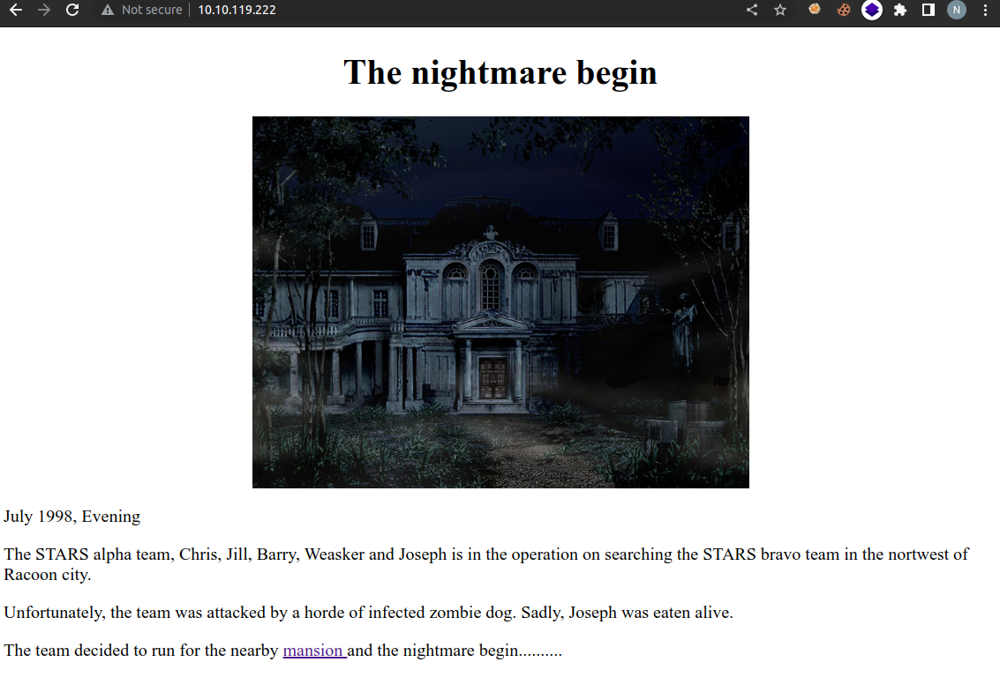
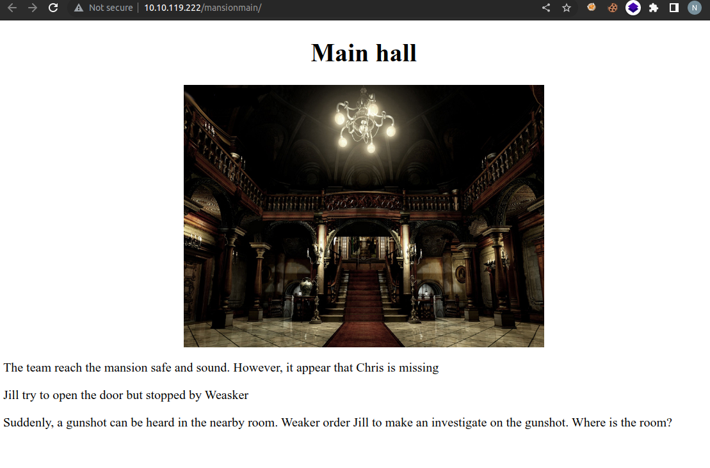
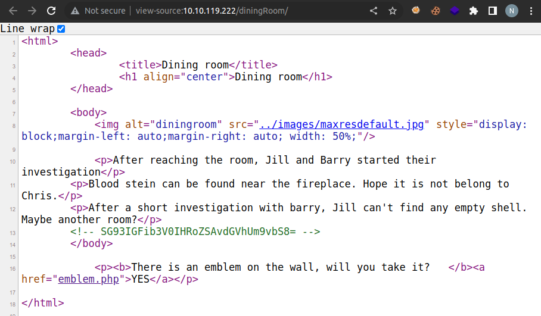
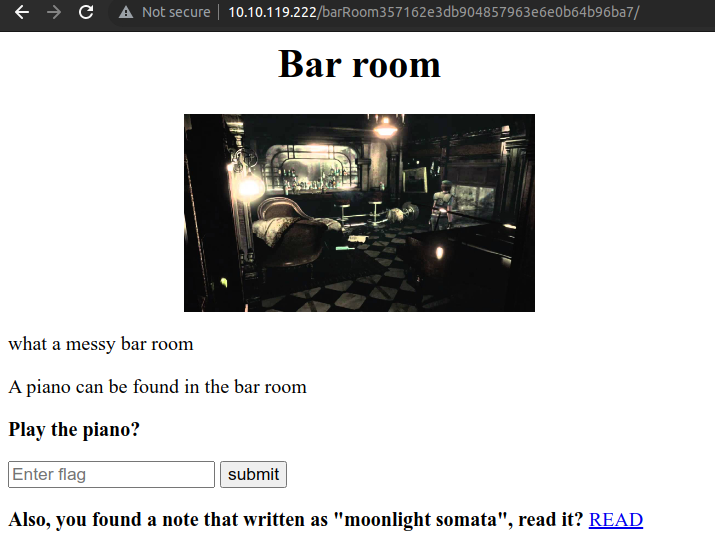
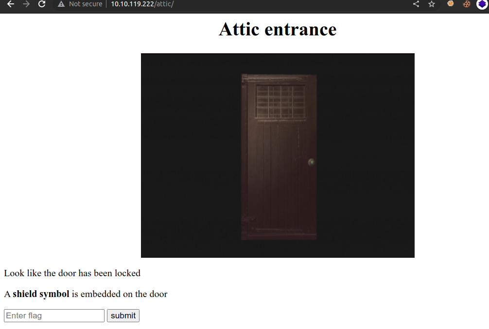

# Biohazard (THM)

- https://tryhackme.com/room/biohazard
- March 21, 2023
- medium

---

## Enumeration

### Nmap

```
PORT   STATE SERVICE REASON  VERSION
21/tcp open  ftp     syn-ack vsftpd 3.0.3
22/tcp open  ssh     syn-ack OpenSSH 7.6p1 Ubuntu 4ubuntu0.3 (Ubuntu Linux; protocol 2.0)
80/tcp open  http    syn-ack Apache httpd 2.4.29 ((Ubuntu))

Service Info: OSs: Unix, Linux; CPE: cpe:/o:linux:linux_kernel
```


### HTTP

- home page 



- main hall -> comment

`<!-- It is in the /diningRoom/ -->`



- `/diningRoom`



```sh
$ echo SG93IGFib3V0IHRoZSAvdGVhUm9vbS8= | base64 -d
How about the /teaRoom/
```
- `emblem flag` is here `http://$IP/diningRoom/emblem.php`

- `lock_pick` is here `http://$IP/teaRoom/master_of_unlock.html`


- there is also `/artRoom/`

- `http://$IP/artRoom/MansionMap.html`

```
/diningRoom/
/teaRoom/
/artRoom/
/barRoom/
/diningRoom2F/
/tigerStatusRoom/
/galleryRoom/
/studyRoom/
/armorRoom/
/attic/
```

- `/barRoom` - asks lock_pick key

- redirects to some page and ask piano key



- there is a link `http://$IP/barRoom357162e3db904857963e6e0b64b96ba7/musicNote.html`
- some random words
- it is base32 encrypt and get music_sheet flag
- enter key and redirect to somewhere
- there is one link and get into this link and get a gold_emblem flag
- refresh the previous page and get an input field
- enter `emblem` and get a name
- there is no link from this and go to the next unopened rooms

#### **diningRoom2F**
```
Lbh trg gur oyhr trz ol chfuvat gur fgnghf gb gur ybjre sybbe. Gur trz vf ba gur qvavatEbbz svefg sybbe. Ivfvg fnccuver.ugzy      
```
- it is rot 13 and give direction to blue_jewel 
- it is end of this room and go to

#### **tigerStatusRoom**
- enter blue gem and redirect to some place and give some cipher
- crest 1
- decode twice -> base64, base32
- get 14 random chars
- nothing to do and go to

#### **galleryRoom**
- link to note.txt
- crest 2
- decode twice -> base32, base58
- get 18 random chars
- nothing to do and go back to 

#### **diningRoom**
- I forget to put golden_emblem and it redirects to a page
- there is random strings and try with rot brute but it is not the answer
- I try with vinegar cipher with name that was found previous
- it shows a way to find `shield_key`
- there is left to find two crests 

#### go to **armorRoom** and enter `shield_key` 
- there is a link to get crest 3
- decode crest 3 -> base64, binary, decimal


#### go to **attic** and enter `shield_key`
- attic



- there is a link to get crest 4
- decode crest 4 -> base58, hex

- combine 4 crests and get encode string (just base64)

### FTP

- enter ftp with username and password\
- found 5 files and get to local machine

```
001-key.jpg
002-key.jpg
003-key.jpg
helmet_key.txt.gpg
important.txt
```
- according to `important.txt` file, by decrypting the gpg key and will get a key to `/hidden_closet/` directory
- check jpg files, pictures of keys
- in key 003 has some hidden text
- `binwalk -e 003-key.jpg` and get `key-003.txt` file
- there must be `key-002.txt` and `key-001.txt` files in other two pictures, binwalk can't see it
- use `steghide extract -sf 001-key.jpg` and extract `key-001.txt` file
- for key 2, it doesn't work
- exiftool shows key 2 in comment
- get 3 key and combine them
- it is base64 decrypted and encrypted it
- it is key for gpg file

```sh
$ gpg --decrypt helmet_key.txt.gpg
# enter passphrase and get halmet key
```

- enter `/hidden_closet` with halmet key 
- 2 links, one is for ssh password and one is random text 
- decrypt it
- it is not rot, it may be viniger 
- I found there was one room that I haven't enter `studyRoom` as it needs halmet key

#### **studyRoom**
- there is one zip file to download `doom.tar.gz` file
- download to local machine
- unzip it and there is a text file for ssh username

## User Access

### SSH

- enter ssh with username and password
- this user has no sudo access

```sh
$ cat /home/umbrella_guest/.jailcell/chris.txt
Jill: Chris, is that you?
Chris: Jill, you finally come. I was locked in the Jail cell for a while. It seem that weasker is behind all this.
Jil, What? Weasker? He is the traitor?
Chris: Yes, Jill. Unfortunately, he play us like a damn fiddle.
Jill: Let's get out of here first, I have contact brad for helicopter support.
Chris: Thanks Jill, here, take this MO Disk 2 with you. It look like the key to decipher something.
Jill: Alright, I will deal with him later.
Chris: see ya.

MO disk 2: albert 
```
- is it key that we haven't decrypted yet in `hidden_closet`?
- it is vigenere encryption and get weasker password

## Root Access

- change weasker user

```sh
weasker@umbrella_corp:/tmp$ sudo -l
[sudo] password for weasker: 
Matching Defaults entries for weasker on umbrella_corp:
    env_reset, mail_badpass, secure_path=/usr/local/sbin\:/usr/local/bin\:/usr/sbin\:/usr/bin\:/sbin\:/bin\:/snap/bin

User weasker may run the following commands on umbrella_corp:
    (ALL : ALL) ALL

```
- he has root access
- to answer questions, needed files
  - `/home/weasker/weasker`
  - `/root/root.txt`
  - `/home/umbrella_guest/.jailcell/chris.txt`

---