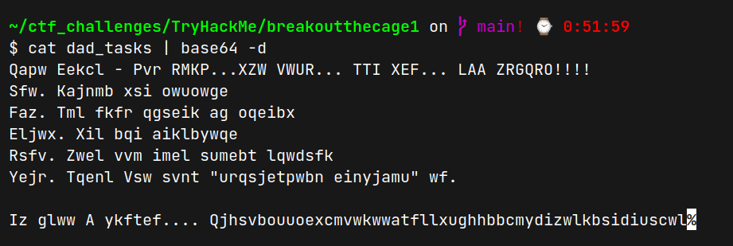

# Break Out The Cage (THM)

- https://tryhackme.com/room/breakoutthecage1
- March 20, 2023
- easy

---

## Enumeration

### Nmap

```
PORT   STATE SERVICE REASON  VERSION
21/tcp open  ftp     syn-ack vsftpd 3.0.3
| ftp-anon: Anonymous FTP login allowed (FTP code 230)
|_-rw-r--r--    1 0        0             396 May 25  2020 dad_tasks
22/tcp open  ssh     syn-ack OpenSSH 7.6p1 Ubuntu 4ubuntu0.3 (Ubuntu Linux; protocol 2.0)
80/tcp open  http    syn-ack Apache httpd 2.4.29 ((Ubuntu))

```

### FTP 

- get dad_tasks file to local machine and analyse



- base64 format but next decryption requires
- I tried with rot but no one is correct
- It may be Vigenere Cipher which requires key
- explore other services

### HTTP

- home page - nothing special found


- directory brute forcing with ffuf (use directory-medium list)
```
html
images
scripts
contracts
auditions
```
- in auditions,  one mp3 file exists
- download and listen
- between 5-12 seconds, random noises appear
- with spectrogram view in audicity some words appear
- Spectrogram view


- it may be the key for above cipher


## User Access

- at first, I don't know what these words mean
- in challenge's Question 1, it is asked weston's password and then know that it is username `weston's` password
- there is ssh service open and enter ssh with these credentials

```sh
weston@national-treasure:~$ sudo -l
[sudo] password for weston: 
Matching Defaults entries for weston on national-treasure:
    env_reset, mail_badpass,
    secure_path=/usr/local/sbin\:/usr/local/bin\:/usr/sbin\:/usr/bin\:/sbin\:/bin\:/snap/bin

User weston may run the following commands on national-treasure:
    (root) /usr/bin/bees
```

- bees is a custom file

```sh
weston@national-treasure:~$ file /usr/bin/bees
/usr/bin/bees: Bourne-Again shell script, ASCII text executable

weston@national-treasure:~$ cat $(which bees)
#!/bin/bash

wall "AHHHHHHH THEEEEE BEEEEESSSS!!!!!!!!"

weston@national-treasure:~$ ls -l $(which bees)
-rwxr-xr-x 1 root root 56 May 25  2020 /usr/bin/bees
```
- can't write in bees file 
- bees calls `wall` file
- check what is `wall`
## Root Access
