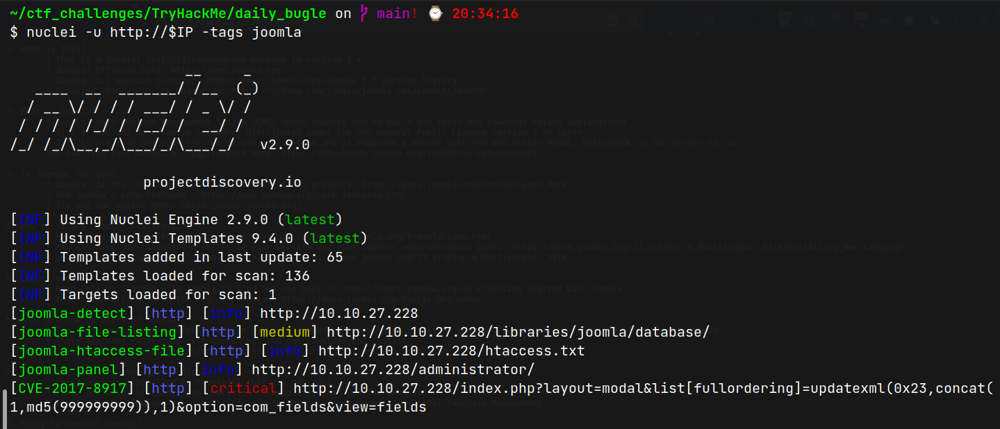
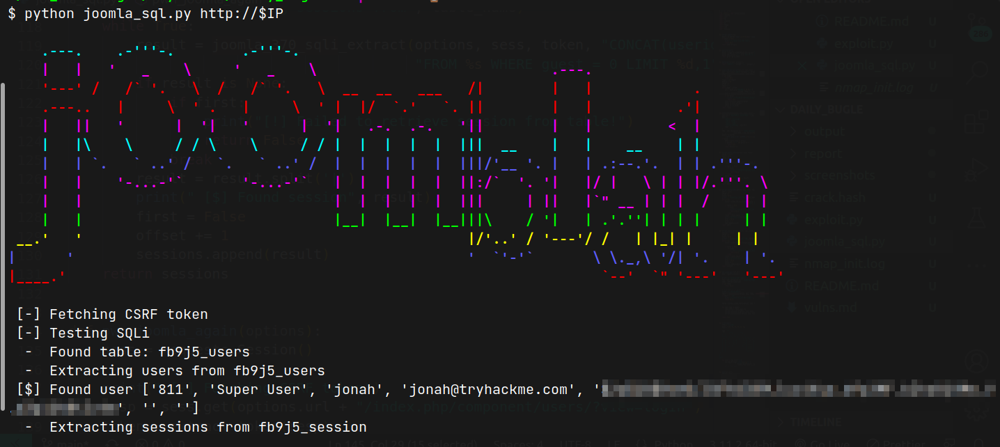

# Daily Bugle (THM)

- https://tryhackme.com/room/dailybugle
- March 25, 2023
- hard

---

## Enumeration

### Nmap

```
PORT     STATE SERVICE REASON  VERSION
22/tcp   open  ssh     syn-ack OpenSSH 7.4 (protocol 2.0)
80/tcp   open  http    syn-ack Apache httpd 2.4.6 ((CentOS) PHP/5.6.40)
http-robots.txt: 15 disallowed entries 
| /joomla/administrator/ /administrator/ /bin/ /cache/ 
| /cli/ /components/ /includes/ /installation/ /language/ 
|_/layouts/ /libraries/ /logs/ /modules/ /plugins/ /tmp/
3306/tcp open  mysql   syn-ack MariaDB (unauthorized)
```

### HTTP 

- directory brute forcing with ffuf 
```
,/administrator/,/bin/,/cache/,/cli/,/components/,/includes/,/installation/,/language/,/layouts/,/libraries/,/logs/,/modules/,/plugins/,/tmp/
```
- I used nuclei scanner for quick win and found a CVE



- used this python script to retrieve database
- https://github.com/stefanlucas/Exploit-Joomla




## User Access

## Root Access
