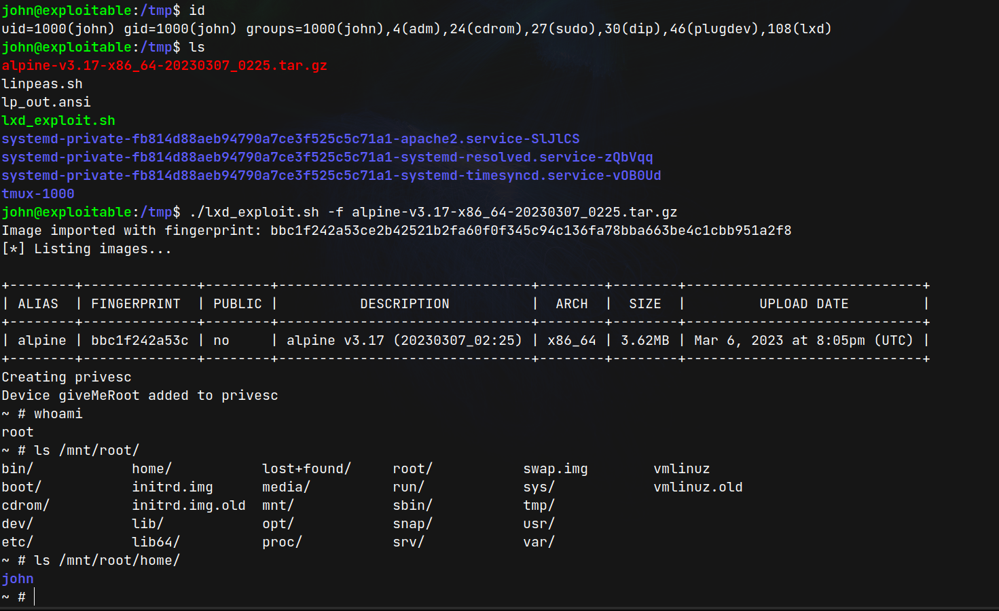

# Gaming Server (THM)

- https://tryhackme.com/room/gamingserver
- March 7, 2023
- easy

---

## Enumeration

### Nmap

1. 22/ssh OpenSSH 7.6p1 Ubuntu 4ubuntu0.3 (Ubuntu Linux; protocol 2.0)
2. 80/http Apache httpd 2.4.29 ((Ubuntu))
3. 3071/tcp csd-mgmt-port

### HTTP

- home page comment

```
<!-- john, please add some actual content to the site! lorem ipsum is horrible to look at. -->
```

- directory brute forcing with ffuf

```
uploads
secret
```

- uploads -> download 3 files
  - `dict.lst` which may be some passwords
  - `manifesto.txt`
  - `meme.jpg`
- secrets -> `secretKey` (ssh id_rsa)

### SSH

- try to enter ssh with username - `john` and `secretKey`
- passphrase required
- crack with john-the-ripper

```sh
ssh2john secretKey > forjohn.txt
john forjohn.txt
```

- got passphrase

## User Access

- enter ssh as john with id_rsa

```sh
john@exploitable:/tmp$ id
uid=1000(john) gid=1000(john) groups=1000(john),4(adm),24(cdrom),27(sudo),30(dip),46(plugdev),108(lxd)
```

- lxd privilege escalation - https://www.hackingarticles.in/lxd-privilege-escalation/
- first git clone into local machine from - https://github.com/saghul/lxd-alpine-builder
- in local machine, build with build-alpine with sudo access
- it will create alpine.someversion.tar.gz file
- from searchsploit, search lxd and will find Ubuntu 18.04 - 'lxd' Privilege Escalation file and download as lxd_exploit.sh
- copy the tar.gz and lxd_exploit.sh file to remote machine's tmp folder

## Root Access



- original / directory exists in /mnt/root/

---
