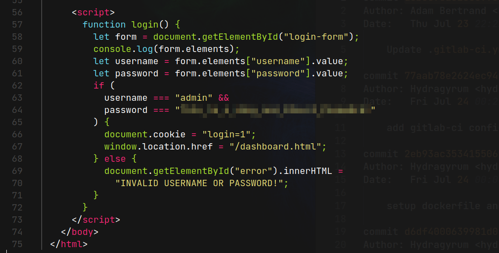

# Git Happens (THM)

- https://tryhackme.com/room/githappens
- March 7, 2023
- easy

---

## Enumeration

### Nmap

- found only 80 port open
- 80/http nginx 1.14.0 (Ubuntu)

### HTTP

- directory brute forcing with ffuf
- found git folder

```
.git/HEAD               [Status: 200, Size: 23, Words: 2, Lines: 2]
.git                    [Status: 301, Size: 194, Words: 7, Lines: 8]
.git/logs/              [Status: 200, Size: 390, Words: 140, Lines: 9]
.git/config             [Status: 200, Size: 110, Words: 10, Lines: 7]
.git/index              [Status: 200, Size: 639, Words: 4, Lines: 6]
css                     [Status: 301, Size: 194, Words: 7, Lines: 8]
index.html              [Status: 200, Size: 6890, Words: 541, Lines: 61]
```

- get .git folder to local machine to analyze

```sh
wget http://10.10.252.129/.git/ --recursive
```

- `git logs` -> find 9 logs
- in 395e087334d613d5e423cdf8f7be27196a360459 log, found password at dashboard.html file

- `git checkout 395e087334d613d5e423cdf8f7be27196a360459`
- in index.html file



- found password

---

- need to learn git
- found accidentally

---