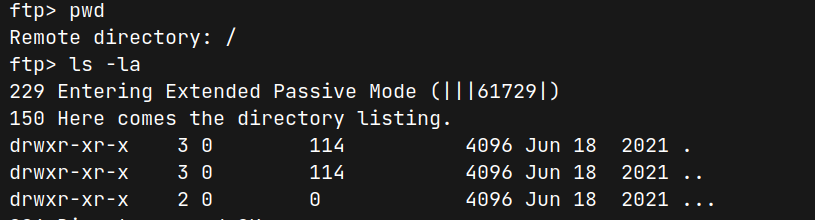
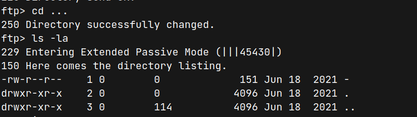
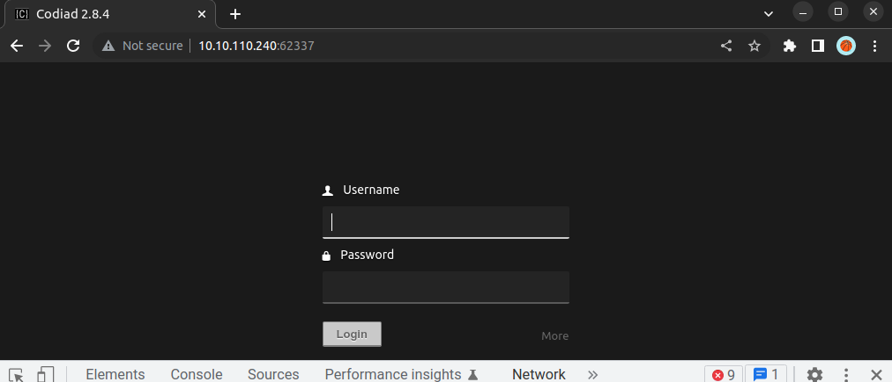
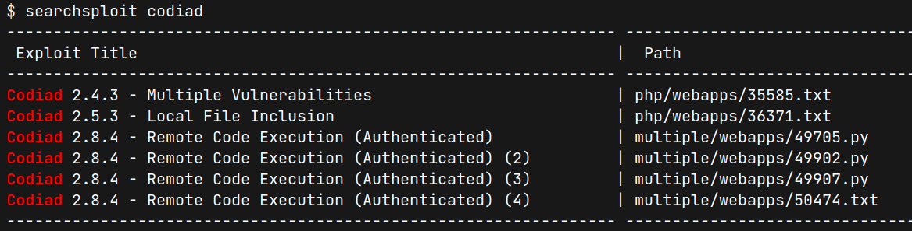
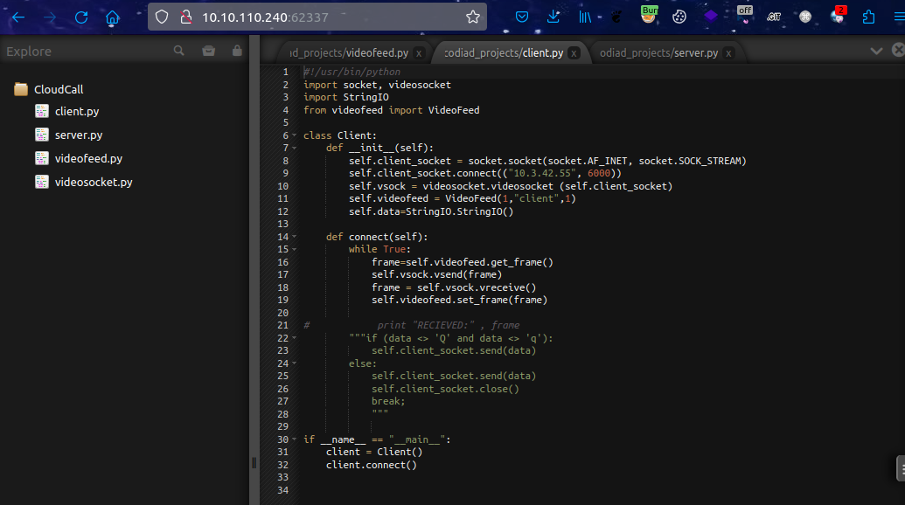

# IDE (THM)

- https://tryhackme.com/room/ide
- March 19, 2023
- easy

---

## Enumeration

### Nmap

```
PORT   STATE SERVICE REASON  VERSION
21/tcp open  ftp     syn-ack vsftpd 3.0.3
|_ftp-anon: Anonymous FTP login allowed (FTP code 230)
22/tcp open  ssh     syn-ack OpenSSH 7.6p1 Ubuntu 4ubuntu0.3 (Ubuntu Linux; protocol 2.0)
80/tcp open  http    syn-ack Apache httpd 2.4.29 ((Ubuntu))
```

- run all ports with rustscan, 1 extra port found

```
PORT      STATE SERVICE REASON  VERSION
62337/tcp open  http    syn-ack Apache httpd 2.4.29 ((Ubuntu))
```

### FTP

- anonymous login allowed -> but no files
- no write access
- trick is here in FTP



- there is one directory that I have missed `...` triple dots



- there is also a file with filename `-` , not directory
- `get -` to get in local machine
- read that file

```
Hey john,
I have reset the password as you have asked. Please use the default password to login. 
Also, please take care of the image file ;)
- drac.
```
- names -> john,drac
- careful if we find login fields and images

### HTTP

- default Apache page, nothing special found
- initial directory bruteforcing with ffuf -> nothing special found


### HTTP/62337

- `Codiad 2.8.4`
- login page found



- initial directory bruteforcing with ffuf

```
components 
data       
js         
languages  
lib        
plugins    
themes     
```
- nothing specials in these directories
- codiad exploits need to be authenticated 



- according to information from ftp, username may be john and find the default password for codiad and try to login
- can enter



## User Access

## Root Access
