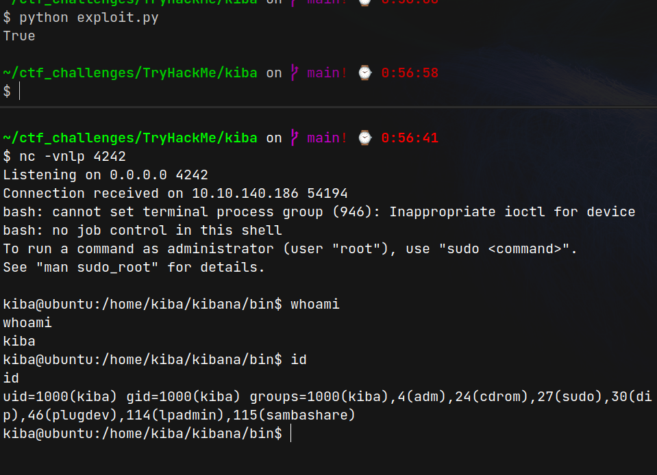
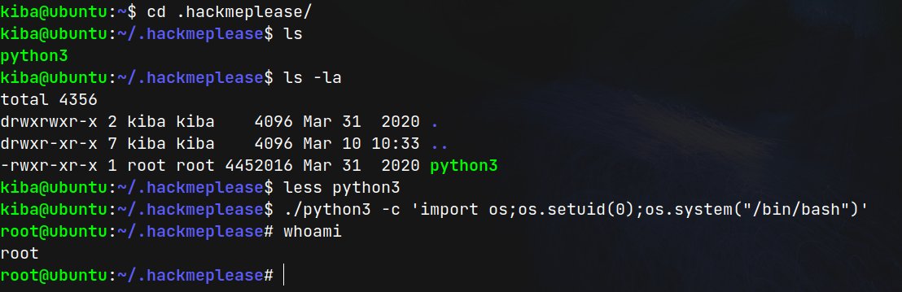
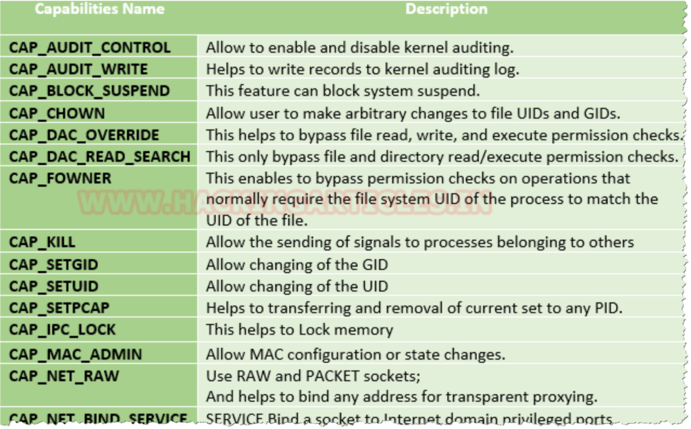

# Kiba (THM)

- https://tryhackme.com/room/kiba
- March 11, 2023
- easy 

--- 

## Enumeration

### Nmap

1. 22/ssh OpenSSH 7.2p2 Ubuntu 4ubuntu2.8 (Ubuntu Linux; protocol 2.0)
2. 80/http Apache httpd 2.4.18 ((Ubuntu))
3. 5601/esmagent (after running rustscan)

### HTTP

- directory brute forcing -> nothing found


### 5601

- from nmap scan, there is a route at /app/kibana
- [what is kibana?](https://www.elastic.co/what-is/kibana)
- it is CVE-2019-7609

## User Access 

- full exploit code is here - https://github.com/Cr4ckC4t/cve-2019-7609/blob/main/cve-2019-7609.py
- I rewrite only exploit part of that file
- I found the version from view page source 
- get kiba user's shell




## Root Access

- I made to enter with ssh for better terminal experience
- the room is about capabilities and i skipped all other testing
- find capabilities by
- `getcap -r / 2>/dev/null`

```sh
kiba@ubuntu:~$ getcap -r / 2>/dev/null
/home/kiba/.hackmeplease/python3 = cap_setuid+ep
/usr/bin/mtr = cap_net_raw+ep
/usr/bin/traceroute6.iputils = cap_net_raw+ep
/usr/bin/systemd-detect-virt = cap_dac_override,cap_sys_ptrace+ep
```

- find from gtfo bin, python3 can be exploited



---



---