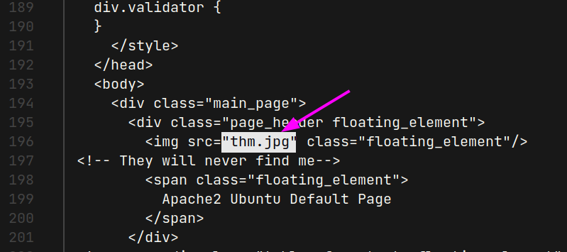
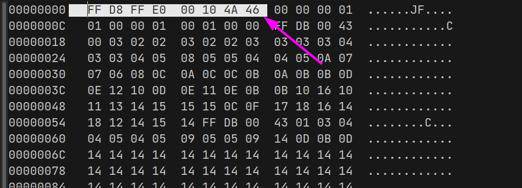
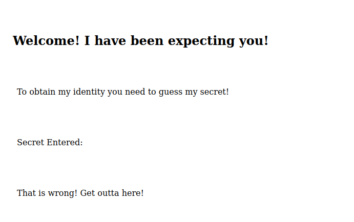
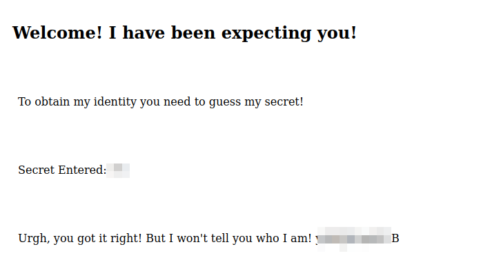
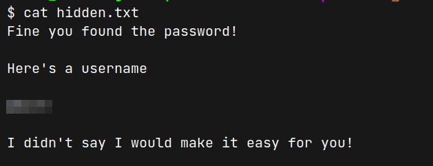
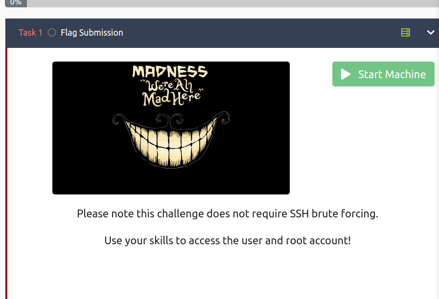
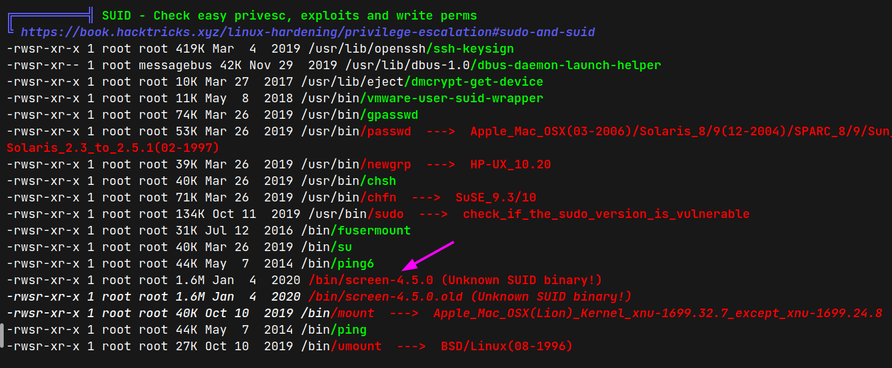
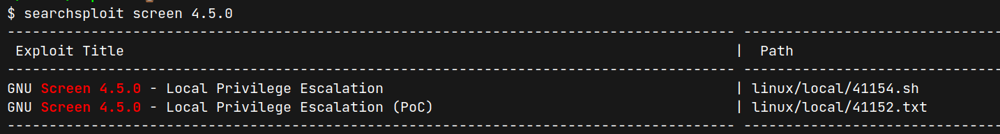
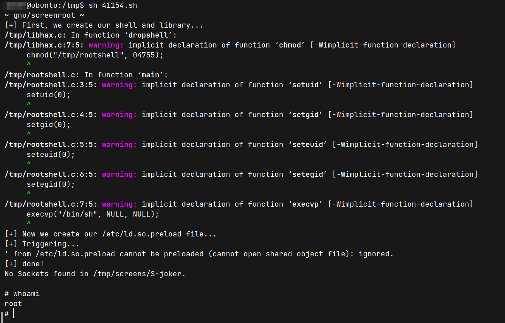

# Madness

- https://tryhackme.com/room/madness
- March 13, 2023
- easy
- it is not easy

---

## Enumeration

### Nmap

1. 22/ssh  7.2p2 Ubuntu 4ubuntu2.8 (Ubuntu Linux; protocol 2.0)
2. 80/http Apache httpd 2.4.18 ((Ubuntu))

### HTTP

- default apache page and nothing was found in view page source
- directory brute forcing with ffuf 
- nothing found

- I miss one thing
- in default page, there is `thm.jpg` file which may not be an image file



- download this file and analyze this
- let's change the magic number of jpg
- here is the list of magic numbers - https://en.wikipedia.org/wiki/List_of_file_signatures

```sh
hexedit thm.jpg
```



- then open again and found secret route



- in comments `<!-- It's between 0-99 but I don't think anyone will look here-->`

- but where to put these numbers??
- try with parameters
- My thought was if the parameter is correct, the content length will different as the guess number will fill after secret entered word in page
- use ffuf to brute force parameter list (set fs 406 as it is default page)

```sh
$ ffuf -u http://10.10.17.244/xxxxxxxxxxxxx/\?FUZZ\=50 -w /opt/wordlists/SecLists/Discovery/Web-Content/burp-parameter-names.txt -c -fs 406
```
- found one parameter
- then create `1-99` wordlist file

```sh
seq 1 99 > nums.txt
ffuf -u http://10.10.17.244/xxxxxxxxxx/\?xxxxxx\=FUZZ -w nums.txt -c -fs 407,408
```
- filter 407, 408 words as they are wrong words
- found correct guess



- I found some meaningless words and what for??
- it is not a directory 
- one thing to do, I have only one image
- try to extract something from image using this arbitary word

```sh
steghide extract -sf thm.jpg
# Enter with above words
# wrote extracted data to "hidden.txt".
```
- get one user name



- enter ssh??
- enter ssh, fail
- it may be not a valid username and found that it is rot 13 encrypt 
- decrypt and enter ssh, fail 
- what???
- nothing to do here



- one image left 
- binwalk and exiftool show nothing
- extract with steghide

```sh
steghide extract -sf 5iW7kC8.jpg
# enter (no password)
```
- found password.txt file and get username and password for ssh login

## User Access

- enter with credentials
- run linpeas as my initial checks do not work



- screen-4.5.0 haven't seen before
- there is searchsploit code



## Root Access

- get that sh script in the victim machine and run it



- get root access

---