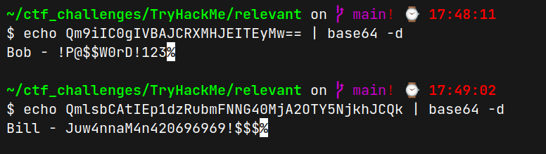
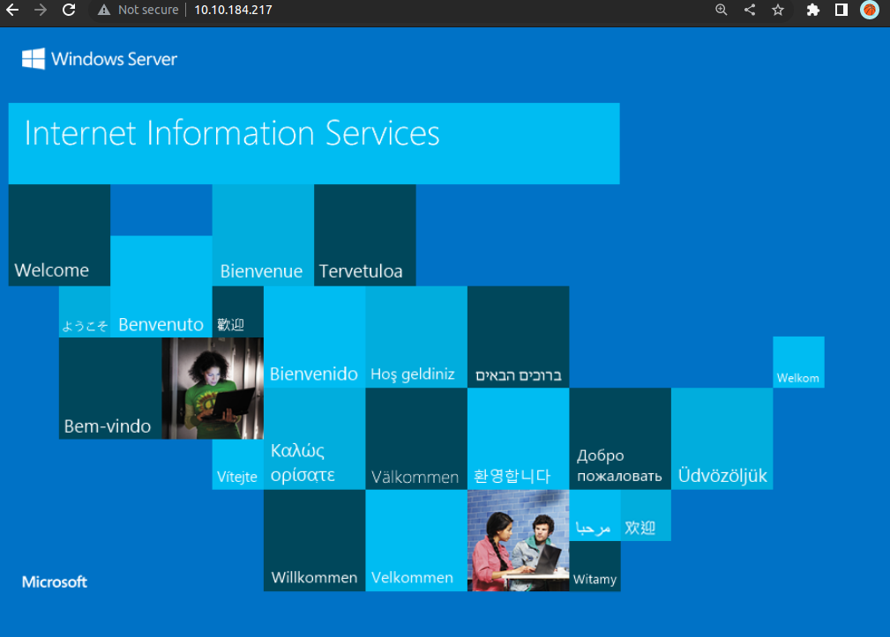
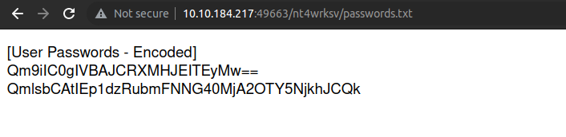
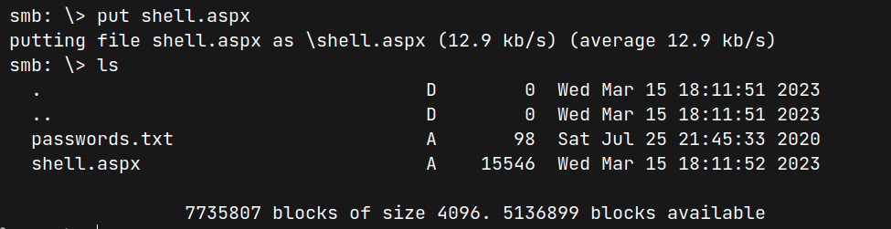
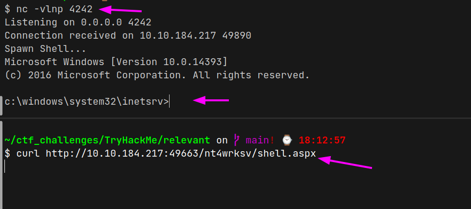

# (THM)

- https://tryhackme.com/room/relevant
- March 15, 2023
- medium

---

## Enumeration

### Nmap

```
PORT     STATE SERVICE            REASON  VERSION
80/tcp   open  http               syn-ack Microsoft HTTPAPI httpd 2.0 (SSDP/UPnP)
135/tcp  open  msrpc              syn-ack Microsoft Windows RPC
139/tcp  open  netbios-ssn        syn-ack Microsoft Windows netbios-ssn
445/tcp  open  microsoft-ds       syn-ack Microsoft Windows Server 2008 R2 - 2012 microsoft-ds
3389/tcp open  ssl/ms-wbt-server? syn-ack
```
- it is a window machine
- OS detection
```sh
sudo nmap -O $IP -oN nmap_os.log -vv
```

```
Aggressive OS guesses: 
    Microsoft Windows Server 2016 (91%), 
    Microsoft Windows Server 2012 (85%), 
    Microsoft Windows Server 2012 or Windows Server 2012 R2 (85%), 
    Microsoft Windows Server 2012 R2 (85%), 
    Microsoft Windows Server 2008 R2 (85%), 
    Microsoft Windows 10 1607 (85%)
```

- with rustscan to all port found extra 3 ports: 49663,49667,49669
- port 49663 is another http server

```
PORT      STATE SERVICE REASON  VERSION
49663/tcp open  http    syn-ack Microsoft IIS httpd 10.0
| http-methods: 
|   Supported Methods: OPTIONS TRACE GET HEAD POST
|_  Potentially risky methods: TRACE
|_http-server-header: Microsoft-IIS/10.0
|_http-title: IIS Windows Server
49667/tcp open  msrpc   syn-ack Microsoft Windows RPC
49669/tcp open  msrpc   syn-ack Microsoft Windows RPC
```


### SMB

- authentication error for smbmap
- with smbclient

```
$ smbclient -L $IP
Password for [WORKGROUP\hope]:

	Sharename       Type      Comment
	---------       ----      -------
	ADMIN$          Disk      Remote Admin
	C$              Disk      Default share
	IPC$            IPC       Remote IPC
	nt4wrksv        Disk      
SMB1 disabled -- no workgroup available
```

- found `nt4wrksv` share can enter with anonymous user 

```sh
$ smbclient \\\\10.10.184.217\\nt4wrksv
```

- found `password.txt` file and get to local machine

```
Qm9iIC0gIVBAJCRXMHJEITEyMw==
QmlsbCAtIEp1dzRubmFNNG40MjA2OTY5NjkhJCQk
```


- enter smb with that credentials (`--user`, `--password`) -> can't access
- enter rdp -> fail


### HTTP

- home page



- directory brute forcing with ffuf -> nothing found
- try the directories and filenames with the name of the shares from ftp or smb
- not found

### HTTP:49663

- same page with above
- directory brute forcing with ffuf 
- nothing special found
- try with smb share name



- smb share folder is connected with this service
- try to put reverse shell for aspx 



- can write shell.aspx file in smb share folder which is connected with http service
- I use aspx reverse shell file from here - https://github.com/borjmz/aspx-reverse-shell/blob/master/shell.aspx
- change host and port

## User Access

- listen with nc and get request to shell file and get `iis apppool\defaultapppool` user access



- find the nt4wrksv folder inside the system and it is here `c:\inetpub\wwwroot\nt4wrksv>`


## Root Access
